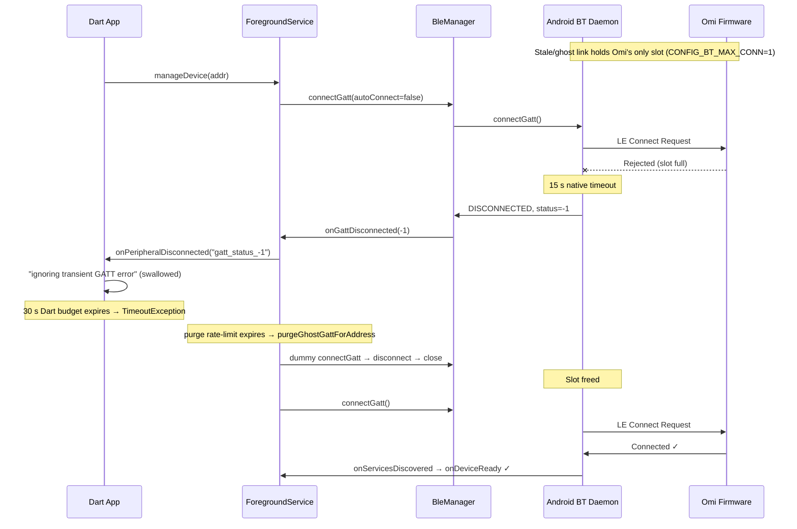

# BLE Wedge Research

A living log of "advertising but won't connect" / connection-wedge outages on the Omi
BLE link, and how each one cleared. The goal is to separate the two populations —

- **Toggle-required wedges** — cleared only when the user toggled phone Bluetooth off/on.
- **Self-clearing wedges** — cleared on their own (device came back, screen woke, Doze
  exited, a background recovery attempt landed) with no BT toggle.

— and find what distinguishes them, so we can either make the self-clearing recovery
fire for the toggle-required ones, or make the firmware/app close the outage faster.

Append a new record (template at the bottom) each time a `ble_wedge` / `ble_wedge_recovered`
pair shows up in a debug log. Classify it into one of the two buckets using the rule in
§3 and fill in the diagnostic signature — the signature is what lets patterns emerge.

Source-of-truth code:
- Detection + recovery lifecycle: `app/android/app/src/main/kotlin/com/omi/offline/OmiBleForegroundService.kt`
- Snapshot + advertising probe: `app/android/app/src/main/kotlin/com/omi/offline/WedgeDiagnostics.kt`
- GATT wrapper (ghost purge, connect/close): `app/android/app/src/main/kotlin/com/omi/offline/OmiBleManager.kt`
- Firmware counters + re-advertise: `omi/firmware/omi/src/lib/core/transport.c`
- Prose background: `NOTES.md` → "BLE: advertising but won't connect"

---

## 1. What a wedge is

The app declares a wedge after `WEDGE_NOTIFY_AFTER = 6` consecutive failed connect
attempts (`OmiBleForegroundService.kt:66`). It emits, into the same `omi_debug_*.log`:

- `ble_wedge` — the outage snapshot at detection.
- `ble_wedge_scan_probe` — the verdict of an 8 s, address-filtered, full-duty LE scan run
  right after detection: is the peripheral still on the air?
- `ble_wedge_recovered` — logged when a connect finally discovers services, carrying the
  **same environment fields** as `ble_wedge` so the two can be diffed to explain the recovery.

At `AUTONOMOUS_RETRY_STOP_AFTER = 6` failures (`:76`) native **stops** its own fast retry
loop (rapid `connectGatt`/`closeGatt` churn is itself the most common cause of daemon
wedges) and hands reconnection to a backed-off recovery alarm (2 → 4 → 8 → 16 min,
`RECOVERY_PROBE_MIN_MS` `:106`) plus the periodic sync alarm.

Wedges are **connectivity** outages, not data loss: firmware keeps writing to SD, and on
reconnect the WAL sync re-fetches everything. Across today's two wedges: `block_drops=0`,
all SD/codec drop counters 0, `ring_io_errors=0`, and the resume-offset guard rewound
correctly when a bin was missing.

---

## 2. Decoding the diagnostic fields

### `ble_wedge` / `ble_wedge_recovered` (from `WedgeDiagnostics.environmentSnapshot`)

| Field | Meaning | How to read it |
|---|---|---|
| `consecutive_failures` / `failures_before_recovery` | Failed connect attempts of any status this outage | Higher = longer/harder outage |
| `last_gatt_status` | Most recent status; `-1` = our own connect-timeout backstop fired (Android never reported) | `-1` alone = initiator wedged silent |
| `last_real_gatt_status` | Most recent *real* status Android delivered (not `-1`, not `0`) | `147` = `BluetoothGatt.GATT_CONNECTION_TIMEOUT` (0x93, API 33+) — **the peer never completed the link**, not "the stack rejected us"; `8` = supervision timeout (0x08), which means the link *did* come up and then died, so the peripheral was demonstrably on the air; `null` = all-timeout outage, zero callbacks |
| `bond_state` | Should be `bonded` | If not bonded, different problem |
| `omi_in_gatt_list` | Is Omi in the system GATT-profile connected list | `false` at wedge = **no ghost host link to purge** |
| `omi_acl_connected` | Does the phone hold a live ACL to Omi | `false` + `omi_in_gatt_list=false` = nothing host-side holding the firmware's single slot |
| `other_le_links` | Every *other* LE link (e.g. `Instinct 2X Solar` Garmin watch) | Coexistence context |
| `contending_le_links` | Count of the above (excludes Omi's own link) | **Diff this across wedge→recovery** — a drop is the contention signal |
| `le_link_count` | Raw system-wide total (`contending + (omi_in_gatt?1:0)`) | Goes 1→2 when Omi rejoins |
| `screen_interactive` | Screen on at that moment | **false→true across wedge→recovery = screen-wake recovery** |
| `doze_mode` | Device in Doze | Recovery with `doze=true` throughout = self-clear under Doze |
| `adapter_state` | Should be `on` | An `off` between wedge and recovery ⟹ a **BT toggle** happened (see §3) |

### `ble_wedge_scan_probe` — the pivotal field

| `verdict` | Log name | Meaning |
|---|---|---|
| ADVERTISING | `peripheral_advertising` | Omi is audibly on the air and we still can't connect → the link dies in the establishment handshake. **The connectable case.** |
| SILENT | `no_advertisements_heard` | Zero packets. Either the peripheral stopped advertising **or our own scanner was starved and never listened.** Ambiguous — this is why the app does not auto-act on it. |
| INCONCLUSIVE | `scan_failed` | Framework refused the scan (e.g. `SCANNING_TOO_FREQUENTLY`). No opinion. |
| UNAVAILABLE | `probe_unavailable` | No adapter / off / no permission. Treated as "present" for the alert. |

### Firmware counters — `device_conn_fail` / WARN line (read on each successful connect)

The peripheral's own view, persisted across reboots — **only the delta across an outage
means anything**, never the absolute value.

- `estab_fail_count` — links that came up (`err=0`) then died with **HCI `0x3e`
  (CONN_FAIL_TO_ESTAB)** — no data-channel packet in the first 6 connection events
  (`transport.c:1473`). This is what a central sees during "visible but unconnectable."
- `last_failure_adv_mode` / `last_failed_adv_slow` — advertising interval in effect at the
  last failure: `fast` (post-boot/post-disconnect) vs `slow` (1 s, after VAD sleeps).
- `failed_conn_count` — a *different* counter: connected callback fired with `err != 0`
  (told outright the attempt failed). Not establishment failures.

**Interpreting the estab delta across a wedge:**

| estab_fail_count across outage | Meaning | Fault side |
|---|---|---|
| **Rose** (+1 or more) | Omi *did* receive the CONNECT_INDs; link died at establishment | Peripheral controller / RF / coexistence |
| **Flat** (+0) | Omi never heard the CONNECT_INDs at all | Central (phone) — deaf RX or nothing reached the air |

To get the delta you need a reading from the successful connect **before** the wedge and
the one **after** it (both logged as `device_conn_fail` / `device_drop_stats`).

---

## 3. Classifying a log: toggle-required vs self-clearing

**Rule.** Look at the window between the last `ble_wedge` and the `ble_wedge_recovered`:

**A toggle in the window no longer implies toggle-*required*.** Wedge 5b took a toggle at 17:50
and stayed wedged. So the test below identifies "a toggle happened", and you must then check
whether it actually *cured* anything — if failures continue afterwards, the bucket is
**toggle-resistant**, which is a different and more alarming animal. Also note the duration: a
≤ 5 s Quick-Settings double-tap may never reach `STATE_OFF` and is not a controller reset.

- **Toggle-required** if a Bluetooth adapter cycle appears in that window — the
  `bluetoothReceiver` logs `Bluetooth turning off, cleaning up GATT` → … →
  `Bluetooth on, reconnecting in 2s`, and/or `onBluetoothStateChanged("off")` then
  `("on")`. Equivalent: `adapter_state` was `on` at the `ble_wedge` but the recovery was
  immediately preceded by a STATE_OFF→STATE_ON. (A manual toggle is the only way an
  ordinary app sees the adapter go off on Android 13+.)
- **Self-clearing** if `adapter_state` stayed `on` throughout and no STATE_OFF appears.
  Then read the env diff to sub-classify *how* it cleared:
  - `screen_interactive` false→true ⟹ **screen-wake** (foreground radio priority).
  - `le_link_count` 1→2 with Doze still on / screen still off ⟹ **device-return / background
    recovery alarm** landed on its own.
  - `contending_le_links` dropped ⟹ **contention cleared**.
- **Unresolved** if there is no `ble_wedge_recovered` at all — the log ends with the outage still
  open. Added for Wedge 5b (76 min and still failing at the tail). Do not force these into either
  bucket: an outage that never cleared tells you nothing about what would have cleared it, and
  filing it as "self-clearing" because no toggle appears would be exactly backwards.

**First, rule out plain out-of-range — it mimics every wedge signature.** Wedge 6 reproduced SILENT
probes, `147` timeouts, `omi_in_gatt_list=false`, `bonded`, no toggle, and a multi-hour duration, and
was simply the Omi in another room overnight. Four discriminators, in order of strength:

1. **`rssi_min`/`rssi_max` on any ADVERTISING probe.** Non-null and near the floor (≲ −95 dBm) ⟹
   range. Genuine wedges give SILENT probes with `rssi_*` all `null` — the device is not on the air
   at *any* signal level, so there is nothing to be weak.
2. **`last_real_gatt_status=8`, or any link that reaches service discovery.** Status `8` is a
   supervision timeout on an *established* link, so the peripheral demonstrably answered a
   CONNECT_IND. A device that stopped advertising cannot produce it. Wedges are `147`/`-1` only.
3. **Convert the timestamps to local time before theorising.** Logs are UTC. An outage that spans
   the user's night and clears within minutes of their normal wake-up is range until proven
   otherwise, and the giveaway is the *shape*: overnight the RF geometry is static, so a marginal
   link yields one lucky connect and then hours of nothing, rather than the irregular retry pattern
   a wedge produces. Ask what time it was locally — it is one question and it has now overturned a
   whole entry.
4. **Recovery quality.** A range recovery is slow and weak at the moment it lands (Wedge 6: 8576 ms
   to device-ready, 23 KB/s). A cleared wedge reconnects at normal speed.

Caveat on `ble_wedge_recovered`: it fires at service discovery, which has twice (Wedges 2, 5a)
preceded a link that failed under load seconds later. Before classifying, check that a **sync
actually completed** — otherwise you are recording a relapse as a recovery.

Record the sub-class in the "Recovery trigger" column below.

---

## 4. Observation log

### Summary

| # | Date (UTC) | Duration | Probe | Recovery trigger | **BT toggle?** | estab Δ | adv mode | last_real status |
|---|---|---|---|---|---|---|---|---|
| 0 | *(undated; pre-snapshot)* | ~4m stall cycles | *(none — pre-instrumentation)* | ghost-purge / self (30 s rate-limit expired) | **No** | *(not recorded)* | — | *none — all `-1`* |
| 1 | 2026-07-22 15:08→15:36 | 28m 16s | SILENT | screen-wake (`screen_interactive` false→true) | **No** | +1 (in 07:34–18:23 window) | fast | 147, then 8 |
| 2 | 2026-07-22 21:01→21:07 | 5m 54s | SILENT | device-return / self (Doze stayed on, screen off) | **No** | +0 (55→55) | fast | 147 |
| 3 | 2026-07-24 04:42→04:45 | 3m 12s | *(none — sub-threshold)* | **BT toggle** (`error=bluetooth_off` → immediate reconnect) | **Yes** | +0 (flat at 3) | fast | *none — all `-1`* |
| 4 | 2026-07-28 19:47→22:27 | ~2h 40m (3 cycles) | **ADVERTISING** (first ever) | Forget Device + power-cycle | **No** | +0 (flat at 61) | fast | *none — all `-1`* |
| 5a | 2026-07-31 15:52→16:07 | 14m 41s | SILENT | device-return / self (screen already on) | **No** | *(not captured)* | — | 147 |
| 5b | 2026-07-31 16:10→18:19 | 2h 06m | SILENT ×5 | **device power-cycle** (toggle tried twice, both failed) | **Yes — ineffective** | *(not captured)* | — | 147 |
| 6a | 2026-08-02 09:22→10:07 | 44m 52s | SILENT, then **ADVERTISING @ −103 dBm** | **NOT A WEDGE — out of range** (overnight, user-confirmed) | **No** | *(not in excerpt)* | — | **8** |
| 6b | 2026-08-02 10:45→15:23 | 4h 37m 30s | SILENT ×10, then **ADVERTISING @ −91 dBm** | **NOT A WEDGE — out of range**; cleared when the user woke up | **No** | *(not in excerpt)* | — | 147 |
| 7 | 2026-08-04 03:07→03:08 | 1m 38s | *(none — sub-threshold)* | **BT toggle** (`error=bluetooth_off` → reconnect in 2.5 s) | **Yes** | +0 (flat at 19) | fast | *none — all `-1`* |

**Wedge 5 is SOLVED** — see the resolution block below. Root cause: the post-disconnect
`bt_le_adv_start()` in `transport.c` was fire-and-forget, so a single failure left the device
permanently off the air with the firmware still running and still recording. Fixed with
a 30 s advertising watchdog. This is very likely the same fault behind Wedges 0–2 (all SILENT, all
no-ghost, all cleared by "device-return" — which is what a lucky later restart would look like).

Wedge 0 is the **origin of the ghost-GATT hypothesis** and the purge fixes now shipped
(§8 background, §6 "already implemented"); it predates the env-snapshot instrumentation, so
its ghost was **inferred, not proven** (no `omi_in_gatt_list`). Tellingly, the two later wedges
that *did* carry the snapshot (1–2) showed **no ghost** — see §5.

Wedges 1–2 were **self-clearing**; Wedge 3 is the **first toggle-required** sighting — the
population §7 was hunting for. Its signature is distinct from the self-clearing pair: **every
failure was `gatt_status_-1`** (pure connect-timeout, Android never delivered a real status —
vs. the 147/8 the self-clearing wedges carried), **`estab_fail_count` flat**, and it cleared
**only** when the adapter cycled. That matches the §7 hypothesis: flat-estab + all-timeout(`-1`)
= central-side initiator wedge = a toggle (which resets the phone's own controller) is what fixes it.

**Wedge 7 reproduces Wedge 3 exactly** — all-`-1`, flat estab, sub-threshold, cured by an adapter
cycle — which takes the toggle-required class from n=1 to **n=2 with an identical signature**. It
also carries the firmware exoneration Wedge 3 could not: its build runs the post-2.8.4 advertising
watchdog *and* the event log, and neither `DIAG_ADV_START_FAIL` nor `DIAG_ADV_WATCHDOG_RESCUE`
appears anywhere in the outage window. So for this episode the Wedge 5 root cause is affirmatively
ruled out on device evidence rather than inferred, and the fault sits on the central.

Wedge 5 is the first **unresolved** episode on record — it is still failing when the log ends —
and the first where `screen_interactive=true` for the entire outage, which removes screen-wake
and Doze deprioritization from the causal picture for this class.

### Detail — Wedge 0 (undated, ~4 min stall cycles) — the ghost-GATT origin

The forensic session that first surfaced the "stale system GATT holds the firmware's single
slot" theory and drove the two purge fixes now shipped. Predates the `WedgeDiagnostics`
env-snapshot / `scan_probe` instrumentation, so — like Wedge 3 — everything below is
reconstructed from connect/transport lines, and the ghost is **inferred, not observed**.

- Log source: device `C3:94:71:EA:A8:D5`, `uptime_ms` = 22 h 40 m at the successful connect.
- Preceded by: a clean fast connect (18:23:48→18:24:05, ~6 s), then a manual disconnect
  (`Disconnecting (isManual: true)` @ 18:24:49, `error=unmanaged`).
- Outage: auto-reconnect looped for ~4.5 min (18:24:49→18:29:13). Each cycle ran the full
  30 s Dart budget and logged repeating `gatt_status_-1` with `ignoring transient GATT error
  during connect (native will retry)`. **Every failure was `-1`** (our own timeout backstop —
  Android never delivered a real status), same all-`-1` signature as Wedge 3.
- Recovered @ 18:29:13 — connect finally landed. Best explanation: the `purgeGhostGattForAddress`
  30 s rate-limit expired and the purge flushed the daemon's stale link, freeing the slot.
  **No BT toggle.** Then the connection was **immediately killed** @ 18:29:14 by the background
  drop-guard (`_handleDeviceConnected`, app backgrounded + no sync pending) — a hard-won
  connection thrown away (see §6 candidate #5). A clean fast connect followed @ 18:33:23 (1.6 s),
  the ghost by then gone.
- Ghost caveat: no `omi_in_gatt_list` field existed at this app version, so the ghost is a
  **hypothesis** — the diagnosis rests on the all-`-1` timeouts + recovery-on-purge timing, not
  on a positive system-GATT-list reading. The later instrumented wedges (1–2) had
  `omi_in_gatt_list=false` (§5), which is why §7 still wants one instrumented ghost sighting.
- Bucket: **self-clearing (ghost-purge)** — the only ghost-class wedge on record.

### Detail — Wedge 1 (2026-07-22, ~28 min)

- Log source: app 0.31.1, device `C3:94:71:EA:A8:D5`, `uptime_ms` 995465491.
- Preceded by ~5 min of 30 s connect timeouts (`gatt_status_147`, then `-1`, then `8`).
- `ble_wedge` @ 15:08:41 — `consecutive_failures=6`, `last_gatt_status=-1`,
  `last_real_gatt_status=147`, `omi_in_gatt_list=false`, `omi_acl_connected=false`,
  `contending_le_links=1` (Garmin), `screen_interactive=false`, `doze_mode=false`.
- `scan_probe` @ 15:08:50 — **0 adv packets → SILENT**.
- Re-declared `ble_wedge` @ 15:28:17 — `consecutive_failures=11`, `last_gatt_status=8`
  (a brief 15:28 connect that dropped at supervision timeout before service discovery).
- `scan_probe` @ 15:29:08 — **0 adv packets → SILENT**.
- `ble_wedge_recovered` @ 15:36:58 — `wedge_duration_ms=1696471`, `failures_before_recovery=11`,
  `omi_in_gatt_list=true`, `omi_acl_connected=true`, `le_link_count=2`,
  **`screen_interactive=true`** (was false), `doze_mode=false`. The connect that landed
  (`_scanConnectDevice: starting connect` @ 15:36:55) used the same path that had failed
  for 28 min — it worked once the screen woke.
- estab context: `last_failure_adv_mode=fast`; `estab_fail_count` 54 @ 07:34 → 55 @ 18:23,
  i.e. **+1** somewhere in that window (this wedge is the only establishment-class event
  in it, so near-certainly its). Rising ⟹ Omi received the CONNECT_INDs; link died at
  establishment ⟹ peripheral/RF side.
- **Bucket: self-clearing (screen-wake).** No BT toggle.

### Detail — Wedge 2 (2026-07-22, ~6 min)

- `uptime_ms` 1016649537.
- Preceded @ 20:56 by a partial connect that failed **mid-transfer** — write
  `PlatformException … Not found`, `Stream closed without EOT`, `Connection lost after
  failure, aborting syncAll` — then a run of `gatt_status_-1 / 147 / 8`.
- `ble_wedge` @ 21:01:45 — `consecutive_failures=6`, `last_gatt_status=147`,
  `last_real_gatt_status=147`, `omi_in_gatt_list=false`, `omi_acl_connected=false`,
  `contending_le_links=1`, `screen_interactive=false`, **`doze_mode=true`**.
- `scan_probe` @ 21:02:46 — **0 adv packets → SILENT**.
- `ble_wedge_recovered` @ 21:07:39 — `wedge_duration_ms=353999`,
  `failures_before_recovery=7`, `omi_in_gatt_list=true`, `omi_acl_connected=true`,
  `le_link_count=2` (1→2), **`doze_mode=true` still, `screen_interactive=false` still**.
  Recovered with nothing in the environment changed except the Omi link returning →
  device came back / a background recovery attempt landed.
- Note: the first *post-recovery* connect @ 21:08 still failed (`Rejected: 4` write,
  abort); a clean sync only completed @ 21:10:45. So `ble_wedge_recovered` fired slightly
  optimistically.
- estab context: `estab_fail_count` 55 @ 18:23 → 55 @ 00:01, i.e. **+0** across this wedge.
  Flat ⟹ Omi never heard the CONNECT_INDs ⟹ central-side, consistent with SILENT.
- **Bucket: self-clearing (device-return / background recovery).** No BT toggle.

### Detail — Wedge 3 (2026-07-24, ~3 min) — first toggle-required

- Log source: app 0.31.x, device `C3:94:71:EA:A8:D5`, `live_uptime_ms` ~8.4M (2h 20m), firmware
  clean throughout (`block_drops=0`, `ring_io_errors=0`, `estab_fail_count` flat at 3).
- **No formal `ble_wedge` / `scan_probe` / `ble_wedge_recovered` emitted** — the outage cleared
  at failure **3**, below `WEDGE_NOTIFY_AFTER=6`, so the snapshot instrumentation never tripped.
  Everything below is reconstructed from the connect/transport lines. (This is itself a finding:
  a toggle-required outage can resolve before the app's own wedge detector fires, so we get no
  env snapshot / probe verdict for it. Consider lowering the snapshot threshold, or snapshotting
  on the first `bluetooth_off` during an active reconnect loop.)
- Preceded by: a clean session — last good activity was a full sync + manual battery-save
  disconnect @ 04:25:14. No mid-transfer failure led in (unlike Wedge 2). Two *earlier* drops
  this session (`gatt_status_8` @ 03:15:53, `Error 133` @ 03:55:31) were plain mid-transfer
  drops that **native auto-reconnect cleared in seconds** — not wedges.
- Outage start @ 04:42:07 — `[DeviceService] device lookup result: Omi
  (locator: DeviceLocatorKind.bluetooth)` → **the peripheral was discoverable at outage start**
  (phone's scanner heard it), then 3 connects each ran the full 30 s `_scanConnectDevice`
  timeout:
  - fail 1 @ 04:42:37 (`timed out after 30002ms`) → `gatt_status_-1`
  - fail 2 @ 04:43:22 (`timed out after 30004ms`) → `gatt_status_-1`
  - fail 3 @ 04:45:01 (`timed out after 30001ms`) → `gatt_status_-1`, incl.
    `ignoring transient GATT error during connect (native will retry): gatt_status_-1`.
  Every failure was `-1` (our own timeout backstop; **Android never reported a real status** —
  no 147, no 8). Env fields (`screen_interactive`, `doze_mode`, `contending_le_links`,
  `omi_in_gatt_list`) unavailable — no snapshot fired.
- scan_probe: **not run** (sub-threshold). But the 04:42:07 lookup hearing `Omi` is a weak
  ADVERTISING-leaning signal — the peripheral was on the air at the start.
- **Bluetooth toggle in window? YES** — @ 04:45:15 `[NativeBleTransport] … disconnected
  (error=bluetooth_off …)`, the only way an ordinary app sees the adapter go off on Android 13+.
  Recovery landed immediately: @ 04:45:17 `connecting` → @ 04:45:19 `connected`, `device ready
  after 2126ms` → @ 04:45:21 `SDCardWalSync: Loaded 0 persisted WALs`. Total outage 3m 12s.
- estab context: `last_failure_adv_mode=fast`; `estab_fail_count` was **3 for the entire
  session** (04:22 / 03:55 / 03:20 / 03:16 readings all 3); the post-recovery reading is just
  past the log tail, but flat-3 throughout ⟹ **+0 ⟹ Omi never heard the CONNECT_INDs ⟹
  central (phone) side.** Consistent with the all-`-1` timeout signature.
- **Bucket: toggle-required.** The self-clearing recovery mechanisms (screen-wake, device-return
  alarm) did **not** land in the ~3 min before the user toggled; the adapter cycle is what cleared it.

---

### Detail — Wedge 4 (2026-07-28) — bond loss caught in the act

The first wedge where the snapshot instrumentation captured the bond flipping, and the first
**ADVERTISING** probe verdict on record. Settles several open questions at once.

- Log source: app 0.31.x, device `C3:94:71:EA:A8:D5`, firmware `oo-2.8.0`.
- **The device never reset and the SD is clean.** `live_uptime_ms` climbs monotonically all day —
  `4797968` (04:07) → `53129979` (17:32) → `70820793` (22:27) = **19 h 40 m continuous**. Every
  drop counter zero throughout (`block_drops=0`, `ring_io_errors=0`, `codec_frame_drops=0`),
  `estab_fail_count` flat at **61**. The only reboot is the operator's own power-cycle at 22:28:50
  (`live_uptime_ms=2982`, `last reset = low power wake; prior boot ran 19h 40m`).
  ⟹ **The §9 crash-loop / dirty-mount hypothesis is dead for this episode.**
- **`bond_state` flipped spontaneously, phone-side, with no DFU and no unpair:**
  - `ble_wedge` @ 19:47:11 — `bond_state=bonded`
  - `ble_wedge` @ 20:06:54 — `bond_state=bonded`
  - `ble_wedge` @ 21:47:08 — **`bond_state=not_bonded`**
  - `ble_wedge` @ 22:17:08 — `not_bonded`
- `scan_probe` @ 21:47:16 — **2 adv packets, RSSI −73 → ADVERTISING**; @ 22:17:16 — 3 packets,
  RSSI −100 → ADVERTISING. The peripheral was demonstrably healthy and on the air the whole time.
- Post-flip symptom is the §9 signature exactly: connect → `device ready (14 services)` →
  `Failed to write characteristic: Disconnected` → drop, on a ~4–6 s cycle, repeating from
  22:25:29 to 22:26:16 without ever completing setup.
- Cleared by **Forget Device** @ 22:26:13 (which resets the app's own device state and re-pairs
  clean), then a power-cycle @ 22:28. The connect at 22:27:22 read the diagnostics characteristics
  successfully, and the encrypted storage characteristic worked again by 22:30:34.
- **Bucket: bond-mismatch (§9), not a wedge.** Establishment was never the problem.

**What this settles.** The bond-mismatch class is real and now directly instrumented — no longer
inferred from a confounded button press. It is also the **first ADVERTISING verdict**, answering
§7's lead question: ADVERTISING wedges do happen on this phone/device, and they are the
bond-mismatch population, not the establishment population. `CONFIG_BT_SMP_ALLOW_UNAUTH_OVERWRITE=y`
would make this failure recoverable, but was reverted as unsafe — see §9 for why, and for the
user-presence-gated design that replaces it.

**Still open:** *why* the phone dropped its bond unprompted. One plausible chain that fits the
ordering — the device's own key went first, the phone's stale-LTK connect drew a
`PIN_OR_KEY_MISSING`, and Android cleared its bond in response (which would also mean the
"Android reliably auto-clears" premise §9 doubted is correct on this handset). Unverified; a
btsnoop capture across the flip would settle it.

### Detail — Wedge 4 companion finding: the mic was wedged, and the reboot fixed it

Same log, separate fault, worth recording because the two were easy to conflate. Every recording
in the 19 h 40 m session decoded to **digital silence** — e.g. 18:38:26,
`1785263851_2496461859.bin — 2070 frames, 2025 speech frames, maxAmp=0.0000`. The high "speech"
count is force-capture from a Priority Recording, not detection; **`maxAmp` is the real signal and
it was flat zero.** The first bin of the post-power-cycle session reads
`1785277726_4189929963.bin — 1537 frames, 987 speech frames, **maxAmp=0.4998**`.

⟹ The T5838 was returning silence, the power-cycle recovered it, and `oo-2.8.0` predates the
`mic_reset()` work (PR #361) that recovers this without a reboot.

**Heading correction (2026-08-02): a reboot cannot fix this — it was the power-cycle.** The two
are not interchangeable for the mic. PDM_EN is held high by a board pull-up and the firmware only
ever drives it in `mic_reset()` and `mic_off()` (whose sole caller is `turnoff_all()`), so a SoC
reset — DFU, `sys_reboot`, watchdog, brownout — leaves the T5838 continuously powered and keeps
whatever state it was stuck in. Only removing the supply clears it, which a 4-tap-hold power-cycle
does and a restart does not. A second, longer outage on 2026-08-02 confirmed it: the mic went
silent, survived a DFU reset *and* a System-OFF wake, and came back only when a Priority Recording
called `mic_reset()`. Telling someone to reboot a silent Omi is telling them to do the one thing
that provably cannot work. `oo-2.8.5` cycles the rail once on the first boot of a new image for
this reason; the still-open question is whether the mic also wedges spontaneously mid-session,
which `DIAG_VAD_LEVEL` was added to answer.

**RETRACTED: an earlier revision of this section claimed the mic "re-wedged within ~90 seconds"
after the power-cycle. That was wrong** — the operator confirmed recording was working; the short
recordings were short speech, not a fault.

The mistake was reading **empty bins as a fault signal. They are not.** In auto mode the VAD gate
means silence writes no audio at all, so a bin that closes containing only its 36-byte
`0xFFFFFFFB` metadata header (4-byte tag + 4-byte length + 28-byte payload) is the *expected*
outcome of a quiet window. `empty_bin_rotations` counts exactly that normal case, and
`Expecting N files (36 bytes total)` from `CMD_LIST_FILES` means "nothing was said", not "the mic
is dead". **Do not treat `empty_bin_rotations` or 36-byte bins as evidence of a wedge on their
own.**

What the same log does show working: `priority_starts=4`, `priority_stops=4`,
`session_end_marker_emits=4`, `marker_write_drops=0`, WAL sync fetching and deleting normally,
and the audio-bearing bin decoding and finalizing to
`recordings/2026-07-28/recording_1785277736980.wav`.

This also weakens the pre-reboot reading above: `maxAmp=0.0000` across that session is still
anomalous for a force-captured Priority Recording, but with the empty-bin signal withdrawn it is
no longer corroborated, and `maxAmp` is printed to 4 dp so a genuinely quiet room is not excluded.
Treat the 19 h 40 m wedge as **plausible, not established.**

---

### Detail — Wedge 5 (2026-07-31, 14 min then 76 min unresolved) — screen-on, and the first relapse

Two outages back to back, split by a 2½-minute window in which the link came up, failed
mid-transfer twice, and went straight back down. Six `ble_wedge` snapshots, six probes, **every
one SILENT**, `adapter_state=on` and `screen_interactive=true` throughout, and no recovery by the
end of the log.

- Log source: device `C3:94:71:EA:A8:D5`, phone `uptime_ms` 1775931877 → 1781296408
  (**20.5 days** since phone boot — `SystemClock.elapsedRealtime()`, `WedgeDiagnostics.kt:269`;
  this field is the *phone's* uptime, not the Omi's). App version and firmware version are not in
  the excerpt.
- Preceded by: **eight flawless hours.** Sixteen 30-minute background sync cycles from 07:53 to
  15:22, every one connecting in 0.76–1.71 s device-ready, syncing and disconnecting cleanly. The
  15:22 cycle was unremarkable (`getMissingWals returned 0`). No gradual degradation — the outage
  starts cold at the next scheduled sync slot.

**Outage A — 15:52:41 → 16:07:22 (14m 41s), self-clearing.**

- Opens at the 15:52 sync alarm (`ensureConnection … force: true`) with a full 30 s
  `_scanConnectDevice` timeout. Six failures follow at 15:53:11 / 15:53:42 / 15:54:16 / 15:54:52 /
  15:55:34 / 15:56:28 — **four real `gatt_status_147`, then two `-1`**.
- `ble_wedge` @ 15:56:28 — `consecutive_failures=6`, `retry_count=6`, `last_gatt_status=-1`,
  `last_real_gatt_status=147`, `bond_state=bonded`, `omi_in_gatt_list=false`,
  `omi_acl_connected=false`, `contending_le_links=1` (Garmin), `le_link_count=1`,
  **`screen_interactive=true`**, `doze_mode=false`, `adapter_state=on`.
- `scan_probe` @ 15:56:36 — **0 adv packets → SILENT**.
- `ble_wedge_recovered` @ 16:07:22 — `wedge_duration_ms=654375`, `failures_before_recovery=7`,
  `omi_in_gatt_list=true`, `omi_acl_connected=true`, `le_link_count` 1→2. **Every other env field
  identical to the wedge snapshot**: screen still on, Doze still off, `contending_le_links` still 1,
  adapter still on. Nothing in the environment changed except the Omi link returning.
- Bucket: **self-clearing (device-return).** No BT toggle anywhere in the log.

**The 2½-minute window between them — a recovery that wasn't.**

`ble_wedge_recovered` fires on service discovery (`OmiBleForegroundService.kt:410`), and here that
was demonstrably premature — for the second time (Wedge 2 noted the same, more mildly). Two
independent signals say the link was still sick:

- **Setup-phase latency, ~10–30× normal.** On a healthy cycle (13:24) `_handleDeviceConnected` →
  `setConnectedDevice` took **124 ms** and the WAL load a further **494 ms**. On the 16:07:22
  recovery the same two steps took **4059 ms** and **3745 ms**; the 16:09:36 retry took 1127 ms.
  Every GATT operation was dragging before any bulk transfer started.
- **Both transfers died.** @ 16:07:54, 18 s into a **44,916-byte** WAL — a trivially small file —
  `Stream closed without EOT` (`OmiBleManager.kt:604`), `Connection lost after failure, aborting
  syncAll`. The 16:09:36 retry managed **4400/44916 B** before dying (`strike 1/5`), then a storage
  read-control read failed `Disconnected` @ 16:10:02.

**Outage B — 16:10:02 → 17:26:06+ (76 min, never recovered in this log).**

- Failures resume immediately: `147` @ 16:10:33 / 16:11:06 / 16:11:42, `-1` @ 16:12:24 / 16:13:18.
- `ble_wedge` @ 16:13:18 — identical signature to the first (`cf=6`, `retry=6`, `-1`/`147`,
  no host-side link, screen on, Doze off). `scan_probe` @ 16:13:27 — **SILENT**.
- Four further `ble_wedge` snapshots @ 16:34:21 (`cf=9`, `retry_count=1`), ~16:50:17, ~17:10:32,
  17:25:52 (`cf=25`, `retry_count=1`), each with a probe 8 s later @ 16:34:29 / 16:50:25 / 17:10:40 /
  17:26:00 — **all SILENT, 0 adv packets, `rssi_*` all null**. The 15–21 min spacing matches
  `WEDGE_REPROBE_INTERVAL_MS` (15 min) riding the next attempt; `wedgeAlertPosted` never latches
  because SILENT returns before posting (`:1163`), so re-probing correctly continued all outage.
- `retry_count` 6→1 across the outage confirms `AUTONOMOUS_RETRY_STOP_AFTER` fired as designed:
  native's fast loop stopped and every later attempt is a fresh externally-driven one.
- Bucket: **unresolved.** §3's rule cannot classify it — the rule assumes an outage ends inside the
  log. Add a third bucket: *unresolved-at-log-end*.

**The Bluetooth toggle — tried at 17:50, and it did not work.**

The first time the toggle has been applied to an instrumented establishment wedge and **failed**.
Wedge 3 was toggle-required *and* toggle-cured; this is the counter-example.

- 17:49:57 — a connect is in flight (`manageDevice sent`).
- 17:50:13.374 — `disconnected (error=bluetooth_off isConnecting=true state=connecting)`. With a
  connect in flight this is the `bluetoothReceiver` `STATE_TURNING_OFF` branch
  (`OmiBleForegroundService.kt:1344`), not the `manageDevice` already-off guard (`:555`) — so the
  adapter genuinely started turning off here.
- 17:50:17.595 — `connecting` again. Dart's `scan()` returns early on `!isBluetoothEnabled`
  (`device_provider.dart:701`), so the adapter was **already back on**. **Off for ≤ 4.2 s.**
- Three attempts follow on the fresh controller — 17:50:47 (30 s timeout), 17:51:19
  (`connect failed after 29670ms`), 17:51:33 (`starting fresh connect`) — **all `gatt_status_147`,
  and notably not a single `-1`.** Android delivers a real verdict every time within ~30 s.

**Caveat, and it is a real one: ~4 seconds is a very short toggle.** The excerpt never shows the
adapter reaching `STATE_OFF` (`:1348`) — only `TURNING_OFF` — and a Quick-Settings double-tap that
fast can short-circuit the teardown without power-cycling the controller. So this is *evidence*
that the toggle doesn't cure this wedge, not proof. **The clean experiment is a 60 s off period**,
long enough that a `ble_wedge` snapshot taken during it would read `adapter_state=off`. Until
someone runs that, treat 5b as "toggle-resistant (short toggle)".

**Retry cadence — the backoff holds in background and collapses in foreground.**

After the handoff the recovery alarm behaved exactly as specified: attempts at 16:13 → 16:17 →
16:24 → 16:34, i.e. **4 / 7 / 10 min** steps. Then it collapses:

| Window | Attempts | Cadence |
|---|---|---|
| 16:13→16:34 | 3 | 4 / 7 / 10 min (recovery alarm, as designed) |
| 16:40→16:41 | 3 | 42 s |
| 17:10→17:11 | 3 | 42 s |
| 17:21→17:26 | 9 | ~45 s, continuous |

The ~45 s beat is `periodicConnect`'s 15 s `Timer.periodic` (`device_provider.dart:716`, gated by
`isConnecting`) wrapped around the 30 s `_scanConnectDevice` budget. `Device discovering…` @
17:23:17 and `Using stored device: Omi` @ 17:23:52 place the user in the app for the final stretch.
That is **12 connect attempts in 16 minutes ≈ 80/hour** — essentially the ~120/hour churn
`AUTONOMOUS_RETRY_STOP_AFTER` was introduced to remove (`:74`), reintroduced by the foreground path.
The code comment at `:1211` names this explicitly ("foreground: Dart's connection-check timer"), so
it is a **design gap, not a bug** — but §6 is on record that rapid `connectGatt`/`closeGatt` churn
is the #1 daemon-wedge trigger, and this log is the first to show us doing it for 16 straight
minutes into an already-wedged stack. Whether the churn *sustained* the wedge is unproven; it is
the only lever the log shows moving.

- estab context: **unavailable** — no `device_conn_fail` / `device_drop_stats` lines in the
  excerpt, so no estab delta, no `last_failure_adv_mode`, no firmware version. The two connects
  that did discover services were too degraded to complete setup reads (the 16:10:02 read failed
  outright), so the counters may genuinely never have been read. **Next log: grab these** — they
  are the one field that would place fault on the peripheral vs. the phone for this episode.
- **Bucket: 5a self-clearing (device-return); 5b unresolved.** No BT toggle in either.

### Wedge 5 — RESOLVED. Root cause found and fixed.

The three-step protocol run at 18:00–18:19 settled it outright.

| Step | Result | What it eliminates |
|---|---|---|
| **Independent scanner** (2nd phone, nRF Connect) | **Could not see the Omi** | Our scanner was *not* starved. The 10 SILENT probes were true negatives. |
| **Proper 2.5 min BT toggle** (`bluetooth_off` @ 18:14:43 → attempts resume 18:17:17) | **Still `gatt_status_147`** | The phone's controller/initiator. A full reset changed nothing. |
| **Device power-cycle** (4-tap-hold) | **Connected immediately**, 8 WALs pending | The device was alive and recording — only the radio was gone. |

The clinching line, read on the first connect after the power-cycle:

```
Device diagnostics: last reset = low power wake; prior boot ran 33h 40m before it
```

**The firmware never crashed.** It ran 33 h 40 m straight through a 2-hour outage, kept
recording to SD the whole time (8 unsynced WALs waiting), and simply stopped advertising. No
reset, no watchdog, no brownout — the radio just went quiet and nothing ever restarted it.

**Root cause — `transport.c:1760`, the post-disconnect advertising restart:**

```c
current_adv_mode = "fast";
bt_le_adv_start(BT_LE_ADV_CONN, bt_ad, ARRAY_SIZE(bt_ad), bt_sd, ARRAY_SIZE(bt_sd));
```

The return value was **discarded**. Not logged, not counted, not retried. One failure here and
the device is invisible until someone power-cycles it. Two aggravating details:

- **Called inline from the disconnected callback.** With `CONFIG_BT_MAX_CONN=1` the stack still
  holds the disconnecting conn object while that callback runs, so a *connectable*
  `bt_le_adv_start()` there can return `-ENOMEM`. This is the most likely trigger, and it
  explains the intermittency — it depends on whether anything else still holds a conn ref.
- **`transport_set_adv_slow()` / `..._fast()` were worse.** They `bt_le_adv_stop()` first (which
  succeeds) and *then* start (which can fail) — so a failure leaves the device provably off the
  air. Both call sites in `aad.c:277-280` discard the return value **and** clear their request
  flag with `atomic_cas` *before* calling, so nothing upstream could ever retry.

This also explains the timing precisely: the outage began at the **15:22:53 disconnect** — the
last healthy sync's own teardown — and the device was never heard from again.

**Fix (applied, `transport.c`): one periodic work item, and one rule.**

`adv_watchdog_work` re-asserts advertising every 30 s while disconnected (5 s after a failed
attempt, 200 ms after a disconnect, 50 ms after a mode request). It cannot ask the stack "am I
advertising?", so re-asserting *is* the test: `-EALREADY` means healthy, `0` means we were off
the air and just came back. There is no separate retry path and no backoff state machine — **the
tick interval is the retry interval.** Every way the radio can end up silent, including ones we
have not thought of, self-heals within one tick instead of lasting until a power cycle.

The rule that keeps it honest: **while the guard is armed, that handler is the only code that
touches the radio.** The AAD mode setters record an intent and return; `transport_start()` and
`transport_off()` are bookends that run with the gate closed. A single writer makes the entire
"two things reconfiguring the advertiser at once" class unreachable.

Two supporting pieces earn their place:
- The post-disconnect restart is **handed to the watchdog rather than called inline**, which is
  the root-cause fix: inline, the stack still holds the disconnecting conn object, so under
  `CONFIG_BT_MAX_CONN=1` a connectable start there can fail `-ENOMEM`.
- `adv_guard_active` is cleared at the *top* of `transport_off()`, before it disconnects, so the
  disconnect callback cannot re-arm work that would then run after `bt_disable()`.

**No counter.** Both the failure and the rescue are `diag_log` events —
`DIAG_ADV_START_FAIL` and `DIAG_ADV_WATCHDOG_RESCUE` on `0x0063`, dev builds only. `0x0062` is
left at 84 bytes.

That is the most-revised decision here and worth recording, because the instinct is to add a
counter. An earlier revision did, and across five review passes **seven separate edge cases were
found in which it counted something that was not an outage** — a failed `bt_le_adv_stop()`; a
routine post-disconnect restart (whether the stack auto-restarts a non-`ONE_TIME` advertiser is
version-dependent, so the same healthy sequence yields `0` or `-EALREADY`); an `-ENOMEM` from a
link coming up mid-tick, in three distinct variants. Every fix spawned the next.

The asymmetry is the lesson: **a counter has to be exactly right or it lies, an event log only
has to be informative.** "Advertising restarted, we thought it was down" is useful even when the
inference is occasionally generous, and a reader can weigh it against the timestamps around it. A
tally that silently includes ~48 routine disconnects a day is worse than no tally at all — it
would have read `advRescues=50` after a clean week and meant nothing.

**Not yet built or flashed** — no Zephyr toolchain on this machine. Verification is: flash, enable
the diagnostic event log, and look for `adv_watchdog_rescue` entries over a few days. Each one is
an outage that *would* have been a multi-hour wedge. The device simply staying reachable is the
other half of the evidence.

**What this settles and unsettles.**

1. **Screen-on does not prevent, and screen-wake does not cure, this wedge class.** All six
   snapshots and the 5a recovery carry `screen_interactive=true`/`doze_mode=false`. Wedge 1
   recovered *on* a screen wake; here the screen was on for 90 minutes and 5b never recovered.
   Foreground radio priority is neither necessary nor sufficient — drop it as a lead.
2. **SILENT is now 7 of 7 for the establishment class** (Wedges 1×2, 2×1, 5×6 — counting probes:
   9 SILENT probes). Both ADVERTISING verdicts on record belong to the bond-mismatch class (§9).
   §7's lead question is answered as firmly as this corpus can: **intervention #1 (scan-gated
   reconnect on ADVERTISING) would not have helped a single establishment wedge yet observed.**
   #2 (firmware re-advertise latency) is the lever.
3. **`ble_wedge_recovered` over-reports, 2-for-2.** Service discovery is too weak a success
   criterion; both times it fired, the link failed under load within seconds. See §6 candidate #8.
4. **Mid-transfer `Stream closed without EOT` → immediate re-wedge is now 2-for-2** (Wedge 2's
   lead-in, and 5a→5b here). The ordering here is cleaner than Wedge 2's: wedge cleared → sync
   started → died 18 s in on a 45 KB file → re-wedged for 76 min. Worth treating as one degraded-RF
   episode punctuated by a brief window, rather than two independent wedges.
5. **The balance of evidence has moved to the peripheral.** Four independent facts now point the
   same way, and the toggle result is what tips it:
   - **9/9 SILENT probes**, zero adv packets, `rssi_*` all null.
   - `omi_in_gatt_list=false` + `omi_acl_connected=false` at every single snapshot — nothing
     host-side is holding the firmware's one slot, so there is no ghost and never was one here.
   - `bond_state=bonded` throughout — not the §9 bond-mismatch class.
   - **A controller reset changed nothing.** A toggle tears down every host-side LE link and
     restarts the phone's initiator and scanner. If the phone's radio were the wedged party, that
     is the intervention that fixes it. It didn't.

   The most economical explanation left is that **the Omi is not on the air** — not merely slow to
   re-advertise, but in a state where it isn't advertising at all. That promotes §6 #2 from "reduce
   re-advertise latency" to a sharper question: *can `transport.c` reach a state where advertising
   stops and nothing restarts it?* Held loosely, because of the short-toggle caveat above and
   because we still have no independent receiver confirming the silence.

---

### Detail — Wedge 6 (2026-08-02) — NOT A WEDGE. Out of range overnight, user-confirmed.

Log source: app 0.31.x, device `C3:94:71:EA:A8:D5`, phone uptime 1.925–1.947 Gms (~22.3 d).
**Firmware oo-2.8.2 — before the advertising watchdog.** The Garmin `Instinct 2X Solar` is the
only other LE link throughout (`contending_le_links=1`, never varies).

> **Resolution — this is a range episode, not an outage.** Log timestamps are UTC; local is
> **UTC−7** (August, PDT). The whole episode runs **01:29 → 08:23 local** and clears at wake-up.
> The user confirms the device was out of range or marginal from ~22:00 the previous evening —
> about 3½ hours before the excerpt begins.
>
> **The 03:07 local window is what proves it.** A device that is merely far away should not become
> reachable at 3 a.m. and then vanish for five hours — until you notice that overnight the RF
> geometry is *static*. Nobody moves, no doors open. A link at −103 dBm sits on the knife edge, so
> one connect lands when multipath happens to favour it and then nothing changes for five hours.
> The firmware-wedge reading has to explain a radio that spontaneously returns twice, at 03:07 and
> 08:23, for no reason. Range only has to explain the user getting up.
>
> Filed here rather than deleted because **the corpus needs a labelled negative**: this log
> reproduces almost every signature the real wedges carry, and a reader working from the summary
> table alone would file it as Wedge 5's twin. See §3 for the discriminators it hands us.

**Both outages start on an app-initiated disconnect, from the same line.**

| | Lead-in | Outage |
|---|---|---|
| 6a | 08:32:06 connect → 08:32:07 `Disconnecting device (isManual: true)` → 08:32:16 `error=unmanaged` | 08:52 first failure → recovered 10:07:39 |
| 6b | 10:08:06 connect → 10:08:11 `Disconnecting device (isManual: true)` → `error=unmanaged` | 10:37 first failure → recovered 15:23:11 |

That is `device_provider.dart:1988` — `_handleDeviceConnected: dropping — app is backgrounded
and no sync was pending`. Wedge 5's outage likewise began at "the 15:22:53 disconnect — the last
healthy sync's own teardown."

**This looked like three-for-three on "every outage begins at a central-initiated disconnect."
It is one-for-three.** Both hang-ups here are *coincidental*: the device was drifting out of range
either way, and the app hangs up whenever it connects with nothing to do — so a hang-up will
precede any range outage the app happened to catch a link during. Only Wedge 5 is a genuine
disconnect-triggered wedge. **Recorded because the false pattern was compelling** — two
independent instances, the right code path, the right firmware version — and it would have
hardened into a load-bearing claim about the `bt_le_adv_start()` fix if the local-time context had
arrived a day later.

**But 6a and 6b are not the same failure.** Split them by `last_real_gatt_status`:

- **6a is `8` throughout** (08:53:22, 08:53:45, 09:03:40, 09:05:00, 09:05:47, 09:08:12, 09:52:59),
  and links *do* come up: 08:31:55 and 09:02:59 both reach service setup and die 5–7 s in, mid-DIS
  read (`2a24` → Error 133, `2a26` → `Disconnected`). A device that is not advertising cannot
  produce status `8`, and cannot answer a CONNECT_IND. **6a is a link that establishes and
  collapses — not an off-air wedge.**
- **6b is `147`/`-1` throughout**, ten SILENT probes, and no link ever forms. That is the
  off-air/unreachable signature of Wedges 1, 2 and 5.

**The RSSI is the whole finding — and §4 Wedge-5 point 2 ("SILENT is 7 of 7 for the establishment
class") therefore still stands.** These two ADVERTISING probes belong to a *range* episode, not to
the establishment class, so they do not count against it. What they do establish is that
**`rssi_min`/`rssi_max` are the field that separates the two populations**, and that a non-null
RSSI near the floor is a range verdict rather than a wedge verdict:

| Probe | Packets / 8 s | first_seen | RSSI min…max |
|---|---|---|---|
| 09:38:37 (during 6a) | 4 | 759 ms | −104 … −103 |
| 15:19:09 (2 min before 6b cleared) | 2 | 1604 ms | −99 … **−91** |

Every other probe (10:49, 11:10, 11:41, 12:10, 12:41, 12:56, 13:26, 14:08, 14:26, 14:58) was
SILENT. −103 dBm is the receiver noise floor; 2–4 packets out of the ~8 a 1 s advertiser emits in
the window is what 50–75 % packet loss at that level looks like. Everything else in the log falls
out of that one number: SILENT probes (below the floor), `147` timeouts, links that establish at
−100 dB and supervision-time-out during service discovery, and a recovery that tracks RSSI climbing
to −91. The 15:23 recovery is itself still marginal — 8576 ms to device-ready, 23 KB/s.

Wedge 5's alternative was killed by three interventions **none of which were run here** — a second
phone that also couldn't see it, a full BT toggle that changed nothing, and a power-cycle that fixed
it instantly. The RSSI is what stands in for them: Wedge 5's ten probes had `rssi_*` **all `null`**;
two of these do not.

**Corroboration if the untruncated log has it.** `device_conn_fail` / `device_drop_stats` are logged
on every successful connect (`device_provider.dart:1832-1843`). Diff `estab_fail_count` between the
10:07:39 connect and the 15:23:12 one — a **rise** confirms the Omi was hearing CONNECT_INDs the
whole time and the links were dying at establishment, which is the range reading. Caveat:
`getDropStats()` self-skips while a sync holds the storage mutex, and the 15:23:12 connect went
straight into a 14-segment sync, so the reading may have landed on the *next* connect instead.

**The app-side defect this exposes — a failed sync buys 30 minutes of "nothing is pending".**
`_shouldSyncNow()` (`device_provider.dart:1286`) gates on `lastSyncCompletedMs`, and
`_doBackgroundSync` stamps that field in **both** its success path (`:1086`) and its failure path
(`:1094`, alongside `lastSyncPartial = true`). The 6b chain:

1. 10:07:39 — `ble_wedge_recovered` after 44 min.
2. 10:07:57 — sync starts, card reads `0/6 segments`; 10:07:58 the link dies mid-LIST
   (`getMissingWals returned 0 WALs` on a corpse).
3. The `catch` stamps `lastSyncCompletedMs = now`.
4. 10:08:06 — native auto-reconnect **succeeds**. The link is back.
5. 10:08:11 — `_shouldSyncNow()` sees a "sync" 13 s old against a 30 min interval → `false` →
   the background guard drops the link, `isManual: true`.
6. Nothing reconnects until 15:23. The 6 stranded segments are 14 by the time it does.

The guard at `:1976-1982` exists *specifically* to adopt hard-won wedge-recovery links, and it was
defeated because a failed sync resets the same clock a successful one does. `lastSyncPartial`
already records the difference and `_shouldSyncNow()` never consults it.

**Scope the cost honestly, though: this log does not demonstrate it.** Given the range finding, the
10:08:06 link was at ~−100 dBm and would very likely have died on its own; the 4 h 37 m is the Omi
being in another room, not the hang-up. The defect is real and worth fixing on Wedge 5's evidence
(where discarding a recovery link *did* cost an outage) — not on this one.

**`ble_wedge_recovered` over-reported again — now 3-for-3.** 10:07:39 fired at service discovery;
the link was dead 19 s later having fetched nothing. Only the 15:23:11 recovery passed the "a sync
actually completed" test (14 segments, 23 KB/s).

- Bluetooth toggle in window? **No** — `adapter_state=on` in all 12 snapshots, no STATE_OFF.
- Bucket: **neither** — out of range. Do not count 6a/6b in wedge statistics.
- Would 2.8.4 have prevented this? **No, and it should not have.** Nothing was wrong with the
  device: it advertised all night, answered every CONNECT_IND it could hear, kept recording, and
  handed over 14 segments the moment the phone was close enough to hold a link.

---

### Detail — Wedge 7 (2026-08-04, ~1.6 min) — second toggle-required; firmware affirmatively cleared

- Log source: app 0.32.1, device `C3:94:71:EA:A8:D5`, `live_uptime_ms` 65817573 (18h 16m).
  Firmware clean throughout: `block_drops=0`, `codec_frame_drops=0`, `ring_io_errors=0`,
  `msgq_peak_depth=22`, `failed_conn_count=0`, `estab_fail_count` **flat at 19**.
- **No formal `ble_wedge` / `scan_probe` / `ble_wedge_recovered`** — cleared at failure **2**,
  well below `WEDGE_NOTIFY_AFTER=6`. Same blind spot Wedge 3 hit; see the threshold note below,
  which explains why the obvious fix (lower the threshold) is wrong.
- Preceded by: a clean session. Background sync completed and disconnected @ 03:03:43. The four
  prior cycles (01:31 / 02:01 / 02:31 / 03:01) all reached device-ready in **0.7–1.2 s**. Nothing
  led in — no mid-transfer failure, no bond event, no reboot.
- Two connect attempts, both ending in our own **40 s** `DIRECT_CONNECT_TIMEOUT_MS` backstop with
  **zero GATT callbacks from Android**:
  - attempt 1: `manageDevice` @ 03:07:01.10 → `gatt_status_-1` @ 03:07:41.12 (**40.02 s** — the
    backstop to the millisecond).
  - attempt 2: native retry @ ~03:07:42.6 (backoff 1.5 s) → `gatt_status_-1` @ 03:08:22.65,
    logged as `ignoring transient GATT error during connect (native will retry)`.
  - attempt 3 started @ ~03:08:25.6 (backoff 3 s) and was still running when the adapter went off.
- **Reading trap — the Dart log overstates the attempt count.** `_scanConnectDevice` budgets 30 s
  while native's direct-connect backstop is 40 s, so Dart declares failure 10 s early (03:07:31,
  03:08:30) on attempts native had not yet abandoned. The Dart-side re-connect @ 03:08:00 was then
  **swallowed by `manageDevice`'s `pendingReconnect != null` guard** and never touched the radio.
  Four Dart-visible attempts, two real ones. Count native's `-1`s, not Dart's timeouts.
- scan_probe: **not run** (sub-threshold). But the peripheral is placed on the air indirectly and
  more strongly than in Wedge 3 — see the next two points.
- **Firmware exoneration (new for this class).** The build emits `DIAG_VAD_LEVEL` (code 16), so it
  necessarily carries codes 13/14 (`DIAG_ADV_START_FAIL` / `DIAG_ADV_WATCHDOG_RESCUE`) — i.e. the
  post-2.8.4 advertising watchdog is present and armed. Diag sequence numbers are **contiguous
  19→23 across the outage** (no drops), and the only record inside the window is the user's own
  `priority_record_start`. **No advertising failure and no watchdog rescue was logged**, and device
  uptime is continuous (59 770 114 → 66 220 280 ms, no reboot). This does not prove photons were on
  the air, but it rules out the Wedge 5 root cause on device evidence rather than by inference.
- **The device was demonstrably awake and running its FSM mid-outage.** Button marker
  (`0xFFFFFFFE`) @ 03:06:52.788, Priority Recording start (`0xFFFFFFF8`) @ 03:08:17.003, stop
  (`0xFFFFFFFC`) @ ~03:09:10.5 — all written to SD and synced intact afterwards
  (`priority_starts=1, stops=1, sessionEndMarkerEmits=1, markerWriteDrops=0`). The user was
  pressing buttons on a device the phone could not reach, and the device recorded every one.
- **Bluetooth toggle in window? YES** — @ 03:08:34.18 `error=bluetooth_off`. Adapter back @
  ~03:08:36.79, `connected` @ 03:08:39.03, `device ready after 2544ms`, 15 services, sync drained
  immediately. Total outage **1 m 38 s**.
- **A ~2.6 s toggle was sufficient.** The adapter was off→on inside ~2.6 s of the `TURNING_OFF`
  notice and it cured the wedge outright. This bears directly on the §7 question *"does a proper
  (60 s) toggle cure 5b-class wedges?"* — **toggle duration is not the discriminator**, since a
  brief cycle cures a toggle-required wedge here. 5b resisted for some other reason.
- estab context: `last_failure_adv_mode=fast`; `estab_fail_count` **19 @ 01:27:54 (before) → 19 @
  03:08:40 (immediately after recovery) → 19 @ 03:13:22 → 19 @ 03:15:23**, `failed_conn_count=0`
  throughout ⟹ **+0 ⟹ the Omi never heard the CONNECT_INDs ⟹ central (phone) side.** This is the
  cleanest before/after pair in the corpus: baseline and post-recovery readings both present, taken
  either side of the outage, on a device that never rebooted.
- **Do not lean on the all-`-1` signature by itself.** NOTES.md §"BLE: advertising but won't
  connect" is right that `-1` alone is a red herring — the 2026-07-08 adb capture showed ACLs
  forming and dying at `0x3e` *behind* a wall of `-1`, because those links die at the BTA layer
  before a Java `onConnectionStateChange` materializes. What makes the reading here safe is the
  **flat estab delta**, which did not exist as working instrumentation in July. `-1` + flat estab is
  the signature; `-1` on its own is not.
- **Bucket: toggle-required.** No self-clearing mechanism had a chance — the user intervened at
  93 s, inside native's own fast-retry phase.

**Threshold note — why "just lower `WEDGE_NOTIFY_AFTER`" is wrong.** Wedge 3 suggested lowering the
snapshot threshold. Do not: the constant is triple-loaded, and two of the three couplings break.
(1) The probe is an 8 s `SCAN_MODE_LOW_LATENCY` scan and the backoff is
`1500 << min(retryCount-1, 5)` capped at 30 s — 1.5 / 3 / 6 / 12 / 24 / **30** s. Failure 6 is the
first point the inter-retry gap can *contain* the scan; at failure 2 the probe would run
03:08:22.6→03:08:30.6 on top of a connect attempt starting 03:08:25.6, putting a full-duty scan
across a live establishment. That is exactly the feedback loop deleted from `_scanConnectDevice`
(the `unawaited(discover())` removal). (2) `AUTONOMOUS_RETRY_STOP_AFTER = WEDGE_NOTIFY_AFTER`, so
lowering it also makes native hand off to the sync schedule that many failures sooner. (3) It would
fire the alert on any 90-second absence — walking out of range — where "toggle Bluetooth" is wrong
advice. **Any earlier capture must be a separate trigger, not a lower threshold** — see §6 #10.

---

## 5. What we understand about how they clear

- **Self-clearing recovery is already partly built and it works.** The backed-off recovery
  alarm (`scheduleRecoveryProbe`) is what caught Wedge 2 in ~6 min with no user action.
- **The ghost-slot purge did NOT apply to the instrumented wedges.** `purgeGhostGattForAddress`
  (`OmiBleManager.kt:212`) is the in-app analog of a BT toggle, but it only fires when a
  stale *host-side* link exists. Both instrumented wedges (1–2) had `omi_in_gatt_list=false` +
  `omi_acl_connected=false` → **no ghost to purge.** These are `0x3e`-class establishment
  wedges with zero host-held links, exactly the case the code notes has "never a ghost."
- **Only Wedge 0 was ghost-class — and even that is inferred.** Wedge 0 (§4) is where the
  ghost-GATT theory came from and it motivated the two purge fixes now shipped, but it predates
  the `omi_in_gatt_list` snapshot, so no wedge on record *proves* a ghost with a positive
  system-GATT-list reading. The purge fixes are still worth keeping (they demonstrably cleared
  Wedge 0's stall), but the two later, better-instrumented wedges say the ghost is **not** the
  dominant cause here — the SILENT-verdict, no-host-link establishment wedge is. §7 tracks the
  open item: catch one toggle-required wedge above the 6-failure snapshot threshold to settle it.
- **Why a BT toggle helps (when it does):** it resets the phone's *own* controller/initiator
  and tears down every host-side LE link — it does not repair the Omi. For a SILENT wedge
  where our scanner is starved, that reset un-starves it; for a device-absent SILENT wedge
  it does nothing.
- **And Wedge 5b shows it often *doesn't*.** A toggle at 17:50 was followed by three more
  `gatt_status_147` failures on a fresh controller. Read against the sentence above, that is
  the "device-absent SILENT wedge" branch: the toggle did nothing because there was nothing
  phone-side to fix. This is the strongest single piece of evidence yet that the establishment
  class is a **peripheral** problem, and it means the user-facing "toggle Bluetooth" alert is
  advice that will not work for this class — which is precisely why the alert is (correctly)
  suppressed on a SILENT verdict (`OmiBleForegroundService.kt:1163`).
- **The two recovery mechanisms observed** map to different fixes:
  - screen-wake (Wedge 1) → emulated by a *fresh scan + connect* on the phone side.
  - device-return (Wedges 2, 5a) → governed by how fast the *firmware* re-advertises after a
    link dies; nothing the phone does can beat the device being silent.
- **Screen-wake is no longer a credible mechanism** (Wedge 5). It was inferred from a single
  false→true transition in Wedge 1. Wedge 5 ran six snapshots and a recovery with
  `screen_interactive=true` throughout, and its second outage stayed wedged for 76 min with the
  screen on and the app in the foreground. Wedge 1's screen wake was most likely coincident with a
  device-return, not causal. Device-return is the only observed self-clearing mechanism that
  survives the corpus.
- **"Recovered" is not recovered.** `ble_wedge_recovered` fires on service discovery
  (`OmiBleForegroundService.kt:410`). Both times it has fired (Wedges 2 and 5a) the link then
  failed under real load within seconds — in Wedge 5a with setup-phase GATT latency 10–30× normal
  *before* any bulk transfer, and a 45 KB WAL that died 18 s in. Treat a lone
  `ble_wedge_recovered` as "the link layer came up", not "the outage ended".

---

## 6. Candidate interventions

**Already shipped (ghost-era, from the Wedge 0 analysis):** purge the stale system GATT
*before* the first `connectGatt` (not just inside the retry loop), and cut
`GHOST_PURGE_MIN_INTERVAL_MS` from 30 s so a re-armed ghost can be flushed sooner
(`OmiBleForegroundService.kt`). These cleared Wedge 0 but do nothing for the no-ghost
SILENT wedges (1–2), which is what the candidates below target.

Not yet implemented:

1. **Scan-gated reconnect on ADVERTISING** (phone-side, low-risk). Today the probe's
   ADVERTISING verdict (`OmiBleForegroundService.kt:1148`) only drives the alert; the
   follow-up reconnect is still a blind `connectGatt` to the cached handle. Instead,
   connect directly to the `ScanResult.device` the probe just heard (fresh timing anchor —
   the `_scanConnectDevice` pattern that cleared Wedge 1). Reuses the probe's scan, fires
   only when a device is audible, adds no churn against an absent device.
   **Caveat, now stronger: every establishment-class probe on record is SILENT (9/9 across
   Wedges 1, 2, 5). This would not have helped a single one of them. Deprioritized.**
2. **Firmware re-advertise latency** (firmware-side, likely highest leverage for the SILENT
   case). Wedge 2 cleared only when the Omi re-advertised. If the peripheral sits in a
   half-open / non-advertising state until a supervision timeout expires, forcing a faster
   re-advertise after a dead/half-open link would turn multi-minute recoveries into seconds.
   Trace `transport.c` disconnect → `bt_le_adv_start` path and the supervision timeout.
3. **Scanner recycle** (phone-side, weak). Stop/restart our own LE scan to un-starve a
   wedged scanner on a SILENT verdict. Cheap but unproven.
4. **Auto BT-toggle** — only possible on Android ≤ 12 (`disable()/enable()` blocked on 13+),
   disrupts the Garmin link, heavy-handed. Not recommended; the alert already covers the
   present-and-reachable case.
5. **Exempt long-running reconnects from the background drop-guard** (from Wedge 0). When a
   connect cycle spans minutes, the app has usually been backgrounded by the time it lands, and
   `_handleDeviceConnected` (`device_provider.dart`) kills the hard-won link because no sync was
   pending — Wedge 0 lost its 18:29:13 connect exactly this way. Track whether the cycle *started*
   in the foreground / during a sync (e.g. set `_pendingSyncResume` at the start of
   `_scanConnectDevice`) and let that connection through.
6. **Runtime ghost-monitor logging** (diagnostic, from the Wedge 0 analysis). Periodically log any
   address that is in `bluetoothManager.getConnectedDevices(GATT)` but not in our `connectedGatts`,
   and always log a `purgeGhostGattForAddress` hit even when rate-limited. This is what would finally
   confirm-or-kill the ghost hypothesis for a toggle-required wedge (the §7 open item) without
   touching the connect path.
7. **Back off the foreground retry loop after the native handoff** (phone-side, from Wedge 5). Once
   `consecutiveConnectFailures` passes `AUTONOMOUS_RETRY_STOP_AFTER`, native pauses its retries and
   the recovery alarm relaxes 2→4→8→16 min — but `periodicConnect`'s fixed 15 s timer
   (`device_provider.dart:716`) keeps firing, so a foregrounded app attempts every ~45 s
   indefinitely. Wedge 5 logged 12 attempts in 16 min against an already-wedged stack, exactly the
   churn the handoff exists to eliminate. Expose the native outage state to Dart (or mirror the
   failure streak) and stretch `_connectionCheckSeconds` to match the recovery backoff while an
   outage is open, snapping back to 15 s on the first success. Untested as a *cure* — churn is
   only a suspected aggravator here — but it costs nothing and removes a confound from every
   future log.
8. **Don't call a wedge recovered on service discovery alone** (diagnostic, from Wedges 2 and 5a).
   `captureRecovery` fires at `onGattServicesDiscovered` (`OmiBleForegroundService.kt:410`); both
   times, the link died under load seconds later. Either move the event behind the first successful
   *data* operation, or keep it where it is and add a `ble_wedge_relapse` when a fresh failure
   streak opens within N minutes of a recovery — Wedge 5 would otherwise be filed as one clean
   14-minute self-clear plus an unrelated 76-minute outage, which misreads it badly.
9. **Log setup-phase GATT latency** (diagnostic, from Wedge 5a, near-free). The
   `_handleDeviceConnected` → `setConnectedDevice` → WAL-load spans ran 124 ms / 494 ms on healthy
   cycles and 4059 ms / 3745 ms on the degraded post-wedge link — a 10–30× separation visible
   *before* any transfer is attempted. Emitting it as a field on the connect event gives a cheap
   link-health proxy and a ready-made trigger for #8.

10. **Snapshot the environment on `bluetooth_off` during an open reconnect loop** (diagnostic, from
    Wedges 3 and 7). Both toggle-required wedges cleared *below* the 6-failure threshold, so the
    class that most needs an env snapshot is the one that never gets one — we have no
    `omi_in_gatt_list`, no `contending_le_links`, no probe verdict for either. The fix is **not** a
    lower `WEDGE_NOTIFY_AFTER` (see the threshold note under Wedge 7 — it would put an 8 s full-duty
    scan on a live connect, and it also moves `AUTONOMOUS_RETRY_STOP_AFTER`). Instead fire
    `environmentSnapshot` alone — no scan, no notification, no new radio load — from the
    `STATE_TURNING_OFF` branch when a managed device has a non-zero failure streak. A user toggling
    the adapter mid-outage is a rare, deliberate, high-signal event, and it is the exact moment the
    missing snapshot would be taken. Caveat: it must run *before* that branch's teardown loop, and
    `contending_le_links` may already be degraded at `TURNING_OFF` — capture it anyway and mark the
    event so it is never diffed against a healthy `ble_wedge` snapshot as if equivalent.

Deliberately **not** doing: hammering reconnects harder. Rapid `connectGatt`/`closeGatt`
churn is the #1 cause of daemon wedges, which is why `AUTONOMOUS_RETRY_STOP_AFTER` exists —
and why #7 exists, since the foreground path currently walks that back.

Also deliberately **not** doing: adding a `ScanFilter` to the Find Devices scan as a contention
mitigation. `ScanFilter` filters *results* (offloaded to the controller at best, saving host
wakeups); `ScanSettings.setScanMode` sets the *duty cycle*. Filtering does not reduce radio-on time,
so it cannot relieve establishment contention. Considered and rejected during the Wedge 7 pass.

---

## 7. Open questions — what more logs should settle

- ~~**Do ADVERTISING wedges ever happen for this phone/device?**~~ **Answered.** Only in the
  bond-mismatch class (§9, Wedge 4). The establishment class is **9 SILENT probes out of 9**
  (Wedges 1, 2, 5). Intervention #1 is deprioritized; #2 (firmware re-advertise latency) is the
  real lever.
- **Does the peripheral actually stop advertising, or is our scanner starved?** This is the
  ambiguity §2 flags on SILENT, and it is now the single highest-value unknown — every
  establishment wedge hinges on it, and #2 is only worth building if the answer is "the peripheral
  went quiet". Settle it with an *independent* receiver: a second phone / nRF Sniffer listening for
  `Omi` advertisements during a wedge on the primary. Wedge 5's 76-minute window would have been an
  ideal capture.
- **Is the ~45 s foreground retry loop an aggravator?** Wedge 5 sustained it for 16 min into a
  wedged stack with no recovery. Candidate #7 would make future logs falsifiable on this.
- **What is `gatt_status_147`, actually?** §2's gloss ("stack actively rejecting") is **unsourced**,
  and 147/`0x93` is now the dominant status in the corpus — every Wedge 5 failure that carried a
  real code carried this one, including all three post-toggle attempts. It is not in the public
  `BluetoothGatt` constants and a web search did not settle it. Pin it from the platform source
  (`gatt_api.h` / `BluetoothGatt.java` in the AOSP tree for this handset's API level) before
  leaning on the current interpretation any further — if 147 turns out to mean a *timeout* rather
  than a *rejection*, the §2 table and the "central vs peripheral" reading of several wedges change.
- **Does a proper (60 s) toggle cure 5b-class wedges?** The 17:50 attempt was ≤ 4.2 s and may never
  have reached `STATE_OFF`. One long toggle during an open wedge settles whether this class is
  genuinely toggle-resistant.
- **Does a device power-cycle cure it?** Untested for the establishment class, and it is the
  cheapest discriminator available: if the Omi comes straight back after a power-cycle while a
  toggle does nothing, the peripheral-side reading (§4 Wedge 5, point 5) is confirmed.
- **Does the toggle-required population have a different signature** — ADVERTISING probe?
  `omi_in_gatt_list=true` (a real ghost, so the purge *should* have fired but didn't)?
  a rising estab delta? *Partially answered by Wedge 3:* its signature was all-`gatt_status_-1`
  (pure timeout, no real status) + **flat** estab delta + peripheral discoverable at outage
  start — i.e. **not** a rising/ADVERTISING-establishment signature; it looks central-side. But
  Wedge 3 cleared sub-threshold so we have **no full env snapshot / probe verdict** for it. Still
  need one toggle-required wedge that trips the 6-failure snapshot to confirm `omi_in_gatt_list`
  and the probe verdict. **Wedge 7 (2026-08-04) reproduced the signature exactly** — all-`-1`,
  flat estab (19→19 either side, the cleanest before/after pair on record), cured by a **~2.6 s**
  adapter cycle — so the signature is now n=2 and stable. It also cleared sub-threshold, so the env
  snapshot is *still* missing for this class; that is what §6 #10 is for, and it is now the
  cheapest way to close this item. Note also that the brief cure at Wedge 7 removes toggle
  *duration* as the explanation for 5b's toggle-resistance.
- **estab delta on each wedge** — is "rose vs flat" a reliable predictor of toggle-required?
  Hypothesis: flat/SILENT = central-side scanner starvation = toggle helps; rose/ADVERTISING
  = establishment RF failure = toggle only helps by resetting the initiator.
- **Contention** — does a wedge ever coincide with `contending_le_links` > 1, and does the
  toggle-required set correlate with the Garmin being connected?

---

## 8. Pipeline & terminology reference (background)

Static reference for the layers a wedge passes through, and the synthetic status code they emit.
Merged in from the original ghost-GATT deep-dive (the Wedge 0 analysis). Line numbers drift —
treat them as a starting point, not gospel.

### The connection pipeline, top to bottom

| Layer | Component (`file:line`) | Key behavior |
|---|---|---|
| 1. Dart orchestrator | `periodicConnect` (`device_provider.dart:568`) | `Timer.periodic` every 15 s; calls `scanAndConnectToDevice()` when `!isConnected && connectedDevice == null && !isConnecting`. |
| 1. Dart orchestrator | `_scanConnectDevice` (`device_provider.dart:590`) | Core attempt: `ensureConnection(force:true)` raced against a 5 s probe, starts a parallel scan on probe-fail, ~30 s total budget. |
| 1. Dart orchestrator | `onDeviceDisconnected` (`device_provider.dart:1250`) | Foreground + accidental → backoff reconnect `1→2→4…→60 s`. Background → no auto-reconnect (sync timer drives it). |
| 2. Mutex gate | `ensureConnection` (`devices.dart:247`) | Single-entry `Mutex`. Already connected → return. `force=false` + transport exists → return null (let native handle). `force=true` → `_connectToDevice`. A stuck attempt blocks all callers up to 30 s. |
| 3. Dart↔native bridge | `connect()` (`native_ble_transport.dart:59`) | `manageDevice` via Pigeon, `await`s `_deviceReadyCompleter` with a 30 s timeout. |
| 3. Dart↔native bridge | `_handleConnectionState` (`native_ble_transport.dart:308`) | **Transient-error swallower:** while connecting, a `133`/`-1` error is ignored ("native will retry"); anything else fails the completer. This is the `ignoring transient GATT error` log. |
| 4. Kotlin conn owner | `connectToDevice` (`OmiBleForegroundService.kt:482`) | Closes stale handle; `autoConnect=false` for first 3 retries then `true`; 15 s (direct) / 30 s (autoConnect) timeout → `handleDisconnection(status=-1)`. |
| 4. Kotlin conn owner | `handleRetryLogic` (`OmiBleForegroundService.kt:717`) | Backoff `1.5→3→6→12→24→30 s`; each retry calls `purgeGhostGattForAddress()`, rate-limited by `GHOST_PURGE_MIN_INTERVAL_MS`. |
| 5. Kotlin GATT wrapper | `onConnectionStateChange` (`OmiBleManager.kt:552`) | `STATE_CONNECTED` → 15 s service-discovery timeout + `discoverServices()`; `STATE_DISCONNECTED` → cleanup + `onGattDisconnected(status)`. |
| 5. Kotlin GATT wrapper | `purgeGhostGattForAddress` (`OmiBleManager.kt:168`) | The ghost fix: if the address is in the system GATT-connected list but not our `connectedGatts`, open a dummy GATT and immediately disconnect+close it to flush daemon state. |

### `gatt_status_-1` is synthetic

Not a real Android status. It's our own value from two timeout backstops, both meaning "GATT
associated but service discovery never completed in time" — the exact footprint of a slot the
firmware can't accept:

- native connect timeout — `handleDisconnection(addr, hash, -1)` (`OmiBleForegroundService.kt:531`)
- service-discovery timeout — `onGattDisconnected(address, hash, -1)` (`OmiBleManager.kt:562`)

A run of all-`-1` failures with **no** real status (no `147`/`8`) is the central-side / timeout
signature (Wedges 0 and 3); a real `147` (stack rejecting) or `8` (0x08 supervision timeout)
means Android actually delivered a verdict (Wedges 1–2).

### The stall, as a sequence



---

## 9. Not a wedge: the bond-mismatch outage (2026-07-28)

A distinct failure class that **looks** like a wedge in the connect logs but is not one, and
must not be filed as Wedge N. Recorded here so the next occurrence is recognised in seconds.

### How to tell it apart

A wedge (§1) is a failure to *establish*: connects time out or die before service discovery,
and the probe argues about whether the peripheral is on the air at all. This one establishes
**perfectly, every time**, and then dies:

```
connected → device ready after ~620 ms (services discovered) → dropped 1–4 s later
```

repeating indefinitely, interleaved with `gatt_status_8`. The tell is the pair of
`device ready after <n>ms` **followed by a drop a second or two later** — a wedge never gets
that far. `gatt_status_8` means the peer went **silent** — no LL_TERMINATE, so the central falls
back to the supervision timeout. Note this is *not* the signature an SMP rejection produces (that
gives an explicit peer-initiated disconnect — status 5, or 137 `GATT_AUTH_FAIL`), which is the
single strongest argument against this whole reading. Tracked as attack #2 in the
competing-hypotheses block below; do not read status 8 as corroborating the bond theory.

Observed 2026-07-28 02:44–02:48 UTC on `C3:94:71:EA:A8:D5` immediately after an `oo-2.8.0`
flash — four cycles: ready@02:47:59.806→drop@02:48:01.2 (1.4 s), ready@02:48:31.7→drop@02:48:35.4
(3.7 s), ready@02:48:52.5→drop@02:48:56.4 (3.9 s).

### Mechanism

Nearly every functional Omi characteristic is encryption-gated, so an unencryptable link
passes service discovery and then fails on first use:

| Characteristic | Source | Permission |
|---|---|---|
| Time sync write `0031` — **written on every connect** | `transport.c:299` | `PERM_WRITE_ENCRYPT` |
| Settings `0011`–`0016` | `transport.c:172–203` | `PERM_READ_ENCRYPT \| PERM_WRITE_ENCRYPT` |
| Storage stream + CCC | `storage.c:138/142/145/149` | `PERM_*_ENCRYPT` |
| Mute `0071` | `transport.c:919/923` | `PERM_READ_ENCRYPT \| PERM_WRITE_ENCRYPT` |

The connect-time time-sync write is the first encrypted access, which is why the drop lands
~1 s after discovery rather than at connect.

### Why it never self-heals (the root cause)

Omi has no IO capabilities ⟹ every pairing is Just Works ⟹ every bond is **unauthenticated**.
In NCS v2.9.0, `zephyr/subsys/bluetooth/host/smp.c` `update_keys_check()` (:645–652) returns
false when an unauthenticated LTK for that peer already exists and a Just Works pairing is
attempted, unless `CONFIG_BT_SMP_ALLOW_UNAUTH_OVERWRITE` (or `CONFIG_BT_ID_ALLOW_UNAUTH_OVERWRITE`)
is set. Callers answer `BT_SMP_ERR_AUTH_REQUIREMENTS` (:3001, :3229). Neither symbol was set in
the firmware tree, and deliberately still are not — see the reverted-fix note below.

So once the two sides' bond state diverges, **the device refuses to re-pair, permanently**:

- A phone Bluetooth toggle cannot fix it — bonds are persistent flash/NVS on both sides. This
  is the discriminator against §3's toggle-required bucket: there a toggle *is* the cure; here
  it provably is not.
- `CONFIG_BT_MAX_PAIRED=1` (`omi.conf:120`) leaves no second slot.
- The only exit is wiping the **device's** bond: `bt_unpair` at `button.c:482`, reached by the
  5-tap + 10 s hold (`UNPAIR_HOLD_TIME`, `button.c:140`). Doing that is the confirming test.

**Attempted fix, REVERTED — `CONFIG_BT_SMP_ALLOW_UNAUTH_OVERWRITE=y`.** Setting it does make
the state recoverable, but it is not safe here, and the review that caught it was right.

With `CONFIG_BT_MAX_PAIRED=1` and `CONFIG_BT_KEYS_OVERWRITE_OLDEST` unset (default `n`), a peer
presenting a *different* address already cannot pair at all — key storage is full, `bt_keys_get_addr()`
returns NULL, pairing fails. So the **only** thing that flag changes is whether a peer presenting the
**bonded phone's identity address** may overwrite its Just Works LTK. Omi has no IO capabilities, so
that pairing is unauthenticated and unprompted: an attacker in range while the phone is away would
take over the encrypted GATT — which includes the storage service, i.e. every recording on the card —
and lock the real phone out. The justification originally written into `omi.conf` ("an attacker can
already pair when the device is unbonded") is true but does not cover the bonded case, which is
exactly the case the flag opens.

**Proper fix, not yet implemented** (needs a build + on-device test). ⚠️ **The form originally
written here does not work — verified against NCS v2.9.0 source on 2026-08-06.** It said to keep
`CONFIG_BT_SMP_ALLOW_UNAUTH_OVERWRITE` unset and gate recovery on `pairing_accept` alone. But in
the peripheral path (`smp_pairing_req`, Omi's path), `update_keys_check()` is called at
`smp.c:3001` and returns `BT_SMP_ERR_AUTH_REQUIREMENTS` **24 lines before**
`smp_pairing_accept_query()` at `:3025` — and its overwrite branch (`:644-652`) is a compile-time
`IS_ENABLED(CONFIG_BT_SMP_ALLOW_UNAUTH_OVERWRITE)` that no runtime callback can influence. As
written it would build, ship, and reject the pairing before the callback ever ran.

The working combination needs **both** Kconfigs plus the callback:

- `CONFIG_BT_SMP_ALLOW_UNAUTH_OVERWRITE=y` — lets `update_keys_check()` pass at all
- `CONFIG_BT_SMP_APP_PAIRING_ACCEPT=y` — without it `pairing_accept` is never invoked
- the callback below, which is what keeps the opened door guarded

The Kconfig opens the door; the callback guards it. That is the difference from the bare
`omi.conf` change that was reverted above, which opened it and left it unguarded.

Also note what this is *for*: it is the only fix for bond corruption **not** associated with a
DFU. Corruption during a flash is handled by the post-DFU bond wipe (see CLAUDE.md, "Post-DFU
bond wipe"), which frees the key slot on both sides after every update.

```c
static enum bt_security_err pairing_accept(struct bt_conn *conn,
                                           const struct bt_conn_pairing_feat *const feat)
{
    /* Nothing to steal when unbonded; otherwise require a recent button press. */
    if (transport_bond_count() == 0) return BT_SECURITY_ERR_SUCCESS;
    return pairing_window_open() ? BT_SECURITY_ERR_SUCCESS : BT_SECURITY_ERR_PAIR_NOT_ALLOWED;
}
```

with the window opened for ~60 s by any button press. That is strictly better than both states: a
fresh device still pairs freely, an attacker is refused exactly as today, and a de-synced phone
recovers with one tap instead of the 10-second 5-tap ritual.

**Until then the recovery path is the 5-tap unpair**, which is clumsy but is itself a user-presence
gate.

### SUPERSEDED hypothesis (2026-07-28): the DFU reset never unmounts the SD card

**Killed by Wedge 4** (§4): that log shows `live_uptime_ms` climbing monotonically to 19 h 40 m
with every drop counter at zero and the only reset being the operator's own power-cycle. The
device never crash-looped, so this cannot be what happened. Retained because the underlying
defect below is real and worth fixing on its own merits — just not as an explanation for these
outages.

Every reset path in this firmware flushes and unmounts the SD **except the one the DFU uses**:

| Path | Unmounts first? |
|---|---|
| Power-off gesture (`button.c:625-626`) | `app_sd_off()` ✓ |
| `CMD_REBOOT` `0x16` (`storage.c:1013-1014`) | `app_sd_off()` ✓ |
| `CMD_POWER_OFF` `0x17` (`storage.c:1086-1087`) | `app_sd_off()` ✓ |
| **mcumgr DFU reset** (SMP OS group, cmd 5) | **nothing** ✗ |

The only `mgmt_callback_register` in the firmware is `ota_mgmt_cb` for
`IMG_MGMT_DFU_STARTED`/`STOPPED` (`main.c:397`). Nothing hooks
`MGMT_EVT_OP_OS_MGMT_RESET`. So the DFU's reset is a bare `sys_reboot` onto a live,
mounted, possibly mid-write volume — and `storage.c:1001-1004` states exactly why that is
unsafe: *"Gracefully close the SD card first … so a reboot landing mid-write doesn't tear an
in-progress block."* **Only OTAs skip it.**

Predicts both reported symptoms from one cause:

- **Boot blocks on a dirty mount** → SD worker stalls → watchdog resets → **crash loop**. Each
  boot advertises, accepts a connection, dies ~1–3 s in. That matched the observed trace, and it
  accounted for `gatt_status_8` (peer silently gone, no LL_TERMINATE) — the one thing the
  bond-mismatch reading does not naturally produce, since an SMP rejection disconnects
  explicitly rather than going quiet. A power cycle clears it; a phone BT toggle cannot.
- **Mounts onto a corrupt volume** → records nothing → "had to wipe the storage", with the
  backend setting still intact because NVS was never involved.

**At the time this outranked the bond-mismatch reading** — more economical, a better fit for
status 8, and requiring no NVS loss (which the operator reports never seeing). Wedge 4 then ruled
it out on uptime evidence. The status-8 objection it raised, however, survives its parent
hypothesis and still stands against the bond reading; see attack #2 below.

**Fix** (not applied — a hang here breaks the update path, and it is unbuildable/untestable on the
analysis machine): register `MGMT_EVT_OP_OS_MGMT_RESET` (present in NCS 2.9,
`zephyr/mgmt/mcumgr/grp/os_mgmt/os_mgmt_callbacks.h`) alongside the existing `ota_mgmt_cb` and do
what the other three paths do — `if (is_sd_on()) app_sd_off();` before letting the reset proceed.
Use a **bounded** wait: if the SD is already wedged, an unbounded `app_sd_off()` in the callback
would hang the reset and fail the DFU outright.

### Two dead ends for automatic recovery — do not re-walk these

Both were proposed and implemented on 2026-08-02 while fixing the post-DFU arm gate,
and both had to be reverted. Recording them because each looks obviously correct
until you read one specific file.

**First, the framing they were built on was wrong**, and that is worth recording too.
The arm gate is a real defect but it was **latent**: `_showResetPairingToggle = false`
since 2026-07-23, so every flash since sent a *disarm* and neither side could wipe.
The `Arming post-DFU unpair failed or timed out` line in the 08-02 log is a failed
disarm — harmless — and was misread as a failed arm, which is how the arm gate got
blamed for that day's unpairing. Fix the gate on its own merits, not because it
caused an outage.

*(This paragraph originally continued "The real cause is the partition overlap
documented above". That attribution is **withdrawn** — see the retraction below. The
2026-08-02 unpairing has no established cause; the partition mechanism it was pinned
on does not occur in the layout the build actually produces. `_showResetPairingToggle`
and the whole arm path were removed on 2026-08-06.)*

> **SUPERSEDED 2026-08-06.** Dead end 1's objection was correct about the *asymmetry* but was
> answered by removing the inference rather than by choosing a side. The device now arms its own
> post-flash wipe from the mcumgr `DFU_PENDING` hook, so there is no arm command, no ACK to
> misread, and no `_postDfuArmWriteOk` gate; both sides act on the same physical event. The app
> now does wipe unconditionally on success — safely, because the device wipes too. See CLAUDE.md,
> "Post-DFU bond wipe". Dead end 2 (the status-5 self-heal) still stands as a dead end.

**Dead end 1 — "just always wipe the phone bond after a successful flash."**
The appeal: the firmware persists the post-DFU arm to NVS *before* it ACKs, so a lost
ACK cannot be read as "not armed", and the current gate (`_postDfuArmWriteOk` in
`firmware_mixin.dart`) therefore produces the very half-applied reset it exists to
prevent. True — but the reverse mismatch is **also** unrecoverable. `omi.conf:120-131`
pins `CONFIG_BT_MAX_PAIRED=1` and deliberately leaves
`CONFIG_BT_SMP_ALLOW_UNAUTH_OVERWRITE` unset, with a note explaining why: Omi has no
IO capabilities, so allowing a peer presenting the bonded phone's identity to
overwrite its Just Works LTK would let anyone in range take the pairing while the
phone is away. So a phone that has dropped its bond **cannot re-pair** over the
device's surviving one, and recovery is the 5-tap-and-hold gesture *on the device* —
strictly harder than the phone-side bond deletion the current gate's failure mode
needs. The conservative gate stays because it fails toward the mismatch the user can
fix from the phone they are already holding.

**Dead end 2 — "re-enable the status-5 stale-bond self-heal, widened to 8/133."**
`OmiBleForegroundService.kt:964-970` already has this, commented out, with the reason:
when a characteristic is `BT_GATT_PERM_READ_ENCRYPT`, Android receives status 5 and
then **automatically elevates security on its own**. Intercepting it to wipe the bond
sabotages the OS's native re-encryption. Widening the trigger to 8/133 is worse still:
those statuses dominate ordinary RF trouble (the entire 2026-08-02 overnight range
episode was 8s and 147s), so it would wipe bonds on any weak link.

**What is actually left.** Stop inferring device state from a write ACK: either read
the arm flag back over the still-live pre-flash link, or detect the mismatch after the
fact and offer a *user-confirmed* one-tap re-pair. The post-flash signature is narrow
enough to be safe — services discovered, then every encrypted read failing, then a
drop within seconds, repeating — and it is specifically **not** the range signature,
where discovery itself is what fails. Keeping the destructive action behind explicit
user intent is what separates this from dead end 2.

### Evidence note — button config is not a witness

`buttonConfigManual` / `buttonConfigAuto` are **re-pushed by the app on every connect**
(`DeviceProvider.pushActiveButtonConfig`), so their survival across an update says nothing about
whether NVS survived. Only device-owned keys count: **storage backend** and **Priority Recording
cap**. Operator reports the storage backend surviving intact, and has never observed a setting
revert after an update — which is evidence *against* the NVS-sector-loss lead below.

### Competing hypotheses — this diagnosis is NOT settled

Everything below this line survived an adversarial pass only partly. Read these before acting
on it.

**1. The recovery evidence is confounded.** The whole "it was a bond mismatch" reading leans on
the 5-tap + 10 s hold (`bt_unpair`, `button.c:482`) being what cleared it. But **4**-tap + hold
is `turnoff_all()` — power off (`button.c:425`). The two gestures are adjacent, and the reporter
described *both* rebooting the device and doing a button combo. A power-cycle alone would clear a
crash-loop or a wedged stack, with no bond involved. `bt_unpair` does **not** reboot (no
`sys_reboot` on that path), so the two are separable in principle — but not from the report we
have.

**2. `gatt_status_8` argues against SMP rejection.** Status 8 is `GATT_CONN_TIMEOUT` — the peer
stopped answering on air with no LL_TERMINATE. An SMP pairing failure normally produces an
explicit peer-initiated disconnect (Android `GATT_AUTH_FAIL` 137, or status 5), not a supervision
timeout. A device that **crashed, watchdog-reset, or browned out** ~1–3 s into each connection
produces exactly the observed trace — connect, discover services, silence, timeout, repeat — and
fits status 8 *better* than the bond theory does.

**3. The direction inference rests on a shaky premise.** "Phone stale / device unbonded
self-heals" assumes Android reliably clears its own bond on `PIN_OR_KEY_MISSING`. Android stacks
are inconsistent here; several retry with the stale key indefinitely. If this phone is one of
those, that direction *also* never self-heals, and the argument that the **device** held the
stale bond collapses — along with the claim that `CONFIG_BT_SMP_ALLOW_UNAUTH_OVERWRITE` would
have prevented this particular outage.

**4. The NVS-overlap theory is probably wrong.** Partition Manager performs overlap validation;
a `settings_storage` genuinely overlapping `mcuboot_primary` would most likely fail the build,
and this firmware builds. NCS also redirects `FIXED_PARTITION(storage_partition)` to the PM
partition when PM is active, so the "falls back to the DT partition at `0xf8000`" step is
doubtful. Treat the section below as an unverified lead, not a finding.

**What settles it:** the `reset_cause` + `uptime_seconds` from the Diagnostics characteristic
(`0x19B10061`) on the **first successful connect after recovery**. A small uptime and/or a
watchdog/brownout cause ⟹ the device was resetting, and hypotheses 1–3 win outright. A large
uptime (hours) ⟹ the device was up throughout, and the bond reading survives. That reading is
already logged as `device_conn_fail` / `device_drop_stats` (§2) — it just wasn't in the excerpt.

The *analysis* stands regardless of the retracted fix: the unrecoverable
refuse-to-re-pair state is provable from the source alone (encrypted characteristics + `smp.c`
`update_keys_check` + the config being unset), independent of whether it caused *this* outage.

### Unverified lead — settings NVS possibly inside the MCUboot app slot

Which side held the stale bond: **the device did, the phone did not.** The two directions have
different observable fates, and only one matches:

- *Phone stale / device unbonded* — phone asks to encrypt, device answers `PIN_OR_KEY_MISSING`,
  Android drops its bond, next connect is a clean Just Works pair ⟹ **self-heals in a couple of
  attempts.** This outage did not, across ~5 min and many attempts.
- *Device bonded / phone unbonded* — status 5, Android auto-elevates, `update_keys_check`
  refuses ⟹ **never self-heals**, and the only exit is wiping the device bond. Matches, and
  matches the 5-tap combo being what cleared it.

Not caused by the app's post-DFU bond wipe: at the time that path was inert
(`firmware_update.dart:43` `_showResetPairingToggle = false`, so `wipeBonds` was always false and
`_wipePhoneBondOnSuccess` returned early). The DFU sent a *disarm*. **All three symbols were
removed on 2026-08-06** — the wipe is now unconditional on a successful flash and armed
device-side from the mcumgr `DFU_PENDING` hook, so do not go looking for them.

> **RETRACTED 2026-08-06 — the generated partition map says otherwise.** Everything in this
> subsection was derived from reading the DTS and `pm_static.yml`. Neither is what the build
> actually uses. `build/omi/partitions.yml` and the generated `pm_config.h` show:
>
> ```
> app:              0x10200 – 0xfc000
> settings_storage: 0xfc000 – 0xfe000   (8 KB, 2 sectors)
> EMPTY_0:          0xfe000 – 0x100000  (8 KB)
> mcuboot_primary:  0x10000 – 0x100000
> ```
>
> Partition Manager already carves the buffer this section proposes carving. The
> `OVERWRITE_ONLY_FAST` trailer erase takes the top sector of the slot — `0xff000`–`0x100000` —
> which lands in **`EMPTY_0`, not in `settings_storage`**; the body erase stops at image size,
> far below `0xfc000`. So the NVS is untouched by an OTA and this cannot be the mechanism.
>
> **Note the trailer size is computed, not fixed** — and `settings_storage` is *inside*
> `mcuboot_primary` (`0xfc000` < `0x100000`), so it survives only because the erase does not reach
> down to it. `boot_copy_image()` erases whole sectors downward from the slot top until they cover
> `boot_trailer_sz()` (`loader.c:1889-1900`). Verified against NCS v2.9.0:
>
> ```
> trailer_sz = BOOT_MAX_IMG_SECTORS * BOOT_STATUS_STATE_COUNT * min_write_sz
>              + (BOOT_MAX_ALIGN * 4 + BOOT_MAGIC_SZ)
>            = 256 * 3 * 4 + (8 * 4 + 16) = 3120 B   →  one 4 KB sector
> ```
>
> `min_write_sz` is `flash_area_align()` of the **primary** slot = the SoC's internal-flash
> `write-block-size` = 4, so `trailer_sz = 12N + 48` and the erase covers `ceil(trailer_sz / 4096)`
> sectors down from `0x100000`:
>
> | `CONFIG_BOOT_MAX_IMG_SECTORS` | Sectors | Erase span | Effect on `settings_storage` |
> |---|---|---|---|
> | ≤ 337 (**256 today**) | 1 | `0xff000`–`0x100000` | untouched |
> | 338 – 678 | 2 | `0xfe000`–`0x100000` | untouched (it ends exactly at `0xfe000`) |
> | 679 – 1020 | 3 | `0xfd000`–`0x100000` | **erases its upper half** |
> | ≥ 1021 | 4 | `0xfc000`–`0x100000` | **erases it in full** |
>
> **The `BUILD_ASSERT` cannot catch the last two rows.** It checks the *layout* (that
> `settings_storage` keeps two sectors of margin), which is necessary but not sufficient; it cannot
> check the trailer *size*, because `CONFIG_BOOT_MAX_IMG_SECTORS` belongs to the mcuboot image and
> is not defined in the app image (verified: absent from its `autoconf.h`). Two sectors is also the
> most the current layout can assert, the margin being exactly `0x2000`. So if that Kconfig is ever
> raised, re-run this table by hand — nothing in the build will warn you, and the fix is to move the
> partition down, not to widen the bound.
>
> Two related facts worth keeping: **`boards/omi/pm_static.yml` is dead** — Partition Manager
> reads `pm_static.yml` from the *application* config dir, not the board dir, and no
> `PM_STATIC_YML_FILE` is set anywhere, which is why the generated map disagrees with it. And the
> layout is therefore **dynamic**. It is anchored (`align: start: 0x4000` against the end of
> `flash_primary`), so it does not drift as the app image grows — `app` grows toward it and would
> fail the build on collision — but a Kconfig change to its size or alignment could move it. That
> is now guarded by a `BUILD_ASSERT` in `settings.c` asserting `settings_storage` ends at least
> **two** 4 KB sectors (`0x2000`) below `mcuboot_primary` — matching the table above, and the most
> the current layout can assert — verified live by inverting it and confirming the build fails.
> Pinning a real `pm_static.yml` was considered and rejected: it is migration risk and permanent
> maintenance burden for a hazard the assert covers for free.
>
> The original (wrong) reasoning is kept below because the *mechanism* it describes is real and
> would apply if the partition ever did move — which is exactly what the assert now prevents.

**Root cause: the settings partition overlaps the MCUboot primary slot.** The board DTS the
build actually includes (`boards/omi/omi_nrf5340_cpuapp.dts:261` →
`zephyr/dts/common/nordic/nrf5340_cpuapp_partition.dtsi`) places `storage_partition` at
**`0xf8000`–`0x100000`** (32 KB). `boards/omi/pm_static.yml` pins `mcuboot_primary` to
**`0x10000`–`0x100000`** and `mcuboot_primary_app` to `0x10200`–`0x100000`. The NVS holding the
BLE bonds *and* every `omi/*` setting therefore sits **inside the slot MCUboot rewrites on every
update**.

**How much of it gets erased — the part that makes this fit the evidence.** A whole-slot erase
would destroy the NVS on *every* update, which the history falsifies: bonds usually survive (that
is why the reset-pairing toggle was hidden). The actual behaviour is narrower.
`sysbuild/mcuboot.conf` sets `CONFIG_BOOT_UPGRADE_ONLY=y`, which the Zephyr port
(`bootloader/mcuboot/boot/zephyr/include/mcuboot_config/mcuboot_config.h:72-75`) expands to
**both** `MCUBOOT_OVERWRITE_ONLY` **and** `MCUBOOT_OVERWRITE_ONLY_FAST`. Under FAST,
`boot_copy_image` (`boot/bootutil/src/loader.c:1872-1899`) erases sectors from the slot start only
up to the *image size* and then breaks, and separately erases only the **trailer sectors at the top
of the slot**. The image stops far below `0xf8000`, and the overwrite-only trailer (magic +
image-ok + swap-info) rounds to a single 4 KB sector.

Net: **one of the eight NVS sectors — `0xff000`–`0x100000` — is erased per OTA.** NVS is a
circular log; it re-inits that sector as free and recovers structurally, but any key whose only
live copy was sitting there is lost. Bonds are rewritten rarely, so they drift around the ring and
land in the doomed sector roughly 1 flash in 8. That is precisely the observed "usually survives,
occasionally doesn't", and it gives `oo-2.7.3` a real mechanism: dropping the redundant pre-flash
NVS write lowered the odds of the freshest bond copy sitting in the top sector at flash time,
without moving the NVS.

**Free test, since the mechanism is indiscriminate:** it should intermittently eat *other* `omi/*`
keys too — storage backend, Priority Recording cap, button config. A history of settings silently
reverting after an OTA is strong confirmation; never seeing that across many flashes while bonds
have been lost more than once weakens the theory badly.

Not a candidate: the **Ring** audio backend. `sd_ring.c:96-104` writes via `disk_access_*` on
`CONFIG_SDMMC_VOLUME_NAME` — the SD NAND on `sdhc0` (spi3 CS0), a different physical chip from
both the internal flash and the P25Q16H NOR. It cannot reach the bond storage.

`pm_static.yml` defines **no `settings_storage`**, and `flash_primary` has zero free space
(`mcuboot` `0x0`–`0x10000` + `mcuboot_primary` `0x10000`–`0x100000` spans it entirely), so
Partition Manager has nowhere to place one — the DT partition at `0xf8000` is the only candidate,
and it is inside the slot.

This is intermittent rather than total because NVS is a wear-levelled ring over 8 sectors: how
much survives depends on which sectors hold the live copy of each key and how far the incoming
image extends. It also explains why `oo-2.7.3`'s mitigation (dropping a redundant pre-flash NVS
write) helped without fixing anything — it only changed the odds of a live copy sitting in a
doomed sector.

Settles a contradiction in the codebase: `OmiBleForegroundService.kt:980` ("the firmware's NVS
bond store sits inside the mcuboot app slot and gets wiped on swap") is **right**;
`firmware_update.dart:37–42` ("bonds are expected to survive a DFU — the flash never reaches the
memory that stores them") is **wrong**, and it is the stated premise for hiding the reset-pairing
toggle.

**Not yet verified by a build** — no Zephyr toolchain on the analysis machine, so the generated
`build/partitions.yml` has not been read. Confirm either by building and checking whether a
`settings_storage` partition is emitted, or by reading flash at `0xf8000` before and after an OTA.

**Fix** (not applied — needs an image-size check from a real build): carve the settings partition
out of the slot. End `mcuboot_primary` / `mcuboot_primary_app` at `0xf8000`, add an explicit
`settings_storage: 0xf8000`–`0x100000` outside the mcuboot span, and let `share_size` shrink
`mcuboot_secondary` to match. Two consequences: the app slot loses 32 KB (`0xefe00` → `0xe7e00`,
~950 KB — check headroom first), and because MCUboot is **not** OTA-updatable here
(`SB_CONFIG_MCUBOOT_UPDATEABLE_IMAGES=2` covers the app and net cores only), the currently
installed MCUboot still believes the slot runs to `0x100000` and will still write its trailer
there. **The fix only lands via a wired flash**; an OTA alone will not apply it.

---

## 10. New-record template

Copy this block per new wedge, add a summary-table row, and set the bucket.

```
### Detail — Wedge N (YYYY-MM-DD, ~D min)

- Log source: app <ver>, device <mac>, uptime_ms <n>.
- Preceded by: <what led in — timeouts, mid-transfer failure, etc.>
- ble_wedge @ <t> — consecutive_failures=<n>, last_gatt_status=<s>,
  last_real_gatt_status=<s>, omi_in_gatt_list=<b>, omi_acl_connected=<b>,
  contending_le_links=<n>, screen_interactive=<b>, doze_mode=<b>, adapter_state=<s>.
- scan_probe @ <t> — <n> adv packets → <VERDICT>.
- Bluetooth toggle in window? <yes/no — cite the STATE_OFF→STATE_ON lines if yes>
- ble_wedge_recovered @ <t> — wedge_duration_ms=<n>, failures_before_recovery=<n>,
  <env fields; note which ones changed vs the ble_wedge snapshot>.
- estab context: last_failure_adv_mode=<fast/slow>; estab_fail_count <before>→<after>
  = <Δ> ⟹ <rose: peripheral/RF | flat: central>.
- Bucket: <toggle-required | self-clearing (screen-wake | device-return | contention-cleared)>.
```
