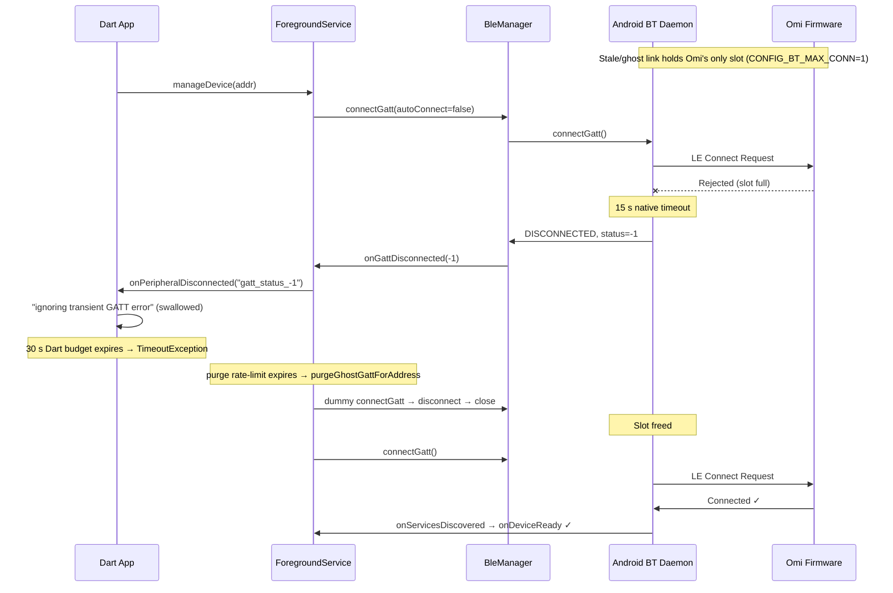

# BLE Wedge Research

A living log of "advertising but won't connect" / connection-wedge outages on the Omi
BLE link, and how each one cleared. The goal is to separate the two populations —

- **Toggle-required wedges** — cleared only when the user toggled phone Bluetooth off/on.
- **Self-clearing wedges** — cleared on their own (device came back, screen woke, Doze
  exited, a background recovery attempt landed) with no BT toggle.

— and find what distinguishes them, so we can either make the self-clearing recovery
fire for the toggle-required ones, or make the firmware/app close the outage faster.

Append a new record (template at the bottom) each time a `ble_wedge` / `ble_wedge_recovered`
pair shows up in a debug log. Classify it into one of the two buckets using the rule in
§3 and fill in the diagnostic signature — the signature is what lets patterns emerge.

Source-of-truth code:
- Detection + recovery lifecycle: `app/android/app/src/main/kotlin/com/omi/offline/OmiBleForegroundService.kt`
- Snapshot + advertising probe: `app/android/app/src/main/kotlin/com/omi/offline/WedgeDiagnostics.kt`
- GATT wrapper (ghost purge, connect/close): `app/android/app/src/main/kotlin/com/omi/offline/OmiBleManager.kt`
- Firmware counters + re-advertise: `omi/firmware/omi/src/lib/core/transport.c`
- Prose background: `NOTES.md` → "BLE: advertising but won't connect"

---

## 1. What a wedge is

The app declares a wedge after `WEDGE_NOTIFY_AFTER = 6` consecutive failed connect
attempts (`OmiBleForegroundService.kt:66`). It emits, into the same `omi_debug_*.log`:

- `ble_wedge` — the outage snapshot at detection.
- `ble_wedge_scan_probe` — the verdict of an 8 s, address-filtered, full-duty LE scan run
  right after detection: is the peripheral still on the air?
- `ble_wedge_recovered` — logged when a connect finally discovers services, carrying the
  **same environment fields** as `ble_wedge` so the two can be diffed to explain the recovery.

At `AUTONOMOUS_RETRY_STOP_AFTER = 6` failures (`:76`) native **stops** its own fast retry
loop (rapid `connectGatt`/`closeGatt` churn is itself the most common cause of daemon
wedges) and hands reconnection to a backed-off recovery alarm (2 → 4 → 8 → 16 min,
`RECOVERY_PROBE_MIN_MS` `:106`) plus the periodic sync alarm.

Wedges are **connectivity** outages, not data loss: firmware keeps writing to SD, and on
reconnect the WAL sync re-fetches everything. Across today's two wedges: `block_drops=0`,
all SD/codec drop counters 0, `ring_io_errors=0`, and the resume-offset guard rewound
correctly when a bin was missing.

---

## 2. Decoding the diagnostic fields

### `ble_wedge` / `ble_wedge_recovered` (from `WedgeDiagnostics.environmentSnapshot`)

| Field | Meaning | How to read it |
|---|---|---|
| `consecutive_failures` / `failures_before_recovery` | Failed connect attempts of any status this outage | Higher = longer/harder outage |
| `last_gatt_status` | Most recent status; `-1` = our own connect-timeout backstop fired (Android never reported) | `-1` alone = initiator wedged silent |
| `last_real_gatt_status` | Most recent *real* status Android delivered (not `-1`, not `0`) | `147` = stack actively rejecting; `8` = supervision timeout (0x08); `null` = all-timeout outage, zero callbacks |
| `bond_state` | Should be `bonded` | If not bonded, different problem |
| `omi_in_gatt_list` | Is Omi in the system GATT-profile connected list | `false` at wedge = **no ghost host link to purge** |
| `omi_acl_connected` | Does the phone hold a live ACL to Omi | `false` + `omi_in_gatt_list=false` = nothing host-side holding the firmware's single slot |
| `other_le_links` | Every *other* LE link (e.g. `Instinct 2X Solar` Garmin watch) | Coexistence context |
| `contending_le_links` | Count of the above (excludes Omi's own link) | **Diff this across wedge→recovery** — a drop is the contention signal |
| `le_link_count` | Raw system-wide total (`contending + (omi_in_gatt?1:0)`) | Goes 1→2 when Omi rejoins |
| `screen_interactive` | Screen on at that moment | **false→true across wedge→recovery = screen-wake recovery** |
| `doze_mode` | Device in Doze | Recovery with `doze=true` throughout = self-clear under Doze |
| `adapter_state` | Should be `on` | An `off` between wedge and recovery ⟹ a **BT toggle** happened (see §3) |

### `ble_wedge_scan_probe` — the pivotal field

| `verdict` | Log name | Meaning |
|---|---|---|
| ADVERTISING | `peripheral_advertising` | Omi is audibly on the air and we still can't connect → the link dies in the establishment handshake. **The connectable case.** |
| SILENT | `no_advertisements_heard` | Zero packets. Either the peripheral stopped advertising **or our own scanner was starved and never listened.** Ambiguous — this is why the app does not auto-act on it. |
| INCONCLUSIVE | `scan_failed` | Framework refused the scan (e.g. `SCANNING_TOO_FREQUENTLY`). No opinion. |
| UNAVAILABLE | `probe_unavailable` | No adapter / off / no permission. Treated as "present" for the alert. |

### Firmware counters — `device_conn_fail` / WARN line (read on each successful connect)

The peripheral's own view, persisted across reboots — **only the delta across an outage
means anything**, never the absolute value.

- `estab_fail_count` — links that came up (`err=0`) then died with **HCI `0x3e`
  (CONN_FAIL_TO_ESTAB)** — no data-channel packet in the first 6 connection events
  (`transport.c:1473`). This is what a central sees during "visible but unconnectable."
- `last_failure_adv_mode` / `last_failed_adv_slow` — advertising interval in effect at the
  last failure: `fast` (post-boot/post-disconnect) vs `slow` (1 s, after VAD sleeps).
- `failed_conn_count` — a *different* counter: connected callback fired with `err != 0`
  (told outright the attempt failed). Not establishment failures.

**Interpreting the estab delta across a wedge:**

| estab_fail_count across outage | Meaning | Fault side |
|---|---|---|
| **Rose** (+1 or more) | Omi *did* receive the CONNECT_INDs; link died at establishment | Peripheral controller / RF / coexistence |
| **Flat** (+0) | Omi never heard the CONNECT_INDs at all | Central (phone) — deaf RX or nothing reached the air |

To get the delta you need a reading from the successful connect **before** the wedge and
the one **after** it (both logged as `device_conn_fail` / `device_drop_stats`).

---

## 3. Classifying a log: toggle-required vs self-clearing

**Rule.** Look at the window between the last `ble_wedge` and the `ble_wedge_recovered`:

- **Toggle-required** if a Bluetooth adapter cycle appears in that window — the
  `bluetoothReceiver` logs `Bluetooth turning off, cleaning up GATT` → … →
  `Bluetooth on, reconnecting in 2s`, and/or `onBluetoothStateChanged("off")` then
  `("on")`. Equivalent: `adapter_state` was `on` at the `ble_wedge` but the recovery was
  immediately preceded by a STATE_OFF→STATE_ON. (A manual toggle is the only way an
  ordinary app sees the adapter go off on Android 13+.)
- **Self-clearing** if `adapter_state` stayed `on` throughout and no STATE_OFF appears.
  Then read the env diff to sub-classify *how* it cleared:
  - `screen_interactive` false→true ⟹ **screen-wake** (foreground radio priority).
  - `le_link_count` 1→2 with Doze still on / screen still off ⟹ **device-return / background
    recovery alarm** landed on its own.
  - `contending_le_links` dropped ⟹ **contention cleared**.

Record the sub-class in the "Recovery trigger" column below.

---

## 4. Observation log

### Summary

| # | Date (UTC) | Duration | Probe | Recovery trigger | **BT toggle?** | estab Δ | adv mode | last_real status |
|---|---|---|---|---|---|---|---|---|
| 0 | *(undated; pre-snapshot)* | ~4m stall cycles | *(none — pre-instrumentation)* | ghost-purge / self (30 s rate-limit expired) | **No** | *(not recorded)* | — | *none — all `-1`* |
| 1 | 2026-07-22 15:08→15:36 | 28m 16s | SILENT | screen-wake (`screen_interactive` false→true) | **No** | +1 (in 07:34–18:23 window) | fast | 147, then 8 |
| 2 | 2026-07-22 21:01→21:07 | 5m 54s | SILENT | device-return / self (Doze stayed on, screen off) | **No** | +0 (55→55) | fast | 147 |
| 3 | 2026-07-24 04:42→04:45 | 3m 12s | *(none — sub-threshold)* | **BT toggle** (`error=bluetooth_off` → immediate reconnect) | **Yes** | +0 (flat at 3) | fast | *none — all `-1`* |
| 4 | 2026-07-28 19:47→22:27 | ~2h 40m (3 cycles) | **ADVERTISING** (first ever) | Forget Device + power-cycle | **No** | +0 (flat at 61) | fast | *none — all `-1`* |

Wedge 0 is the **origin of the ghost-GATT hypothesis** and the purge fixes now shipped
(§8 background, §6 "already implemented"); it predates the env-snapshot instrumentation, so
its ghost was **inferred, not proven** (no `omi_in_gatt_list`). Tellingly, the two later wedges
that *did* carry the snapshot (1–2) showed **no ghost** — see §5.

Wedges 1–2 were **self-clearing**; Wedge 3 is the **first toggle-required** sighting — the
population §7 was hunting for. Its signature is distinct from the self-clearing pair: **every
failure was `gatt_status_-1`** (pure connect-timeout, Android never delivered a real status —
vs. the 147/8 the self-clearing wedges carried), **`estab_fail_count` flat**, and it cleared
**only** when the adapter cycled. That matches the §7 hypothesis: flat-estab + all-timeout(`-1`)
= central-side initiator wedge = a toggle (which resets the phone's own controller) is what fixes it.

### Detail — Wedge 0 (undated, ~4 min stall cycles) — the ghost-GATT origin

The forensic session that first surfaced the "stale system GATT holds the firmware's single
slot" theory and drove the two purge fixes now shipped. Predates the `WedgeDiagnostics`
env-snapshot / `scan_probe` instrumentation, so — like Wedge 3 — everything below is
reconstructed from connect/transport lines, and the ghost is **inferred, not observed**.

- Log source: device `C3:94:71:EA:A8:D5`, `uptime_ms` = 22 h 40 m at the successful connect.
- Preceded by: a clean fast connect (18:23:48→18:24:05, ~6 s), then a manual disconnect
  (`Disconnecting (isManual: true)` @ 18:24:49, `error=unmanaged`).
- Outage: auto-reconnect looped for ~4.5 min (18:24:49→18:29:13). Each cycle ran the full
  30 s Dart budget and logged repeating `gatt_status_-1` with `ignoring transient GATT error
  during connect (native will retry)`. **Every failure was `-1`** (our own timeout backstop —
  Android never delivered a real status), same all-`-1` signature as Wedge 3.
- Recovered @ 18:29:13 — connect finally landed. Best explanation: the `purgeGhostGattForAddress`
  30 s rate-limit expired and the purge flushed the daemon's stale link, freeing the slot.
  **No BT toggle.** Then the connection was **immediately killed** @ 18:29:14 by the background
  drop-guard (`_handleDeviceConnected`, app backgrounded + no sync pending) — a hard-won
  connection thrown away (see §6 candidate #5). A clean fast connect followed @ 18:33:23 (1.6 s),
  the ghost by then gone.
- Ghost caveat: no `omi_in_gatt_list` field existed at this app version, so the ghost is a
  **hypothesis** — the diagnosis rests on the all-`-1` timeouts + recovery-on-purge timing, not
  on a positive system-GATT-list reading. The later instrumented wedges (1–2) had
  `omi_in_gatt_list=false` (§5), which is why §7 still wants one instrumented ghost sighting.
- Bucket: **self-clearing (ghost-purge)** — the only ghost-class wedge on record.

### Detail — Wedge 1 (2026-07-22, ~28 min)

- Log source: app 0.31.1, device `C3:94:71:EA:A8:D5`, `uptime_ms` 995465491.
- Preceded by ~5 min of 30 s connect timeouts (`gatt_status_147`, then `-1`, then `8`).
- `ble_wedge` @ 15:08:41 — `consecutive_failures=6`, `last_gatt_status=-1`,
  `last_real_gatt_status=147`, `omi_in_gatt_list=false`, `omi_acl_connected=false`,
  `contending_le_links=1` (Garmin), `screen_interactive=false`, `doze_mode=false`.
- `scan_probe` @ 15:08:50 — **0 adv packets → SILENT**.
- Re-declared `ble_wedge` @ 15:28:17 — `consecutive_failures=11`, `last_gatt_status=8`
  (a brief 15:28 connect that dropped at supervision timeout before service discovery).
- `scan_probe` @ 15:29:08 — **0 adv packets → SILENT**.
- `ble_wedge_recovered` @ 15:36:58 — `wedge_duration_ms=1696471`, `failures_before_recovery=11`,
  `omi_in_gatt_list=true`, `omi_acl_connected=true`, `le_link_count=2`,
  **`screen_interactive=true`** (was false), `doze_mode=false`. The connect that landed
  (`_scanConnectDevice: starting connect` @ 15:36:55) used the same path that had failed
  for 28 min — it worked once the screen woke.
- estab context: `last_failure_adv_mode=fast`; `estab_fail_count` 54 @ 07:34 → 55 @ 18:23,
  i.e. **+1** somewhere in that window (this wedge is the only establishment-class event
  in it, so near-certainly its). Rising ⟹ Omi received the CONNECT_INDs; link died at
  establishment ⟹ peripheral/RF side.
- **Bucket: self-clearing (screen-wake).** No BT toggle.

### Detail — Wedge 2 (2026-07-22, ~6 min)

- `uptime_ms` 1016649537.
- Preceded @ 20:56 by a partial connect that failed **mid-transfer** — write
  `PlatformException … Not found`, `Stream closed without EOT`, `Connection lost after
  failure, aborting syncAll` — then a run of `gatt_status_-1 / 147 / 8`.
- `ble_wedge` @ 21:01:45 — `consecutive_failures=6`, `last_gatt_status=147`,
  `last_real_gatt_status=147`, `omi_in_gatt_list=false`, `omi_acl_connected=false`,
  `contending_le_links=1`, `screen_interactive=false`, **`doze_mode=true`**.
- `scan_probe` @ 21:02:46 — **0 adv packets → SILENT**.
- `ble_wedge_recovered` @ 21:07:39 — `wedge_duration_ms=353999`,
  `failures_before_recovery=7`, `omi_in_gatt_list=true`, `omi_acl_connected=true`,
  `le_link_count=2` (1→2), **`doze_mode=true` still, `screen_interactive=false` still**.
  Recovered with nothing in the environment changed except the Omi link returning →
  device came back / a background recovery attempt landed.
- Note: the first *post-recovery* connect @ 21:08 still failed (`Rejected: 4` write,
  abort); a clean sync only completed @ 21:10:45. So `ble_wedge_recovered` fired slightly
  optimistically.
- estab context: `estab_fail_count` 55 @ 18:23 → 55 @ 00:01, i.e. **+0** across this wedge.
  Flat ⟹ Omi never heard the CONNECT_INDs ⟹ central-side, consistent with SILENT.
- **Bucket: self-clearing (device-return / background recovery).** No BT toggle.

### Detail — Wedge 3 (2026-07-24, ~3 min) — first toggle-required

- Log source: app 0.31.x, device `C3:94:71:EA:A8:D5`, `live_uptime_ms` ~8.4M (2h 20m), firmware
  clean throughout (`block_drops=0`, `ring_io_errors=0`, `estab_fail_count` flat at 3).
- **No formal `ble_wedge` / `scan_probe` / `ble_wedge_recovered` emitted** — the outage cleared
  at failure **3**, below `WEDGE_NOTIFY_AFTER=6`, so the snapshot instrumentation never tripped.
  Everything below is reconstructed from the connect/transport lines. (This is itself a finding:
  a toggle-required outage can resolve before the app's own wedge detector fires, so we get no
  env snapshot / probe verdict for it. Consider lowering the snapshot threshold, or snapshotting
  on the first `bluetooth_off` during an active reconnect loop.)
- Preceded by: a clean session — last good activity was a full sync + manual battery-save
  disconnect @ 04:25:14. No mid-transfer failure led in (unlike Wedge 2). Two *earlier* drops
  this session (`gatt_status_8` @ 03:15:53, `Error 133` @ 03:55:31) were plain mid-transfer
  drops that **native auto-reconnect cleared in seconds** — not wedges.
- Outage start @ 04:42:07 — `[DeviceService] device lookup result: Omi
  (locator: DeviceLocatorKind.bluetooth)` → **the peripheral was discoverable at outage start**
  (phone's scanner heard it), then 3 connects each ran the full 30 s `_scanConnectDevice`
  timeout:
  - fail 1 @ 04:42:37 (`timed out after 30002ms`) → `gatt_status_-1`
  - fail 2 @ 04:43:22 (`timed out after 30004ms`) → `gatt_status_-1`
  - fail 3 @ 04:45:01 (`timed out after 30001ms`) → `gatt_status_-1`, incl.
    `ignoring transient GATT error during connect (native will retry): gatt_status_-1`.
  Every failure was `-1` (our own timeout backstop; **Android never reported a real status** —
  no 147, no 8). Env fields (`screen_interactive`, `doze_mode`, `contending_le_links`,
  `omi_in_gatt_list`) unavailable — no snapshot fired.
- scan_probe: **not run** (sub-threshold). But the 04:42:07 lookup hearing `Omi` is a weak
  ADVERTISING-leaning signal — the peripheral was on the air at the start.
- **Bluetooth toggle in window? YES** — @ 04:45:15 `[NativeBleTransport] … disconnected
  (error=bluetooth_off …)`, the only way an ordinary app sees the adapter go off on Android 13+.
  Recovery landed immediately: @ 04:45:17 `connecting` → @ 04:45:19 `connected`, `device ready
  after 2126ms` → @ 04:45:21 `SDCardWalSync: Loaded 0 persisted WALs`. Total outage 3m 12s.
- estab context: `last_failure_adv_mode=fast`; `estab_fail_count` was **3 for the entire
  session** (04:22 / 03:55 / 03:20 / 03:16 readings all 3); the post-recovery reading is just
  past the log tail, but flat-3 throughout ⟹ **+0 ⟹ Omi never heard the CONNECT_INDs ⟹
  central (phone) side.** Consistent with the all-`-1` timeout signature.
- **Bucket: toggle-required.** The self-clearing recovery mechanisms (screen-wake, device-return
  alarm) did **not** land in the ~3 min before the user toggled; the adapter cycle is what cleared it.

---

### Detail — Wedge 4 (2026-07-28) — bond loss caught in the act

The first wedge where the snapshot instrumentation captured the bond flipping, and the first
**ADVERTISING** probe verdict on record. Settles several open questions at once.

- Log source: app 0.31.x, device `C3:94:71:EA:A8:D5`, firmware `oo-2.8.0`.
- **The device never reset and the SD is clean.** `live_uptime_ms` climbs monotonically all day —
  `4797968` (04:07) → `53129979` (17:32) → `70820793` (22:27) = **19 h 40 m continuous**. Every
  drop counter zero throughout (`block_drops=0`, `ring_io_errors=0`, `codec_frame_drops=0`),
  `estab_fail_count` flat at **61**. The only reboot is the operator's own power-cycle at 22:28:50
  (`live_uptime_ms=2982`, `last reset = low power wake; prior boot ran 19h 40m`).
  ⟹ **The §9 crash-loop / dirty-mount hypothesis is dead for this episode.**
- **`bond_state` flipped spontaneously, phone-side, with no DFU and no unpair:**
  - `ble_wedge` @ 19:47:11 — `bond_state=bonded`
  - `ble_wedge` @ 20:06:54 — `bond_state=bonded`
  - `ble_wedge` @ 21:47:08 — **`bond_state=not_bonded`**
  - `ble_wedge` @ 22:17:08 — `not_bonded`
- `scan_probe` @ 21:47:16 — **2 adv packets, RSSI −73 → ADVERTISING**; @ 22:17:16 — 3 packets,
  RSSI −100 → ADVERTISING. The peripheral was demonstrably healthy and on the air the whole time.
- Post-flip symptom is the §9 signature exactly: connect → `device ready (14 services)` →
  `Failed to write characteristic: Disconnected` → drop, on a ~4–6 s cycle, repeating from
  22:25:29 to 22:26:16 without ever completing setup.
- Cleared by **Forget Device** @ 22:26:13 (which resets the app's own device state and re-pairs
  clean), then a power-cycle @ 22:28. The connect at 22:27:22 read the diagnostics characteristics
  successfully, and the encrypted storage characteristic worked again by 22:30:34.
- **Bucket: bond-mismatch (§9), not a wedge.** Establishment was never the problem.

**What this settles.** The bond-mismatch class is real and now directly instrumented — no longer
inferred from a confounded button press. It is also the **first ADVERTISING verdict**, answering
§7's lead question: ADVERTISING wedges do happen on this phone/device, and they are the
bond-mismatch population, not the establishment population. `CONFIG_BT_SMP_ALLOW_UNAUTH_OVERWRITE=y`
would make this failure recoverable, but was reverted as unsafe — see §9 for why, and for the
user-presence-gated design that replaces it.

**Still open:** *why* the phone dropped its bond unprompted. One plausible chain that fits the
ordering — the device's own key went first, the phone's stale-LTK connect drew a
`PIN_OR_KEY_MISSING`, and Android cleared its bond in response (which would also mean the
"Android reliably auto-clears" premise §9 doubted is correct on this handset). Unverified; a
btsnoop capture across the flip would settle it.

### Detail — Wedge 4 companion finding: the mic was wedged, and the reboot fixed it

Same log, separate fault, worth recording because the two were easy to conflate. Every recording
in the 19 h 40 m session decoded to **digital silence** — e.g. 18:38:26,
`1785263851_2496461859.bin — 2070 frames, 2025 speech frames, maxAmp=0.0000`. The high "speech"
count is force-capture from a Priority Recording, not detection; **`maxAmp` is the real signal and
it was flat zero.** The first bin of the post-power-cycle session reads
`1785277726_4189929963.bin — 1537 frames, 987 speech frames, **maxAmp=0.4998**`.

⟹ The T5838 was returning silence, the power-cycle recovered it, and `oo-2.8.0` predates the
`mic_reset()` work (PR #361) that recovers this without a reboot.

**RETRACTED: an earlier revision of this section claimed the mic "re-wedged within ~90 seconds"
after the power-cycle. That was wrong** — the operator confirmed recording was working; the short
recordings were short speech, not a fault.

The mistake was reading **empty bins as a fault signal. They are not.** In auto mode the VAD gate
means silence writes no audio at all, so a bin that closes containing only its 36-byte
`0xFFFFFFFB` metadata header (4-byte tag + 4-byte length + 28-byte payload) is the *expected*
outcome of a quiet window. `empty_bin_rotations` counts exactly that normal case, and
`Expecting N files (36 bytes total)` from `CMD_LIST_FILES` means "nothing was said", not "the mic
is dead". **Do not treat `empty_bin_rotations` or 36-byte bins as evidence of a wedge on their
own.**

What the same log does show working: `priority_starts=4`, `priority_stops=4`,
`session_end_marker_emits=4`, `marker_write_drops=0`, WAL sync fetching and deleting normally,
and the audio-bearing bin decoding and finalizing to
`recordings/2026-07-28/recording_1785277736980.wav`.

This also weakens the pre-reboot reading above: `maxAmp=0.0000` across that session is still
anomalous for a force-captured Priority Recording, but with the empty-bin signal withdrawn it is
no longer corroborated, and `maxAmp` is printed to 4 dp so a genuinely quiet room is not excluded.
Treat the 19 h 40 m wedge as **plausible, not established.**

---

## 5. What we understand about how they clear

- **Self-clearing recovery is already partly built and it works.** The backed-off recovery
  alarm (`scheduleRecoveryProbe`) is what caught Wedge 2 in ~6 min with no user action.
- **The ghost-slot purge did NOT apply to the instrumented wedges.** `purgeGhostGattForAddress`
  (`OmiBleManager.kt:212`) is the in-app analog of a BT toggle, but it only fires when a
  stale *host-side* link exists. Both instrumented wedges (1–2) had `omi_in_gatt_list=false` +
  `omi_acl_connected=false` → **no ghost to purge.** These are `0x3e`-class establishment
  wedges with zero host-held links, exactly the case the code notes has "never a ghost."
- **Only Wedge 0 was ghost-class — and even that is inferred.** Wedge 0 (§4) is where the
  ghost-GATT theory came from and it motivated the two purge fixes now shipped, but it predates
  the `omi_in_gatt_list` snapshot, so no wedge on record *proves* a ghost with a positive
  system-GATT-list reading. The purge fixes are still worth keeping (they demonstrably cleared
  Wedge 0's stall), but the two later, better-instrumented wedges say the ghost is **not** the
  dominant cause here — the SILENT-verdict, no-host-link establishment wedge is. §7 tracks the
  open item: catch one toggle-required wedge above the 6-failure snapshot threshold to settle it.
- **Why a BT toggle helps (when it does):** it resets the phone's *own* controller/initiator
  and tears down every host-side LE link — it does not repair the Omi. For a SILENT wedge
  where our scanner is starved, that reset un-starves it; for a device-absent SILENT wedge
  it does nothing.
- **The two recovery mechanisms observed** map to different fixes:
  - screen-wake (Wedge 1) → emulated by a *fresh scan + connect* on the phone side.
  - device-return (Wedge 2) → governed by how fast the *firmware* re-advertises after a
    link dies; nothing the phone does can beat the device being silent.

---

## 6. Candidate interventions

**Already shipped (ghost-era, from the Wedge 0 analysis):** purge the stale system GATT
*before* the first `connectGatt` (not just inside the retry loop), and cut
`GHOST_PURGE_MIN_INTERVAL_MS` from 30 s so a re-armed ghost can be flushed sooner
(`OmiBleForegroundService.kt`). These cleared Wedge 0 but do nothing for the no-ghost
SILENT wedges (1–2), which is what the candidates below target.

Not yet implemented:

1. **Scan-gated reconnect on ADVERTISING** (phone-side, low-risk). Today the probe's
   ADVERTISING verdict (`OmiBleForegroundService.kt:1148`) only drives the alert; the
   follow-up reconnect is still a blind `connectGatt` to the cached handle. Instead,
   connect directly to the `ScanResult.device` the probe just heard (fresh timing anchor —
   the `_scanConnectDevice` pattern that cleared Wedge 1). Reuses the probe's scan, fires
   only when a device is audible, adds no churn against an absent device.
   **Caveat: does nothing for a SILENT wedge — which is what both logged wedges were.**
2. **Firmware re-advertise latency** (firmware-side, likely highest leverage for the SILENT
   case). Wedge 2 cleared only when the Omi re-advertised. If the peripheral sits in a
   half-open / non-advertising state until a supervision timeout expires, forcing a faster
   re-advertise after a dead/half-open link would turn multi-minute recoveries into seconds.
   Trace `transport.c` disconnect → `bt_le_adv_start` path and the supervision timeout.
3. **Scanner recycle** (phone-side, weak). Stop/restart our own LE scan to un-starve a
   wedged scanner on a SILENT verdict. Cheap but unproven.
4. **Auto BT-toggle** — only possible on Android ≤ 12 (`disable()/enable()` blocked on 13+),
   disrupts the Garmin link, heavy-handed. Not recommended; the alert already covers the
   present-and-reachable case.
5. **Exempt long-running reconnects from the background drop-guard** (from Wedge 0). When a
   connect cycle spans minutes, the app has usually been backgrounded by the time it lands, and
   `_handleDeviceConnected` (`device_provider.dart`) kills the hard-won link because no sync was
   pending — Wedge 0 lost its 18:29:13 connect exactly this way. Track whether the cycle *started*
   in the foreground / during a sync (e.g. set `_pendingSyncResume` at the start of
   `_scanConnectDevice`) and let that connection through.
6. **Runtime ghost-monitor logging** (diagnostic, from the Wedge 0 analysis). Periodically log any
   address that is in `bluetoothManager.getConnectedDevices(GATT)` but not in our `connectedGatts`,
   and always log a `purgeGhostGattForAddress` hit even when rate-limited. This is what would finally
   confirm-or-kill the ghost hypothesis for a toggle-required wedge (the §7 open item) without
   touching the connect path.

Deliberately **not** doing: hammering reconnects harder. Rapid `connectGatt`/`closeGatt`
churn is the #1 cause of daemon wedges, which is why `AUTONOMOUS_RETRY_STOP_AFTER` exists.

---

## 7. Open questions — what more logs should settle

- **Do ADVERTISING wedges ever happen for this phone/device?** Both samples are SILENT. If
  SILENT dominates, intervention #1 won't help and #2 (firmware) is the real lever.
- **Does the toggle-required population have a different signature** — ADVERTISING probe?
  `omi_in_gatt_list=true` (a real ghost, so the purge *should* have fired but didn't)?
  a rising estab delta? *Partially answered by Wedge 3:* its signature was all-`gatt_status_-1`
  (pure timeout, no real status) + **flat** estab delta + peripheral discoverable at outage
  start — i.e. **not** a rising/ADVERTISING-establishment signature; it looks central-side. But
  Wedge 3 cleared sub-threshold so we have **no full env snapshot / probe verdict** for it. Still
  need one toggle-required wedge that trips the 6-failure snapshot to confirm `omi_in_gatt_list`
  and the probe verdict.
- **estab delta on each wedge** — is "rose vs flat" a reliable predictor of toggle-required?
  Hypothesis: flat/SILENT = central-side scanner starvation = toggle helps; rose/ADVERTISING
  = establishment RF failure = toggle only helps by resetting the initiator.
- **Contention** — does a wedge ever coincide with `contending_le_links` > 1, and does the
  toggle-required set correlate with the Garmin being connected?

---

## 8. Pipeline & terminology reference (background)

Static reference for the layers a wedge passes through, and the synthetic status code they emit.
Merged in from the original ghost-GATT deep-dive (the Wedge 0 analysis). Line numbers drift —
treat them as a starting point, not gospel.

### The connection pipeline, top to bottom

| Layer | Component (`file:line`) | Key behavior |
|---|---|---|
| 1. Dart orchestrator | `periodicConnect` (`device_provider.dart:568`) | `Timer.periodic` every 15 s; calls `scanAndConnectToDevice()` when `!isConnected && connectedDevice == null && !isConnecting`. |
| 1. Dart orchestrator | `_scanConnectDevice` (`device_provider.dart:590`) | Core attempt: `ensureConnection(force:true)` raced against a 5 s probe, starts a parallel scan on probe-fail, ~30 s total budget. |
| 1. Dart orchestrator | `onDeviceDisconnected` (`device_provider.dart:1250`) | Foreground + accidental → backoff reconnect `1→2→4…→60 s`. Background → no auto-reconnect (sync timer drives it). |
| 2. Mutex gate | `ensureConnection` (`devices.dart:247`) | Single-entry `Mutex`. Already connected → return. `force=false` + transport exists → return null (let native handle). `force=true` → `_connectToDevice`. A stuck attempt blocks all callers up to 30 s. |
| 3. Dart↔native bridge | `connect()` (`native_ble_transport.dart:59`) | `manageDevice` via Pigeon, `await`s `_deviceReadyCompleter` with a 30 s timeout. |
| 3. Dart↔native bridge | `_handleConnectionState` (`native_ble_transport.dart:308`) | **Transient-error swallower:** while connecting, a `133`/`-1` error is ignored ("native will retry"); anything else fails the completer. This is the `ignoring transient GATT error` log. |
| 4. Kotlin conn owner | `connectToDevice` (`OmiBleForegroundService.kt:482`) | Closes stale handle; `autoConnect=false` for first 3 retries then `true`; 15 s (direct) / 30 s (autoConnect) timeout → `handleDisconnection(status=-1)`. |
| 4. Kotlin conn owner | `handleRetryLogic` (`OmiBleForegroundService.kt:717`) | Backoff `1.5→3→6→12→24→30 s`; each retry calls `purgeGhostGattForAddress()`, rate-limited by `GHOST_PURGE_MIN_INTERVAL_MS`. |
| 5. Kotlin GATT wrapper | `onConnectionStateChange` (`OmiBleManager.kt:552`) | `STATE_CONNECTED` → 15 s service-discovery timeout + `discoverServices()`; `STATE_DISCONNECTED` → cleanup + `onGattDisconnected(status)`. |
| 5. Kotlin GATT wrapper | `purgeGhostGattForAddress` (`OmiBleManager.kt:168`) | The ghost fix: if the address is in the system GATT-connected list but not our `connectedGatts`, open a dummy GATT and immediately disconnect+close it to flush daemon state. |

### `gatt_status_-1` is synthetic

Not a real Android status. It's our own value from two timeout backstops, both meaning "GATT
associated but service discovery never completed in time" — the exact footprint of a slot the
firmware can't accept:

- native connect timeout — `handleDisconnection(addr, hash, -1)` (`OmiBleForegroundService.kt:531`)
- service-discovery timeout — `onGattDisconnected(address, hash, -1)` (`OmiBleManager.kt:562`)

A run of all-`-1` failures with **no** real status (no `147`/`8`) is the central-side / timeout
signature (Wedges 0 and 3); a real `147` (stack rejecting) or `8` (0x08 supervision timeout)
means Android actually delivered a verdict (Wedges 1–2).

### The stall, as a sequence



---

## 9. Not a wedge: the bond-mismatch outage (2026-07-28)

A distinct failure class that **looks** like a wedge in the connect logs but is not one, and
must not be filed as Wedge N. Recorded here so the next occurrence is recognised in seconds.

### How to tell it apart

A wedge (§1) is a failure to *establish*: connects time out or die before service discovery,
and the probe argues about whether the peripheral is on the air at all. This one establishes
**perfectly, every time**, and then dies:

```
connected → device ready after ~620 ms (services discovered) → dropped 1–4 s later
```

repeating indefinitely, interleaved with `gatt_status_8`. The tell is the pair of
`device ready after <n>ms` **followed by a drop a second or two later** — a wedge never gets
that far. `gatt_status_8` here is a consequence, not a cause: the peer stops answering
without an LL_TERMINATE, so the central reports the supervision timeout.

Observed 2026-07-28 02:44–02:48 UTC on `C3:94:71:EA:A8:D5` immediately after an `oo-2.8.0`
flash — four cycles: ready@02:47:59.806→drop@02:48:01.2 (1.4 s), ready@02:48:31.7→drop@02:48:35.4
(3.7 s), ready@02:48:52.5→drop@02:48:56.4 (3.9 s).

### Mechanism

Nearly every functional Omi characteristic is encryption-gated, so an unencryptable link
passes service discovery and then fails on first use:

| Characteristic | Source | Permission |
|---|---|---|
| Time sync write `0031` — **written on every connect** | `transport.c:299` | `PERM_WRITE_ENCRYPT` |
| Settings `0011`–`0016` | `transport.c:172–203` | `PERM_READ_ENCRYPT \| PERM_WRITE_ENCRYPT` |
| Storage stream + CCC | `storage.c:138/142/145/149` | `PERM_*_ENCRYPT` |
| Mute `0071` | `transport.c:919/923` | `PERM_READ_ENCRYPT \| PERM_WRITE_ENCRYPT` |

The connect-time time-sync write is the first encrypted access, which is why the drop lands
~1 s after discovery rather than at connect.

### Why it never self-heals (the root cause)

Omi has no IO capabilities ⟹ every pairing is Just Works ⟹ every bond is **unauthenticated**.
In NCS v2.9.0, `zephyr/subsys/bluetooth/host/smp.c` `update_keys_check()` (:645–652) returns
false when an unauthenticated LTK for that peer already exists and a Just Works pairing is
attempted, unless `CONFIG_BT_SMP_ALLOW_UNAUTH_OVERWRITE` (or `CONFIG_BT_ID_ALLOW_UNAUTH_OVERWRITE`)
is set. Callers answer `BT_SMP_ERR_AUTH_REQUIREMENTS` (:3001, :3229). Neither symbol was set in
the firmware tree, and deliberately still are not — see the reverted-fix note below.

So once the two sides' bond state diverges, **the device refuses to re-pair, permanently**:

- A phone Bluetooth toggle cannot fix it — bonds are persistent flash/NVS on both sides. This
  is the discriminator against §3's toggle-required bucket: there a toggle *is* the cure; here
  it provably is not.
- `CONFIG_BT_MAX_PAIRED=1` (`omi.conf:120`) leaves no second slot.
- The only exit is wiping the **device's** bond: `bt_unpair` at `button.c:482`, reached by the
  5-tap + 10 s hold (`UNPAIR_HOLD_TIME`, `button.c:140`). Doing that is the confirming test.

**Attempted fix, REVERTED — `CONFIG_BT_SMP_ALLOW_UNAUTH_OVERWRITE=y`.** Setting it does make
the state recoverable, but it is not safe here, and the review that caught it was right.

With `CONFIG_BT_MAX_PAIRED=1` and `CONFIG_BT_KEYS_OVERWRITE_OLDEST` unset (default `n`), a peer
presenting a *different* address already cannot pair at all — key storage is full, `bt_keys_get_addr()`
returns NULL, pairing fails. So the **only** thing that flag changes is whether a peer presenting the
**bonded phone's identity address** may overwrite its Just Works LTK. Omi has no IO capabilities, so
that pairing is unauthenticated and unprompted: an attacker in range while the phone is away would
take over the encrypted GATT — which includes the storage service, i.e. every recording on the card —
and lock the real phone out. The justification originally written into `omi.conf` ("an attacker can
already pair when the device is unbonded") is true but does not cover the bonded case, which is
exactly the case the flag opens.

**Proper fix, not yet implemented** (needs a build + on-device test): keep the overwrite closed by
default and gate it on user presence with a `bt_conn_auth_cb.pairing_accept` callback —

```c
static enum bt_security_err pairing_accept(struct bt_conn *conn,
                                           const struct bt_conn_pairing_feat *const feat)
{
    /* Nothing to steal when unbonded; otherwise require a recent button press. */
    if (transport_bond_count() == 0) return BT_SECURITY_ERR_SUCCESS;
    return pairing_window_open() ? BT_SECURITY_ERR_SUCCESS : BT_SECURITY_ERR_PAIR_NOT_ALLOWED;
}
```

with the window opened for ~60 s by any button press. That is strictly better than both states: a
fresh device still pairs freely, an attacker is refused exactly as today, and a de-synced phone
recovers with one tap instead of the 10-second 5-tap ritual.

**Until then the recovery path is the 5-tap unpair**, which is clumsy but is itself a user-presence
gate.

### Leading hypothesis (2026-07-28): the DFU reset never unmounts the SD card

Every reset path in this firmware flushes and unmounts the SD **except the one the DFU uses**:

| Path | Unmounts first? |
|---|---|
| Power-off gesture (`button.c:625-626`) | `app_sd_off()` ✓ |
| `CMD_REBOOT` `0x16` (`storage.c:1013-1014`) | `app_sd_off()` ✓ |
| `CMD_POWER_OFF` `0x17` (`storage.c:1086-1087`) | `app_sd_off()` ✓ |
| **mcumgr DFU reset** (SMP OS group, cmd 5) | **nothing** ✗ |

The only `mgmt_callback_register` in the firmware is `ota_mgmt_cb` for
`IMG_MGMT_DFU_STARTED`/`STOPPED` (`main.c:397`). Nothing hooks
`MGMT_EVT_OP_OS_MGMT_RESET`. So the DFU's reset is a bare `sys_reboot` onto a live,
mounted, possibly mid-write volume — and `storage.c:1001-1004` states exactly why that is
unsafe: *"Gracefully close the SD card first … so a reboot landing mid-write doesn't tear an
in-progress block."* **Only OTAs skip it.**

Predicts both reported symptoms from one cause:

- **Boot blocks on a dirty mount** → SD worker stalls → watchdog resets → **crash loop**. Each
  boot advertises, accepts a connection, dies ~1–3 s in. That is the observed trace, and it
  explains `gatt_status_8` (peer silently gone, no LL_TERMINATE) — which the bond theory never
  explained. A power cycle clears it; a phone BT toggle cannot.
- **Mounts onto a corrupt volume** → records nothing → "had to wipe the storage", with the
  backend setting still intact because NVS was never involved.

**This now outranks the bond-mismatch reading.** It is more economical, it fits status 8, and it
requires no NVS loss — which the operator reports never seeing.

**Fix** (not applied — a hang here breaks the update path, and it is unbuildable/untestable on the
analysis machine): register `MGMT_EVT_OP_OS_MGMT_RESET` (present in NCS 2.9,
`zephyr/mgmt/mcumgr/grp/os_mgmt/os_mgmt_callbacks.h`) alongside the existing `ota_mgmt_cb` and do
what the other three paths do — `if (is_sd_on()) app_sd_off();` before letting the reset proceed.
Use a **bounded** wait: if the SD is already wedged, an unbounded `app_sd_off()` in the callback
would hang the reset and fail the DFU outright.

### Evidence note — button config is not a witness

`buttonConfigManual` / `buttonConfigAuto` are **re-pushed by the app on every connect**
(`DeviceProvider.pushActiveButtonConfig`), so their survival across an update says nothing about
whether NVS survived. Only device-owned keys count: **storage backend** and **Priority Recording
cap**. Operator reports the storage backend surviving intact, and has never observed a setting
revert after an update — which is evidence *against* the NVS-sector-loss lead below.

### Competing hypotheses — this diagnosis is NOT settled

Everything below this line survived an adversarial pass only partly. Read these before acting
on it.

**1. The recovery evidence is confounded.** The whole "it was a bond mismatch" reading leans on
the 5-tap + 10 s hold (`bt_unpair`, `button.c:482`) being what cleared it. But **4**-tap + hold
is `turnoff_all()` — power off (`button.c:425`). The two gestures are adjacent, and the reporter
described *both* rebooting the device and doing a button combo. A power-cycle alone would clear a
crash-loop or a wedged stack, with no bond involved. `bt_unpair` does **not** reboot (no
`sys_reboot` on that path), so the two are separable in principle — but not from the report we
have.

**2. `gatt_status_8` argues against SMP rejection.** Status 8 is `GATT_CONN_TIMEOUT` — the peer
stopped answering on air with no LL_TERMINATE. An SMP pairing failure normally produces an
explicit peer-initiated disconnect (Android `GATT_AUTH_FAIL` 137, or status 5), not a supervision
timeout. A device that **crashed, watchdog-reset, or browned out** ~1–3 s into each connection
produces exactly the observed trace — connect, discover services, silence, timeout, repeat — and
fits status 8 *better* than the bond theory does.

**3. The direction inference rests on a shaky premise.** "Phone stale / device unbonded
self-heals" assumes Android reliably clears its own bond on `PIN_OR_KEY_MISSING`. Android stacks
are inconsistent here; several retry with the stale key indefinitely. If this phone is one of
those, that direction *also* never self-heals, and the argument that the **device** held the
stale bond collapses — along with the claim that `CONFIG_BT_SMP_ALLOW_UNAUTH_OVERWRITE` would
have prevented this particular outage.

**4. The NVS-overlap theory is probably wrong.** Partition Manager performs overlap validation;
a `settings_storage` genuinely overlapping `mcuboot_primary` would most likely fail the build,
and this firmware builds. NCS also redirects `FIXED_PARTITION(storage_partition)` to the PM
partition when PM is active, so the "falls back to the DT partition at `0xf8000`" step is
doubtful. Treat the section below as an unverified lead, not a finding.

**What settles it:** the `reset_cause` + `uptime_seconds` from the Diagnostics characteristic
(`0x19B10061`) on the **first successful connect after recovery**. A small uptime and/or a
watchdog/brownout cause ⟹ the device was resetting, and hypotheses 1–3 win outright. A large
uptime (hours) ⟹ the device was up throughout, and the bond reading survives. That reading is
already logged as `device_conn_fail` / `device_drop_stats` (§2) — it just wasn't in the excerpt.

The *analysis* stands regardless of the retracted fix: the unrecoverable
refuse-to-re-pair state is provable from the source alone (encrypted characteristics + `smp.c`
`update_keys_check` + the config being unset), independent of whether it caused *this* outage.

### Unverified lead — settings NVS possibly inside the MCUboot app slot

Which side held the stale bond: **the device did, the phone did not.** The two directions have
different observable fates, and only one matches:

- *Phone stale / device unbonded* — phone asks to encrypt, device answers `PIN_OR_KEY_MISSING`,
  Android drops its bond, next connect is a clean Just Works pair ⟹ **self-heals in a couple of
  attempts.** This outage did not, across ~5 min and many attempts.
- *Device bonded / phone unbonded* — status 5, Android auto-elevates, `update_keys_check`
  refuses ⟹ **never self-heals**, and the only exit is wiping the device bond. Matches, and
  matches the 5-tap combo being what cleared it.

Not caused by the app's post-DFU bond wipe: that path is inert (`firmware_update.dart:43`
`_showResetPairingToggle = false`, so `wipeBonds` at :575 is always false and
`_wipePhoneBondOnSuccess` returns early, `firmware_mixin.dart:238`). The DFU sent a *disarm*.

**Root cause: the settings partition overlaps the MCUboot primary slot.** The board DTS the
build actually includes (`boards/omi/omi_nrf5340_cpuapp.dts:261` →
`zephyr/dts/common/nordic/nrf5340_cpuapp_partition.dtsi`) places `storage_partition` at
**`0xf8000`–`0x100000`** (32 KB). `boards/omi/pm_static.yml` pins `mcuboot_primary` to
**`0x10000`–`0x100000`** and `mcuboot_primary_app` to `0x10200`–`0x100000`. The NVS holding the
BLE bonds *and* every `omi/*` setting therefore sits **inside the slot MCUboot rewrites on every
update**.

**How much of it gets erased — the part that makes this fit the evidence.** A whole-slot erase
would destroy the NVS on *every* update, which the history falsifies: bonds usually survive (that
is why the reset-pairing toggle was hidden). The actual behaviour is narrower.
`sysbuild/mcuboot.conf` sets `CONFIG_BOOT_UPGRADE_ONLY=y`, which the Zephyr port
(`bootloader/mcuboot/boot/zephyr/include/mcuboot_config/mcuboot_config.h:72-75`) expands to
**both** `MCUBOOT_OVERWRITE_ONLY` **and** `MCUBOOT_OVERWRITE_ONLY_FAST`. Under FAST,
`boot_copy_image` (`boot/bootutil/src/loader.c:1872-1899`) erases sectors from the slot start only
up to the *image size* and then breaks, and separately erases only the **trailer sectors at the top
of the slot**. The image stops far below `0xf8000`, and the overwrite-only trailer (magic +
image-ok + swap-info) rounds to a single 4 KB sector.

Net: **one of the eight NVS sectors — `0xff000`–`0x100000` — is erased per OTA.** NVS is a
circular log; it re-inits that sector as free and recovers structurally, but any key whose only
live copy was sitting there is lost. Bonds are rewritten rarely, so they drift around the ring and
land in the doomed sector roughly 1 flash in 8. That is precisely the observed "usually survives,
occasionally doesn't", and it gives `oo-2.7.3` a real mechanism: dropping the redundant pre-flash
NVS write lowered the odds of the freshest bond copy sitting in the top sector at flash time,
without moving the NVS.

**Free test, since the mechanism is indiscriminate:** it should intermittently eat *other* `omi/*`
keys too — storage backend, Priority Recording cap, button config. A history of settings silently
reverting after an OTA is strong confirmation; never seeing that across many flashes while bonds
have been lost more than once weakens the theory badly.

Not a candidate: the **Ring** audio backend. `sd_ring.c:96-104` writes via `disk_access_*` on
`CONFIG_SDMMC_VOLUME_NAME` — the SD NAND on `sdhc0` (spi3 CS0), a different physical chip from
both the internal flash and the P25Q16H NOR. It cannot reach the bond storage.

`pm_static.yml` defines **no `settings_storage`**, and `flash_primary` has zero free space
(`mcuboot` `0x0`–`0x10000` + `mcuboot_primary` `0x10000`–`0x100000` spans it entirely), so
Partition Manager has nowhere to place one — the DT partition at `0xf8000` is the only candidate,
and it is inside the slot.

This is intermittent rather than total because NVS is a wear-levelled ring over 8 sectors: how
much survives depends on which sectors hold the live copy of each key and how far the incoming
image extends. It also explains why `oo-2.7.3`'s mitigation (dropping a redundant pre-flash NVS
write) helped without fixing anything — it only changed the odds of a live copy sitting in a
doomed sector.

Settles a contradiction in the codebase: `OmiBleForegroundService.kt:980` ("the firmware's NVS
bond store sits inside the mcuboot app slot and gets wiped on swap") is **right**;
`firmware_update.dart:37–42` ("bonds are expected to survive a DFU — the flash never reaches the
memory that stores them") is **wrong**, and it is the stated premise for hiding the reset-pairing
toggle.

**Not yet verified by a build** — no Zephyr toolchain on the analysis machine, so the generated
`build/partitions.yml` has not been read. Confirm either by building and checking whether a
`settings_storage` partition is emitted, or by reading flash at `0xf8000` before and after an OTA.

**Fix** (not applied — needs an image-size check from a real build): carve the settings partition
out of the slot. End `mcuboot_primary` / `mcuboot_primary_app` at `0xf8000`, add an explicit
`settings_storage: 0xf8000`–`0x100000` outside the mcuboot span, and let `share_size` shrink
`mcuboot_secondary` to match. Two consequences: the app slot loses 32 KB (`0xefe00` → `0xe7e00`,
~950 KB — check headroom first), and because MCUboot is **not** OTA-updatable here
(`SB_CONFIG_MCUBOOT_UPDATEABLE_IMAGES=2` covers the app and net cores only), the currently
installed MCUboot still believes the slot runs to `0x100000` and will still write its trailer
there. **The fix only lands via a wired flash**; an OTA alone will not apply it.

---

## 10. New-record template

Copy this block per new wedge, add a summary-table row, and set the bucket.

```
### Detail — Wedge N (YYYY-MM-DD, ~D min)

- Log source: app <ver>, device <mac>, uptime_ms <n>.
- Preceded by: <what led in — timeouts, mid-transfer failure, etc.>
- ble_wedge @ <t> — consecutive_failures=<n>, last_gatt_status=<s>,
  last_real_gatt_status=<s>, omi_in_gatt_list=<b>, omi_acl_connected=<b>,
  contending_le_links=<n>, screen_interactive=<b>, doze_mode=<b>, adapter_state=<s>.
- scan_probe @ <t> — <n> adv packets → <VERDICT>.
- Bluetooth toggle in window? <yes/no — cite the STATE_OFF→STATE_ON lines if yes>
- ble_wedge_recovered @ <t> — wedge_duration_ms=<n>, failures_before_recovery=<n>,
  <env fields; note which ones changed vs the ble_wedge snapshot>.
- estab context: last_failure_adv_mode=<fast/slow>; estab_fail_count <before>→<after>
  = <Δ> ⟹ <rose: peripheral/RF | flat: central>.
- Bucket: <toggle-required | self-clearing (screen-wake | device-return | contention-cleared)>.
```
