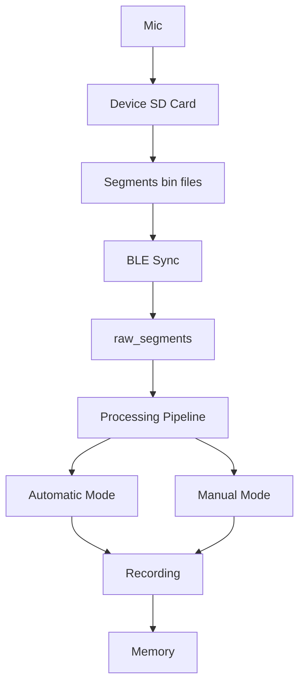

# Omi Offline

Omi Offline is a hardware-software ecosystem designed for **reliable, loss-minimized audio capture** in completely disconnected environments. The system prioritizes local data integrity, robust synchronization, and deterministic processing over cloud dependency.

## 🛡️ Offline-First Philosophy

Unlike traditional recorders, Omi Offline is architected for a reality where the connection to a mobile device is inherently intermittent.
- **Hardware Fallback:** The Nordic nRF5340-based hardware automatically captures and writes raw **Frames** to an onboard SD card whenever the BLE link is saturated or absent.
- **Data Sovereignty:** All **Processing**, from raw **Frame** ingestion to final **Recording** transcoding, occurs locally on the mobile device.
- **Atomic Ingestion:** The system uses a Write-Ahead Log (**WAL**) to ensure resumable, ordered ingestion without duplication under normal operation.

**Core Invariant:** At every stage, audio data remains strictly ordered and loss-resistant from capture to final **Recording**.

## 🏗️ Technical Architecture & Flow

The system follows a strict storage model to ensure consistent data alignment from capture to the UI.

### 🔄 Data Lifecycle


### 1. The Capture Pipeline
1.  **Frame:** The atomic unit of encoded Opus audio (~20ms).
2.  **Segment:** The canonical storage unit (.bin) containing a fixed target number of **Frames**. The final **Segment** in a sequence may be partial.
3.  **DeviceSession:** An internal hardware-bound concept representing a continuous stream from boot to disconnect.

### 2. Synchronization (The WAL Engine)
The sync engine follows a monotonic, append-only logic:
- **Scan & Ingest:** The app scans the device's **WAL** and pulls missing **Segments**.
- **Progress Tracking:** Ingestion is tracked via `lastSyncedSegmentIndex` to ensure resumable, ordered copies of device storage.

### 3. Processing & Transcoding
- **OfflineAudioProcessor:** Uses a custom `FrameRef` (disk-pointer) architecture to process hours of audio without memory bloat.
- **Data Alignment:** The pipeline handles transport-specific frame prefixes to maintain precise timing alignment across varying conditions.
- **Stitching:** Multiple **Segments** are merged into a single **Recording** (M4A) once processed. **Recordings** may become partially playable before a **Capture** completes.

## ⚙️ Processing Modes & Settings

Omi Offline provides granular control over how audio is extracted from the raw stream.

### Processing Modes
- **Automatic (VAD):** Continuous, noise-adaptive **Processing**. The pipeline analyzes every synced **Segment** using Voice Activity Detection to automatically generate a **Recording** whenever speech is identified and subsequently followed by a silence threshold.
- **Manual (Star-Marker):** Selective, event-driven extraction. The system stores the full stream but only generates a **Recording** when a "star-marker" (manual trigger, e.g., hardware double-tap) is identified. It then extracts a precise, temporally-aligned window of audio around that event.

### Sync Behavior
- **Autosync (Hourly):** The app triggers an automatic background sync every hour. It attempts to download all missing **Segments** from the device and process them into **Recordings**, ensuring the user's **Memory** list is up-to-date whenever they open the app.
- **Manual Sync:** Users can manually initiate a sync at any time via the UI to immediately pull every available **Segment** and finalize any pending **Recordings**.

### Device VAD Settings
The Voice Activity Detection (VAD) is noise-adaptive and can be tuned via these parameters:
- **Split Threshold (`offlineSplitSeconds`):** The duration of silence required to consider an interaction finished and trigger a split.
- **Gap Threshold (`offlineGapSeconds`):** The maximum allowed time gap between consecutive **Segments** before the pipeline forces a new **Recording**.
- **SNR Margin (`offlineSnrMarginDb`):** The Signal-to-Noise Ratio threshold used to distinguish speech from background noise.

## 🔌 Integrations

- **HeyPocket:** First-class integration for automatic cloud synchronization. Final **Recordings** can be automatically uploaded to HeyPocket for advanced AI analysis and archival.

## 📋 Standardized Nomenclature

Refer to [NOMENCLATURE.md](./NOMENCLATURE.md) for the authoritative terminology. Key concepts include:
- **Segment:** The physical `.bin` storage unit.
- **Capture:** The active streaming state.
- **Recording:** The final audio artifact.
- **Memory:** The high-level UI object.

## 🚀 Getting Started

### Prerequisites
- [Flutter SDK](https://docs.flutter.dev/get-started/install)
- [nRF Connect SDK](https://developer.nordicsemi.com/nRF_Connect_SDK/doc/latest/nrf/installation.html) for Zephyr RTOS.

### Development
```bash
cd app
flutter pub get
flutter run
```

Refer to `NOMENCLATURE.md` before introducing any new state or storage variables.
