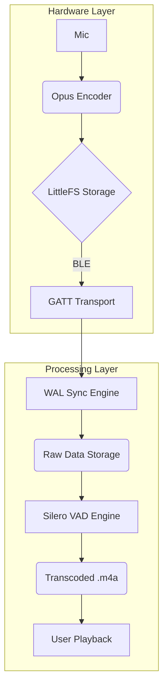

# 🎙️ Omi Offline

**An offline-first, highly private audio capture and processing system for wearables.**

Omi Offline is a privacy-centric ecosystem designed to transform wearable hardware into a secure, personal audio journal. It prioritizes local-only operation, ensuring that your most personal data—your conversations and thoughts—never leave your physical control until you decide to export them.

---

## 🔒 Core Principles

- **Privacy First:** No cloud processing. No mandatory internet connection. Your voice stays on your device.
- **Data Integrity:** Power-loss resilient storage and resumable synchronization ensure zero data loss in the real world.
- **Intelligent Silence:** Advanced on-device neural networks filter noise and silence, delivering only the moments that matter.
- **Open Transparency:** A fully open-source stack from the RTOS firmware to the Flutter mobile application.

---

## 🏗 System Ecosystem

The Omi Offline experience is powered by two tightly integrated layers:

### 1. The Wearable (Firmware)
Running on the **nRF5340 SoC** using **Zephyr RTOS**, the firmware is optimized for high-fidelity audio capture and long-term durability.

- **Audio Capture:** Uses high-sensitivity PDM microphones to capture 16 kHz mono audio.
- **Real-time Encoding:** Compresses raw PCM into **Opus** frames instantly to maximize storage efficiency.
- **Resilient Storage:** Utilizes **LittleFS** on eMMC/SD storage. This copy-on-write filesystem ensures that even if the battery dies mid-sentence, your recording is safe.
- **Power Intelligence:** Features **Acoustic Activity Detection (AAD)** to put the main processor to sleep during silence, waking it only when speech is detected.
- **Physical Interaction:** 
  - **Double-Tap:** Inserts a hardware-level **Marker** into the stream to flag important moments.
  - **Triple-Tap-Hold:** Triggers a clean hardware power-off.

### 2. The Mobile App (Software)
A cross-platform **Flutter** application that acts as the brain of the system, handling synchronization, neural processing, and playback.

- **Robust Sync (WAL):** Uses an append-only **Write-Ahead Log (WAL)** protocol. The app tracks byte offsets, allowing it to resume syncing from the exact point of disconnection.
- **Pigeon Native Bridge:** Bypasses generic BLE libraries in favor of a custom-built native GATT bridge, ensuring rock-solid stability on both iOS and Android.
- **Neural VAD Pipeline:** Powered by the **Silero VAD** neural network running via **ONNX Runtime**. It segments hours of raw audio into discrete conversations by detecting speech boundaries entirely on the phone.
- **Iterative Adjustment:** raw audio data can be re-processed with different sensitivity settings without needing to re-sync from the wearable.

---

## 🔄 The Data Lifecycle

```mermaid
graph TD
    subgraph Wearable [Hardware Layer]
        A[Mic] --> B(Opus Encoder)
        B --> C{LittleFS Storage}
        C -->|BLE| D[GATT Transport]
    end

    subgraph Mobile [Processing Layer]
        D --> E[WAL Sync Engine]
        E --> F(Raw Data Storage)
        F --> G[Silero VAD Engine]
        G --> H(Transcoded .m4a)
        H --> I[User Playback]
    end
```

1. **Capture:** Audio is encoded and written to the wearable's internal storage.
2. **Sync:** When connected via BLE, the app pulls data using a framed protocol that handles gaps and overlaps.
3. **Segment:** The VAD engine scans the synced data, identifying speech and silence.
4. **Finalize:** Speech segments are transcoded into high-quality `.m4a` files, organized by date and time.

---

## 🛠 Project Structure

- `app/`: The Flutter mobile application.
  - `lib/services/wals/`: The core synchronization logic.
  - `lib/services/vad_audio_processor.dart`: The neural processing pipeline.
- `omi/firmware/`: The Zephyr-based C firmware.
  - `src/sd_card.c`: LittleFS and storage driver logic.
  - `src/lib/core/transport.c`: The custom BLE communication protocol.
- `NOMENCLATURE.md`: The definitive project glossary.

---

## 🤝 Reliability & Standards

- **Atomic Operations:** All storage and sync operations are designed to be atomic. Partial files are identified and resolved automatically.
- **Nomenclature:** The project follows a strict naming standard (see `NOMENCLATURE.md`) to ensure consistency between C firmware and Dart application code.
- **Validation:** Includes a comprehensive suite of unit and integration tests to verify the audio pipeline and sync stability.

---

## 📖 Getting Started

To explore or contribute to the project:

1. **Firmware:** Requires the **nRF Connect SDK**. See the [Firmware Guide](./omi/firmware/readme.md) for build instructions.
2. **App:** Requires **Flutter**. Run `./setup.sh` in the `app` directory to initialize the environment.

Enjoy your private, intelligent audio journal! 🎙️
