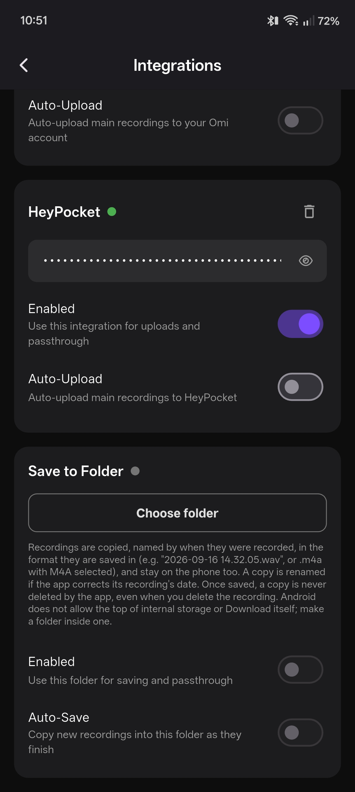

# Omi Offline

A personal fork of the [Omi](https://github.com/BasedHardware/omi) wearable project, rebuilt entirely around local, private audio capture and processing. No cloud dependencies, no internet requirement — audio stays on your device until you choose to export it.

**Current versions:** App `0.24.1` · Firmware `oo-2.2.1`

---

## Screenshots

<table>
<tr>
<td align="center" width="33%"><br><sub>Conversation Page</sub></td>
<td align="center" width="33%"><br><sub>Recording Modes</sub></td>
<td align="center" width="33%"><br><sub>VAD Option</sub></td>
</tr>
<tr>
<td align="center" width="33%"><br><sub>Device Settings</sub></td>
<td align="center" width="33%"><br><sub>Integrations</sub></td>
<td width="33%"></td>
</tr>
</table>

---

## What it does

The nRF5340 wearable captures audio continuously via PDM microphones, encodes it as Opus (16 kHz mono, 20 ms frames), and writes it to an SD card. The Flutter app connects over BLE, pulls files via a resumable WAL protocol, then segments the audio into dated recordings — splitting on firmware activity timestamps (AAD, the default) or, optionally, by running Silero VAD locally on the phone. Recordings are saved as WAV by default (M4A optional). Everything runs on-device.

---

## Key Features

- **100% offline.** No cloud API, no internet check. Data never leaves the device unless you explicitly upload it.
- **Resumable BLE sync (WAL).** Per-file byte-offset bookmarks survive disconnects. Sync resumes exactly where it stopped.
- **AAD (firmware activity detection) by default.** Automatic mode splits on the firmware's audio-activity timestamps and treats all captured audio as speech — no on-phone model. This is the default: it processes faster and uses less battery than Silero.
- **Silero VAD on-device (opt-in).** ONNX Runtime can run Silero VAD v6.2.1 locally on the phone to strip silence and segment speech. Disabled by default in Automatic mode; enabling it shows a one-time battery/processing-time warning. Runs in a background isolate so platform threads stay unblocked.
- **Two recording modes.** Automatic (hands-free; AAD by default, Silero optional) and Manual (explicit start/stop on the hardware button).
- **Customizable button mapping.** Single / double / triple tap, plus their press-and-hold variants, are each mappable to an action (None, Mute, Marker, Toggle LED) from Device Settings. The mapping is synced to the firmware over a dedicated encrypted BLE characteristic and persisted in flash. The 4-tap-and-hold (3 s) Power Off and 5-tap-and-hold (10 s) Unpair gestures are hardware-reserved and cannot be remapped.
- **Mute.** Double-tap-and-hold mutes the mic (default mapping; solid red LED). The app shows a "Muted since H:MM" banner and notification line, exposes a mic-toggle button in the app bar (auto mode), and reads/writes mute state live over a BLE Mute service. Muted stretches are written inline into the audio stream and surface as delete-only "Muted" ghost rows on the day they happened.
- **Verified Markers.** In automatic mode, the gesture mapped to the Marker action (double-tap by default) drops a timestamped bookmark stored inline within the audio stream. During processing, the app parses these events with sub-frame precision to build high-precision EDL sidecars for the resulting recordings. (In manual mode that same gesture starts/stops recording instead of dropping a marker.)
- **Discard recovery (ghost rows).** Audio that processing dropped (silenced as noise, or too short) is surfaced as a greyed-out "ghost" row in the recordings list, appearing in real time as each discard is identified. Source bins are protected for a 48 h window so you can recover a clip with a lower threshold or delete it.
- **Encrypted BLE / single bond.** All sensitive and writable characteristics (offline storage, device settings, time sync, mute, button config, motion) require a bonded, encrypted connection, so a non-bonded device in range can't read recordings, mute the mic, or change settings. The device keeps a single bond slot (`CONFIG_BT_MAX_PAIRED=1`); the physical 5-tap unpair gesture (or the app's `CMD_UNPAIR`) is what frees it for a new phone. Unpairing is synchronized: "Forget Device" sends `CMD_UNPAIR` (`0x15`) so the Omi wipes its own bond keys at the same time the phone clears its own.
- **Background battery saving.** The app always disconnects BLE when backgrounded (after a ~15 s grace window to survive quick screen-off/on) and reconnects only when a sync is due — or immediately on next foreground if the last background sync was skipped. The firmware records to SD card regardless of phone connectivity. A `PARTIAL_WAKE_LOCK` is held over the background sync+process run so Android doesn't downclock the processing isolate when the screen is off.
- **Processing resume from checkpoint.** If processing is interrupted (background kill, BLE drop, cancel), the next run restores the exact Silero LSTM recurrent state from a checkpoint file and picks up from the last completed segment — no re-decoding from scratch.
- **Integrations.** Optional upload to HeyPocket or Omi after processing. Each integration has its own queue and uploads one recording at a time, but different integrations upload concurrently — a slow Omi upload no longer blocks HeyPocket. Omi uploads are split into ~5-minute chunks sent one at a time, with live chunk-level progress and resume-on-retry. Per-integration status (Queued / Uploading / Uploaded / Failed) is shown per recording with individual retry actions, plus per-day "Upload All" and multi-select "Upload Selected" batch actions.
- **Export & share.** Any recording exports through the system share sheet as its on-disk WAV/M4A file; a cropped marker clip is trimmed with FFmpeg (stream copy, no re-encode) before sharing; and each day card has an "Export All" that shares the whole day's recordings at once.
- **Local OTA firmware updates.** Pick a firmware `.zip` from Device Settings → Firmware and flash it to the device over BLE — MCUboot SMP (`mcumgr`) with a legacy Nordic DFU fallback and live install progress. No server round-trip: you flash the zip the build produces. The bond survives the update (the partition map preserves pairing keys across an OTA), so there's no re-pairing afterward.
- **In-app diagnostics.** An opt-in "Show Diagnostics" panel on the Sync page reads the firmware's live counters over the Diagnostics BLE service — SD-queue / block / codec drop counts, BLE connect failures, reset cause, and uptime — with a reset-counters action and an optional "Save Diagnostic Logs" that captures a shareable log file.

---

## Architecture

```
PDM mics → Opus encoder (firmware) → SD card (.bin segments)
                                           |
                              BLE GATT (WAL, ACK-gated)
                                           |
                              Flutter app (raw .bin on phone)
                                           |
                      AAD timestamps (default) or Silero VAD (opt-in)
                                           |
                        recordings/<YYYY-MM-DD>/recording_<ms>.wav
```

### Firmware (Zephyr RTOS, nRF5340)

- **Audio:** PDM at 16 kHz → Opus VBR (32 kbps, complexity 3, CELT), 20 ms frames (codec ID `21` = opusFS320: ~80 B/frame avg, 50 fps).
- **Storage:** LittleFS on SD card. Copy-on-write metadata and journaling means the filesystem stays consistent through sudden power loss.
- **SD write pipeline:** Frames queue into `sd_msgq` (depth 100). Worker batches 100 frames per LittleFS write, fsyncs every 60 s. A write-fairness rule forces a write turn after a run of file reads so an active BLE sync can't starve audio writes. SPI bus is suspended between operations while the card stays mounted; the NAND is only fully powered off at shutdown.
- **Security:** Sensitive GATT characteristics (storage, settings, time sync, mute, button config, accelerometer CCCD) are encryption-gated and require a bond, so a non-bonded device can't read recordings or change settings. The device keeps a single bond slot (`CONFIG_BT_MAX_PAIRED=1`), and `CONFIG_BT_ID_UNPAIR_MATCHING_BONDS` makes a re-pair from the same address replace the matching bond rather than pile up. A 5-tap-and-hold (10 s) gesture, or the app's `CMD_UNPAIR`, wipes all bonds from NVS.
- **Time sync:** On BLE connect the app writes UTC as a little-endian `u32` to characteristic `0x0031`. The firmware renames any `TMP_` files and anchors recording timestamps to real wall time.
- **LED:** Defaults to off (stealth) after the boot-sequence flash (white breathe → solid white → fade). With the default button mapping, triple-tap toggles the LED on/off.
- **Button:** Interrupt-driven (no 25 Hz polling). GPIO callback wakes a counter-based FSM only on press. Tap-count + hold resolves against the customizable mapping synced from the app; 4-tap-hold (Power Off) and 5-tap-hold (Unpair) are reserved and bypass the mapping.
- **Battery:** ADC read every 60 s when connected, 5 min when disconnected. Recording continues down to the critical-voltage clean shutdown (with one durable flush at the low-battery threshold) rather than pausing early.

### App (Flutter)

- **Native BLE bridge.** Pigeon-generated code calls the platform's native iOS/Android Bluetooth stack directly, bypassing Dart BLE library limitations.
- **Connection serialization.** `DeviceService.ensureConnection()` uses a `Mutex` so N concurrent callers (battery, storage, WAL sync) share one attempt.
- **Background lifecycle.** Pressing Back minimizes the app (keeps the BLE foreground service running); swiping from Recents still stops it. The app disconnects BLE ~15 s after going to background and reconnects on the auto-sync schedule or on app open. A skipped background sync (couldn't connect) is tracked separately from the last successful sync, so the next foreground reconnects immediately instead of waiting out the interval.
- **WAL sync (`SDCardWalSyncImpl`).** Saves segments to `raw_segments/<timerStart>/<timerStart>_<sessionId>.bin`, where `timerStart` is the firmware-assigned UTC epoch seconds and `sessionId` is the 32-bit DeviceSession ID (or `0` if unknown). Pre-time-sync files land in a `raw_segments/session_<sessionId>/` fallback folder shown in the UI under "Unorganized".
- **VAD processor (`VadAudioProcessor`).** Runs in a fresh isolate. Stateless across runs — uncut segments stay on disk and are re-processed next cycle. Silero LSTM state is kept as a live native tensor between inference calls (no Dart-layer copy), reducing per-call allocations from ~6 objects to ~1. End-of-run always flushes as a `_draft` file; finalization only on a confirmed silence or cap boundary.
- **Processing checkpoint.** After each completed segment, the processor writes `vad_checkpoint.json` containing the full VAD state. Interrupted runs restore from this snapshot so processing resumes at the last completed segment with identical Silero recurrent state.
- **Background disconnect.** Always disconnects BLE on backgrounding (after ~15 s grace, matching the firmware's 15 s idle-disconnect deadman). A `0x32` keep-alive (`WRITE_NO_RESPONSE`) resets that idle timer during long file reads without blocking the GATT command queue — fired every 5 s by the Dart foreground loop, and by a native Android timer while the foreground service holds the connection.
- **Foreground-service resilience.** A single persistent notification (owned by the native `OmiBle` service) covers the full sync/processing cycle — idle → syncing → processing → ready — and survives BLE disconnects, backgrounding, and swipe-away without a force-close. The `flutter_foreground_task` plugin has been dropped entirely. Recording Settings surfaces a warning card when the app is not exempt from battery optimization, with a one-tap Fix that opens the system exemption prompt. A native `AlarmManager` exact alarm (`setExactAndAllowWhileIdle`) is armed whenever the next sync time is set; if Android freezes the Dart isolate, the alarm fires natively and delivers the sync request without Dart.
- **Recordings manager.** Parses finalized recordings (`.wav` by default; `.m4a` if configured) from `recordings/` for UI binding. Each recording carries a `.meta` sidecar listing the raw bins it was built from (`relativeBins`); marker EDL sidecars live alongside their recordings.

---

## Recording Modes

### Manual (default)

Double-tap the button to start; double-tap again to stop. The LED flashes green on start and red on stop, then stays yellow while recording.

- Start-tap sets the AAD threshold to `0xFFFF` (always-on) so the firmware never suppresses audio while recording; stop-tap returns it to `32769` (manual idle). Both values mark manual mode.
- Stopping emits a dedicated `0xFFFFFFFC` session-end marker so the processor finalizes the recording without waiting for a silence timeout.
- The app treats the captured span as a recording regardless of Silero VAD output.
- AAD Sensitivity and certain VAD settings are hidden in the UI.

### Automatic

The device monitors audio continuously. The LED stays off until audio above the AAD threshold wakes the mic pipeline (yellow = recording). Double-tap drops a white-flash marker.

- **AAD is the default:** the app treats every captured frame as speech and splits only on the firmware's activity timestamps. No on-phone model runs.
- **Silero VAD is opt-in.** Enabling it (in Recording Settings) shows a one-time warning that Silero uses more battery and takes longer to process. When on, it segments speech from silence and splits on `vadSplitSeconds` of continuous silence (default 2 min).
- Either way, an optional max-length cap (`vadMaxConversationMinutes`, off by default) can force a split even without silence.
- Recordings accumulate across sync cycles — partial in-progress recordings are re-processed each run.

---

## LED State Machine

Priority order (highest wins):

| Priority | Condition | LED |
|----------|-----------|-----|
| 1 | Device off | Off |
| 2 | Fatal SD fault | Blinking Red (~500 ms) — overrides stealth / mute / marker / charging; the blink distinguishes it from solid-red mute |
| 3 | Charging starts | Force LED on (restored to prior state on unplug), continue |
| 4 | Double-tap flash event | ~1 s flash, overrides stealth. White = marker tap (auto mode); Green = manual recording start; Red = manual recording stop |
| 5 | Stealth mode | Off |
| 6 | Muted | Solid Red |
| 7 | Low battery (< 10%) | Solid Purple |
| 8 | BLE connected | Solid Blue (wins over recording) |
| 9 | Manual recording active (AAD threshold = 65535) | Solid Yellow |
| 10 | AAD auto-recording (`aad_is_recording()`) | Solid Yellow |
| 11 | Idle / disconnected | Off |

**Charging overlay** (applied on top of base state):
- Fully charged (>= 98%): Solid Green
- Charging: 500 ms blink between Green and current base color

**Button actions.** Tap gestures are user-mappable (Device Settings → Button Configuration) to one of None / Mute / Marker / Toggle LED. The default mapping and the two reserved hardware gestures are:

| Gesture | Default action | Effect |
|---------|----------------|--------|
| Single tap | None | No action |
| Single tap + hold (1 s) | None | No action |
| Double tap | Marker | Auto mode: white flash + timestamped marker. Manual mode: green flash starts a recording, second double-tap (red flash) stops it and emits a session-end marker |
| Double tap + hold (1 s) | Mute | Toggle mute (solid Red LED, mic paused). No-op while a manual recording is active. |
| Triple tap | Toggle LED | Toggle Stealth Mode (LED on/off) |
| Triple tap + hold (1 s) | None | No action |
| 4-tap + hold (3 s) | **Power off** *(reserved)* | Shuts the device down |
| 5-tap + hold (10 s) | **Unpair** *(reserved)* | Wipes all BLE bonds (3× red blink + 1 s vibration) |

The Marker action is ignored while the mic is muted, and the Mute action is ignored while a manual recording is active.

---

## BLE Sync Protocol

Most Omi services use base UUID `19b100xx-e8f2-537e-4f6c-d104768a1214`. Characteristics marked 🔒 require a bonded/encrypted connection. There is no live audio-stream service in this offline fork (audio goes Mic → SD → storage-sync); the device advertises its name (`Omi`) plus the Settings service (`0010`) for discovery.

| Service | UUID suffix | Purpose |
|---------|-------------|---------|
| Settings 🔒 | `0010` / `0011` / `0012` / `0013` | Dim ratio, mic gain, VAD threshold |
| Features | `0020` / `0021` / `0022` | `0021` capability flags; `0022` codec ID |
| Time sync 🔒 | `0030` / `0031` | Write epoch (u32 LE) |
| Battery detail | `0050` / `0051` | Notify 1 byte: uint8 charging 0/1 |
| Diagnostics | `0060` / `0061` / `0062` | Reset cause + uptime; SD/codec/BLE drop counters |
| Mute 🔒 | `0070` / `0071` | Read/Write/Notify 9 B: `[muted][since_utc_s LE][since_uptime_ms LE]` |
| Storage 🔒 | `30295780-…` | File list + read/delete |
| Button | `23ba7924-…` / `23ba7925-…` | Tap-event notify (1 byte) |
| Button config 🔒 | `23ba7926-…` / `23ba7927-…` | Read/Write 6-byte gesture→action map |

**Storage commands** (write to `storageDataStreamCharacteristicUuid`):

| Command | Byte | Payload |
|---------|------|---------|
| LIST_FILES | `0x10` | — |
| READ_FILE | `0x11` | `[cmd, fileNum, offset_4B LE, timestamp_4B LE]` |
| DELETE_FILE | `0x12` | `[cmd, fileNum, timestamp_4B LE]` |
| ROTATE | `0x13` | — |
| CLEAR_STORAGE | `0x14` | — |
| UNPAIR | `0x15` | — (firmware calls `bt_unpair()` and drops the link) |
| KEEP_ALIVE | `0x32` | — (resets the firmware's 15 s idle-disconnect timer) |

File indices are cache positions (0-based, rebuilt after every LIST and every delete). Supplying the timestamp in READ and DELETE lets the firmware re-locate the file by timestamp if the index shifted.

---

## Settings Reference

### Recording Settings

| Setting | Pref key | Default | Notes |
|---------|----------|---------|-------|
| VAD enabled (Automatic mode) | `auto_vadEnabled` | false | On = run Silero; off (default) = AAD, split on firmware timestamps only. Enabling prompts a one-time battery warning. |
| Speech sensitivity | `vadSpeechThreshold` | 0.5 | Silero cutoff (0–1). Lower = more sensitive. |
| Silence to split | `vadSplitSeconds` | 120 s | Silence duration triggering a new recording |
| Min length | `filterMinDurationSeconds` | 0 s | Recordings shorter than this are discarded |
| Max length | `auto_` / `manual_vadMaxConversationMinutes` | 0 (off) | Hard cap; forces a split even without silence. `0` = no cap. Persisted per mode; mirrored into the legacy `vadMaxConversationMinutes` key the processor reads. |
| AAD threshold | `autoVadThreshold` | 250 | Firmware audio-activity gate; mode-specific overrides persisted separately |

### App Settings

| Setting | Pref key | Default | Notes |
|---------|----------|---------|-------|
| Recording format | `audioSaveFormat` | wav | Output container: `wav` (PCM, default) or `m4a` |
| Recording Retention | `keepRecordingsDays` | -1 | -1 = forever, 0 = delete immediately after upload |

---

## Hardware

| Component | Part | Spec |
|-----------|------|------|
| SoC | nRF5340-CLAA | Dual-core Bluetooth LE |
| Microphones | MMICT5838-00-012 x2 | TDK top-port PDM |
| NAND Flash | CSNP4GCR01-DPW | 512 MB |
| IMU | LSM6DS3TR-C | 6-axis accel/gyro |
| Battery | GRP1654M1-1C-1S1P | 3.7 V 150 mAh LiPo |
| Charger | BQ25101YFPR | Li-Ion, magnetic pogo pins |

PCB: mainboard (v1.2) + charger board (v1.0) + FPC (v1.0). Enclosure: CNC aluminium covers, PC+ABS shell, SLA frame, silicone pad. 88 components total.

---

## Repository Structure

```
omi-offline/
├── app/                    # Flutter mobile app
│   ├── lib/
│   │   ├── backend/        # Preferences, BT device schema
│   │   ├── gen/            # Pigeon-generated platform channel code
│   │   ├── pages/          # UI screens (recordings, settings, DFU/OTA)
│   │   ├── providers/      # DeviceProvider (ChangeNotifier, drives all UI)
│   │   ├── services/
│   │   │   ├── devices/    # BLE connection, OmiConnection, DeviceService
│   │   │   ├── wals/       # SDCardWalSyncImpl, WalService
│   │   │   ├── audio/      # Opus decode, audio pipeline
│   │   │   ├── bridges/    # Native platform bridges (Apple Watch)
│   │   │   ├── recordings_manager.dart
│   │   │   └── vad_audio_processor.dart
│   │   ├── utils/
│   │   └── widgets/
│   ├── test/unit/
│   ├── integration_test/
│   └── assets/
│       ├── models/         # Silero VAD ONNX model (v6.2.1 — see models/README.md for hashes + update steps)
│       ├── images/
│       └── fonts/
├── omi/
│   ├── firmware/           # Zephyr RTOS firmware (nRF5340)
│   │   ├── omi/src/        # C source (main.c, sd_card.c, aad.c, mic.c, led.c, …)
│   │   └── boards/
│   └── hardware/consumer/  # PCB design files
├── releases/               # Built APKs
├── screenshots/
├── test-data/
├── CHANGELOG.md
├── NOTES.md
├── IDEAS.md
└── CLAUDE.md
```

---

## Recent Changes

See [CHANGELOG.md](CHANGELOG.md) for the per-version history.

---

## Upstream

This is a fork of [BasedHardware/omi](https://github.com/BasedHardware/omi). The fork has diverged substantially — the entire cloud sync, OAuth, transcription, and memory backend has been removed in favour of the offline pipeline described above. Only the Opus codec and the nRF5340 board files remain compatible; the BLE GATT layout has also diverged (this fork has no live audio-stream service, and the codec ID is read at `0022` under the Features service).
