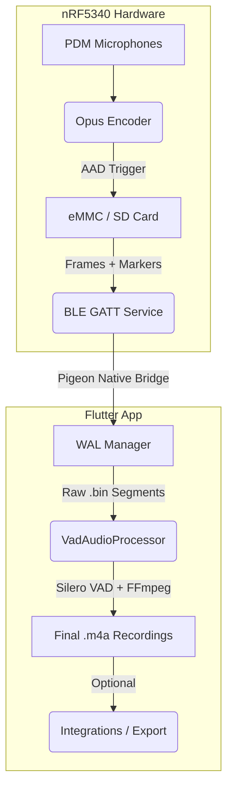

# 🎙️ Omi Offline (v0.6.5)

**An offline-first, highly private audio capture and processing system for wearables.**

Omi Offline is a privacy-centric fork of the Omi project, engineered for local-only operation. It transforms wearable hardware into a secure, personal audio journal where data never leaves your control.

---

## 🚀 What's New (v0.6.x)

The latest 100 commits have focused on **Industrial-Grade Stability** and **Power Efficiency**:

- 🔄 **Persistent Sync Architecture:** The Write-Ahead Log (WAL) and session state now persist across app restarts and hardware disconnects, ensuring zero data loss during long syncs.
- 🔋 **AAD Power Optimization:** Firmware `oo-1.4.0+` introduces Acoustic Activity Detection (AAD) to wake the processor only when speech is detected, significantly extending battery life.
- 🛠️ **Refined Audio Pipeline:**
  - **Stitched Silence Padding:** Gaps between segments are now filled with accurate silence padding to preserve the real-world timing of conversations.
  - **Marker-Anchored Splitting:** Physical button-press markers (double-tap) now act as precision anchors for conversation boundaries.
  - **Intelligent Filtering:** Unified short-recording filters and duration guards prevent clutter from noise or accidental triggers.
- 📱 **Robust Connectivity:** A custom **Pigeon-based Native GATT Bridge** replaces fragile Dart BLE libraries, providing rock-solid reconnections and high-throughput "Zero-cost sync".
- 📴 **Physical Power Control:** Triple-tap-hold gesture on the wearable now triggers a clean hardware power-off.

---

## ✨ Key Features

- 🔒 **100% Offline:** No cloud dependencies, no internet checks, no third-party APIs for core features.
- 🧠 **On-Phone Neural Processing:** Powered by **Silero VAD** (via ONNX Runtime) to segment speech from silence entirely on-device.
- 💾 **Continuous On-Device Storage:** High-quality Opus audio (16 kHz mono) is saved directly to eMMC/SD using a robust Queue Command Pattern.
- 🔄 **Resumable WAL Sync:** Append-only byte-offset tracking allows syncs to resume exactly where they left off.
- 🎛️ **Adjustment Mode:** Fine-tune VAD parameters (sensitivity, split duration, etc.) and re-process raw data without re-syncing from the hardware.
- 📂 **Organized Exports:** Automatically groups recordings into daily batches and handles midnight-spanning conversations seamlessly.

---

## 🏗 System Architecture

```mermaid
graph TD
    subgraph Wearable [nRF5340 Hardware]
        A[PDM Microphones] --> B(Opus Encoder)
        B -->|AAD Trigger| C[eMMC / SD Card]
        C -->|Frames + Markers| D(BLE GATT Service)
    end

    subgraph Mobile [Flutter App]
        D -->|Pigeon Native Bridge| E[WAL Manager]
        E -->|Raw .bin Segments| F(VadAudioProcessor)
        F -->|Silero VAD + FFmpeg| G[Final .m4a Recordings]
        G -->|Optional| H(Integrations / Export)
    end
```

### 1. Hardware & Firmware (`omi/firmware`)
- **RTOS:** Zephyr-based implementation on nRF5340.
- **Storage:** LittleFS on eMMC with atomic ring-buffers to prevent corruption.
- **User Input:** Double-tap for Markers (`0xFE`), Triple-tap for Power-off.
- **Feedback:** RGB LED for Mute, Sync, and Battery status.

### 2. Mobile Application (`app/`)
- **Framework:** Flutter 3.x (State managed via Provider).
- **Sync Engine:** Persistent session IDs and monotonic byte offsets.
- **Processing:** Multi-stage pipeline: Decryption -> Opus Decode -> Silero VAD Segmentation -> FFmpeg Transcode.
- **UI:** Interactive recording player, storage management, and real-time sync feedback.

---

## 📖 Core Nomenclature

To maintain consistency, the project adheres to a strict naming standard:

- **Frame:** Atomic Opus unit (~20ms).
- **Segment:** A `.bin` file containing a sequence of frames.
- **DeviceSession:** Hardware stream from boot to disconnect (ID = UTC start).
- **WAL:** The monotonic Write-Ahead Log tracking sync progress.
- **Recording:** The final transcoded `.m4a` artifact.

*See [NOMENCLATURE.md](./NOMENCLATURE.md) for the full glossary.*

---

## 🛠 Getting Started

### Prerequisites
- **App:** Flutter SDK 3.x, CocoaPods (for iOS), Android NDK.
- **Firmware:** nRF Connect SDK, Zephyr RTOS toolchain.

### Installation
1. **Clone the Repo:** `git clone https://github.com/john-gitdev/omi-offline.git`
2. **Setup App:** `cd app && ./setup.sh`
3. **Run App:** `flutter run` (Ensure a physical device is connected for BLE).
4. **Flash Firmware:** Follow [Firmware Guide](./omi/firmware/readme.md).

---

## 🤝 Reliability & Tests

We prioritize stability over features. 
- **Unit Tests:** `cd app && bash test.sh`
- **Integration Tests:** Located in `app/integration_test/` for profiling and UI stability.
- **Firmware Stability:** Uses a Command Queue pattern for SD writes to prevent BLE timeouts.

Enjoy your private, intelligent audio journal! 🎙️
