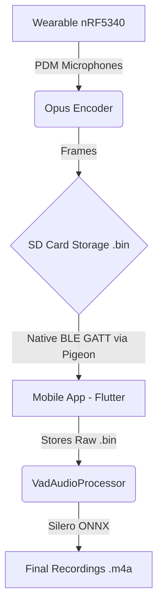

<div align="center">

# 🎙️ Omi Offline

**An offline-first, highly private audio capture and processing system for wearables.**

[](https://opensource.org/licenses/MIT)
[](https://flutter.dev/)
[](https://zephyrproject.org/)

Omi Offline is a personal fork of the Omi project focused entirely on local, private recording. By removing cloud dependencies and continuous internet constraints, this system ensures your audio never leaves your device until you decide to export it.

</div>

---

## ✨ Key Features

- 🔒 **100% Offline by Default:** Zero cloud dependency. No internet connectivity checks, no forced cloud APIs. Your data, your rules.
- 💾 **Continuous On-Device Recording:** Audio is encoded in Opus (16 kHz mono, 20ms frames) directly on the nRF5340 wearable and saved to an SD card.
- 🔄 **Resumable BLE Sync (WAL):** Syncs data to your phone in batches over an ACK-gated, Write-Ahead Log (WAL) BLE protocol. Resumes cleanly on disconnects.
- 🧠 **On-Phone Neural Processing:** Powered by **Silero VAD** (running via ONNX runtime) to segment speech from silence entirely on your mobile device.
- 🎛 **Iterative Adjustment Mode:** Fine-tune Voice Activity Detection (VAD) parameters without needing to re-sync data from the hardware.
- 🔌 **HeyPocket Integration:** The *only* optional external integration, allowing you to upload finalized recordings directly to HeyPocket.

---

## 🏗 System Architecture

The ecosystem consists of two primary layers:


```mermaid
graph TD
    A[Wearable nRF5340] -->|PDM Microphones| B(Opus Encoder)
    B -->|Frames| C{SD Card Storage .bin}
    C -->|Native BLE GATT via Pigeon| D[Mobile App - Flutter]
    D -->|Stores Raw .bin| E(VadAudioProcessor)
    E -->|Silero ONNX| F[Final Recordings .m4a]
```

### 1. Hardware (Firmware)
- **Audio Capture:** Uses PDM microphones.
- **Encoding:** Compresses audio into Opus frames.
- **Storage:** Writes contiguous `.bin` segments to the SD card.
- **Markers:** Inserts a `0xFE` hardware packet into the stream upon button press (double tap) for easy moment tagging.

### 2. Software (Flutter App)
- **Sync:** Connects via a robust Pigeon Native GATT bridge. Downloads raw `.bin` files via WAL offsets.
- **Processing:** `VadAudioProcessor` decodes the Opus stream and splits audio into discrete conversations based on silence boundaries.
- **Storage:** Final recordings are saved as `.m4a` files in `recordings/<YYYY-MM-DD>/`.

---

## 🔄 Sync Pipeline (BLE + WAL)

Instead of fragile real-time audio streaming, Omi Offline uses an append-only **Write-Ahead Log (WAL)**.

- **Native Pigeon Bridge:** Overcomes Dart-based BLE library limitations by using highly stable native iOS/Android GATT implementations.
- **Framed Protocol:**
  - `0x01` (Data): Carries 4-byte file offset. Overlapping packets are trimmed; gaps are detected.
  - `0x02` (EOT): Firmware end-of-file signal.
  - `0x03` (ACK): App receipt confirmation.

---

## 🧠 Processing Pipeline

### VAD Engine (`VadAudioProcessor`)
The core of the offline intelligence is the **Silero VAD** neural network.

- **Disk-Backed Pointers:** PCM audio is never held completely in memory. The app uses `FrameRef` pointers to process frame-by-frame.
- **Chronological Merging:** A conversation crossing midnight is never artificially cut. Segments are sorted by `(deviceSessionId, segmentIndex)`.
- **Cleanup vs Adjustment:** Processed `.bin` files are automatically deleted to save space. However, if **Adjustment Mode** is enabled, raw segments are preserved, allowing you to tweak VAD parameters and re-process the day.

---

## 🎛 VAD Tuning & Settings

Settings are easily tweaked in the App's **Recording Settings** (backed by `SharedPreferencesUtil`).

| Setting | Prefs Key | Default | Description |
|---|---|---|---|
| **Speech Sensitivity** | `vadSpeechThreshold` | 0.5 | Silero probability cutoff (0–1). Lower = more sensitive |
| **Silence to Split** | `vadSplitSeconds` | 120s | Silence duration that triggers a conversation cut |
| **Min. Length** | `vadMinSpeechSeconds` | 5s | Segments shorter than this are discarded |
| **Holdover Buffer** | `vadHangoverSeconds` | 0.5s | How long to record after speech drops out |
| **Pre-Speech Buffer** | `vadPreSpeechSeconds` | 1.0s | Audio captured before speech onset |
| **Gap Threshold** | `vadGapSeconds` | 30s | Nearby segments closer than this are merged |
| **Max Length** | `vadMaxConversationMinutes`| 60 min | Hard cap forcing a split, even without silence |

---

## 📖 Core Nomenclature

To maintain consistency across the codebase, please refer to the following terms (defined fully in `NOMENCLATURE.md`):

- **Frame:** Single Opus unit (~20ms).
- **Segment:** A `.bin` file containing frames (Never refer to this as a "chunk").
- **DeviceSession:** Hardware recording session identified by a UTC start timestamp.
- **Marker:** `0xFE` user event triggered by double tap.
- **WAL:** Byte-offset sync state.
- **Recording:** Final `.m4a` output.
- **Conversation:** A VAD-delimited recording or marker-tagged clip.

---

## 🛠 Repository Structure

```text
omi-offline/
├── app/               # Flutter mobile application (BLE sync, VAD, UI)
│   ├── lib/           # Core Dart logic, providers, services
│   └── test/          # Unit & integration tests
├── omi/
│   └── firmware/      # Zephyr RTOS C code for nRF5340 (Opus encode, SD, BLE)
├── NOMENCLATURE.md    # Definitive project glossary
└── CLAUDE.md          # Agent configuration & architecture notes
```

---

## 🤝 Reliability & Contributing

- **Firmware Integrity:** The firmware utilizes atomic ring buffers (`ring_buf_put_claim` / `ring_buf_put_finish`) to prevent partial storage corruption.
- **App Connectivity:** Serialized operations using a `Mutex` prevent concurrent BLE command collision.
- **Tests:** After modifying Flutter UI or backend code, verify with the test suite: `cd app && bash test.sh`.

Enjoy completely private, offline, intelligent audio journaling! 🎙️
