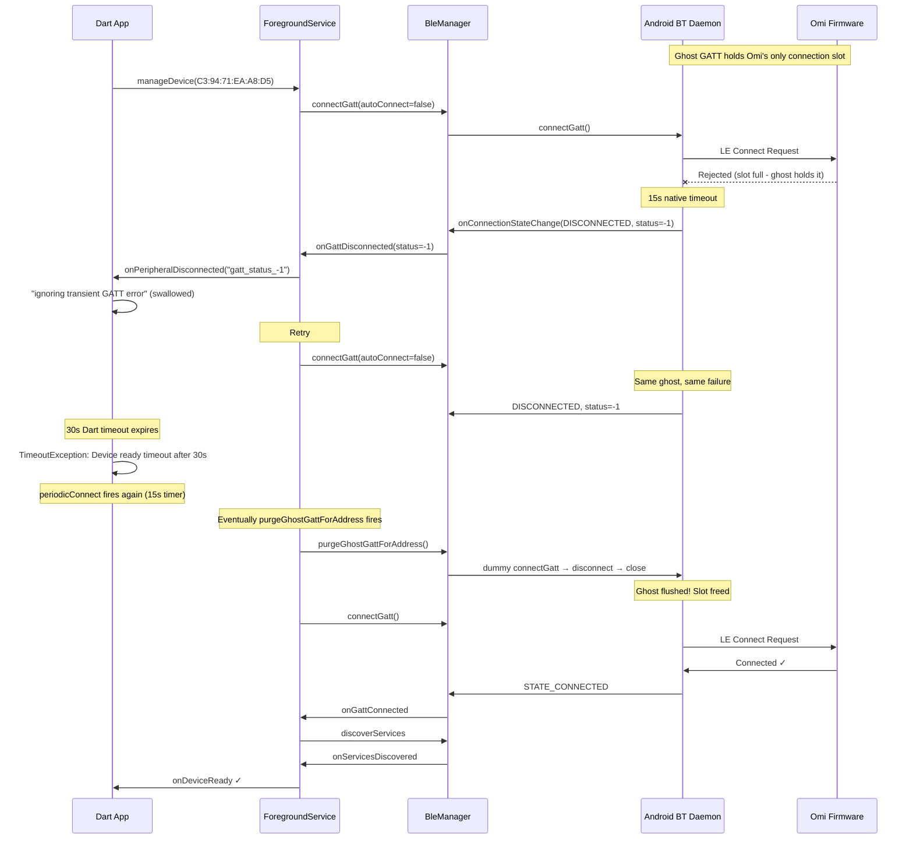

# Omi Bluetooth Stack Deep-Dive Analysis

## Executive Summary

Your Omi device (C3:94:71:EA:A8:D5) intermittently fails to reconnect because **Android's Bluetooth daemon holds a stale ("ghost") GATT connection** to the Omi peripheral even after your app's GATT handle is closed. Since the Omi firmware only accepts **one BLE connection at a time** (`CONFIG_BT_MAX_CONN=1`), the ghost link monopolizes the device's connection slot, causing every `connectGatt()` call to fail with `gatt_status_-1` (a synthetic timeout the app generates when service discovery never completes within 15 seconds). Toggling phone Bluetooth works because it forcibly tears down *all* system-level GATT connections, freeing the slot.

Your codebase already has a mitigation for this (`purgeGhostGattForAddress`), but it's **rate-limited to once per 30 seconds** and only fires *inside the retry loop* — meaning it can't act fast enough when the ghost re-establishes itself between retries or on OEM stacks that re-arm passive links.

---

## 1. The Full Connection Pipeline (Code-Backed)

Here's every layer of your Bluetooth stack, from top to bottom:

### Layer 1: DeviceProvider (Dart orchestrator)

```
periodicConnect() → scanAndConnectToDevice() → _scanConnectDevice()
```

| Component | File | Key Behavior |
|---|---|---|
| [periodicConnect](file:///C:/Users/johnw/repos/omi-offline/app/lib/providers/device_provider.dart#L568-L588) | device_provider.dart:568 | Fires a `Timer.periodic` every **15 seconds** (`_connectionCheckSeconds`). Calls `scanAndConnectToDevice()` if `!isConnected && connectedDevice == null` and `!isConnecting`. |
| [_scanConnectDevice](file:///C:/Users/johnw/repos/omi-offline/app/lib/providers/device_provider.dart#L590-L643) | device_provider.dart:590 | The core connection attempt. Calls `ensureConnection(force: true)`, races it against a 5s probe, starts a parallel BLE scan if the probe fails, then waits up to 25 more seconds (total ~30s budget). |
| [onDeviceConnectionStateChanged](file:///C:/Users/johnw/repos/omi-offline/app/lib/providers/device_provider.dart#L1578-L1597) | device_provider.dart:1578 | Switch on state: `connected` → debounce `_handleDeviceConnected` (1000ms). `disconnected` → debounce `onDeviceDisconnected`. |
| [onDeviceDisconnected](file:///C:/Users/johnw/repos/omi-offline/app/lib/providers/device_provider.dart#L1250-L1323) | device_provider.dart:1250 | If foreground + accidental (not manual): exponential backoff reconnect `1s → 2s → 4s → … → 60s`. If background: no auto-reconnect (sync timer drives it). |

### Layer 2: DeviceService (Dart mutex gate)

| Component | File | Key Behavior |
|---|---|---|
| [ensureConnection](file:///C:/Users/johnw/repos/omi-offline/app/lib/services/devices.dart#L247-L283) | devices.dart:247 | Protected by a Dart `Mutex`. If already connected to this device → return immediately. If `force=false` and transport exists → return null (let native handle it). If `force=true` → call `_connectToDevice()`. |
| [_connectToDevice](file:///C:/Users/johnw/repos/omi-offline/app/lib/services/devices.dart#L139-L181) | devices.dart:139 | Looks up device in discovered list or SharedPreferences. Creates a `DeviceConnection` (which wraps `NativeBleTransport`). Calls `transport.connect()`. |

> [!IMPORTANT]
> **The Mutex is single-entry.** While one `ensureConnection` is blocked waiting for device-ready (up to 30s), all other `ensureConnection` callers queue behind it. This is by design to prevent concurrent `connectGatt` calls, but it means a stuck connection attempt blocks ALL other connection work for 30 seconds.

### Layer 3: NativeBleTransport (Dart ↔ Native bridge)

| Component | File | Key Behavior |
|---|---|---|
| [connect()](file:///C:/Users/johnw/repos/omi-offline/app/lib/services/devices/transports/native_ble_transport.dart#L59-L119) | native_ble_transport.dart:59 | Sends `manageDevice` to native via Pigeon, then `await`s a `_deviceReadyCompleter` with a **30-second timeout**. |
| [_handleConnectionState](file:///C:/Users/johnw/repos/omi-offline/app/lib/services/devices/transports/native_ble_transport.dart#L308-L336) | native_ble_transport.dart:308 | **Critical filter:** If `isConnecting` (completer pending) AND error contains `133` or `-1` → **swallow the error** ("ignoring transient GATT error during connect, native will retry"). Otherwise → fail the completer → disconnect. |
| [_handleDeviceReady](file:///C:/Users/johnw/repos/omi-offline/app/lib/services/devices/transports/native_ble_transport.dart#L338-L350) | native_ble_transport.dart:338 | Completes `_deviceReadyCompleter` with services. Fires `DeviceTransportState.connected`. |

> [!WARNING]
> **Line 316 is the "transient error swallower"** — this is why you see `ignoring transient GATT error during connect (native will retry): gatt_status_-1` in your logs. The Dart layer trusts native to keep retrying. But if native can't actually reconnect (ghost GATT), this just delays the inevitable 30s timeout.

### Layer 4: OmiBleForegroundService (Android Kotlin — connection owner)

| Component | File | Key Behavior |
|---|---|---|
| [manageDevice](file:///C:/Users/johnw/repos/omi-offline/app/android/app/src/main/kotlin/com/omi/offline/OmiBleForegroundService.kt#L362-L438) | OmiBleForegroundService.kt:362 | Saves device to prefs. Calls `OmiCompanionManager.stopObservingForAddress()` (anti-CDM). If already connected → re-fire `onDeviceReady`. If existing ManagedDevice but disconnected → `triggerReconnection`. Otherwise → `connectToDevice`. |
| [connectToDevice](file:///C:/Users/johnw/repos/omi-offline/app/android/app/src/main/kotlin/com/omi/offline/OmiBleForegroundService.kt#L482-L536) | OmiBleForegroundService.kt:482 | `disconnectGatt` + `closeGatt` any stale handle. Uses `autoConnect=false` for first 3 retries, `autoConnect=true` after. Sets a **15s timeout** (direct) or **30s timeout** (autoConnect). On timeout → `handleDisconnection` with status `-1`. |
| [handleDisconnection](file:///C:/Users/johnw/repos/omi-offline/app/android/app/src/main/kotlin/com/omi/offline/OmiBleForegroundService.kt#L552-L636) | OmiBleForegroundService.kt:552 | Fires `onPeripheralDisconnected(error="gatt_status_-1")` to Dart. Then → `handleRetryLogic`. |
| [handleRetryLogic](file:///C:/Users/johnw/repos/omi-offline/app/android/app/src/main/kotlin/com/omi/offline/OmiBleForegroundService.kt#L717-L764) | OmiBleForegroundService.kt:717 | Exponential backoff: `1.5s → 3s → 6s → 12s → 24s → 30s` (capped). Every retry, **checks for ghost GATT** via `purgeGhostGattForAddress()` — but only once per 30s (`GHOST_PURGE_MIN_INTERVAL_MS`). |

### Layer 5: OmiBleManager (Android Kotlin — raw GATT wrapper)

| Component | File | Key Behavior |
|---|---|---|
| [connectGatt](file:///C:/Users/johnw/repos/omi-offline/app/android/app/src/main/kotlin/com/omi/offline/OmiBleManager.kt#L258-L291) | OmiBleManager.kt:258 | Closes any existing GATT for the address. Checks if the system already has this device connected → forces `autoConnect=false`. Calls `device.connectGatt()`. |
| [onConnectionStateChange](file:///C:/Users/johnw/repos/omi-offline/app/android/app/src/main/kotlin/com/omi/offline/OmiBleManager.kt#L552-L582) | OmiBleManager.kt:552 | On `STATE_CONNECTED` → register gatt, start 15s service-discovery timeout, call `discoverServices()`. On `STATE_DISCONNECTED` → cleanup, fire `onGattDisconnected(status)`. |
| [purgeGhostGattForAddress](file:///C:/Users/johnw/repos/omi-offline/app/android/app/src/main/kotlin/com/omi/offline/OmiBleManager.kt#L168-L185) | OmiBleManager.kt:168 | **The ghost-GATT fix.** Checks `bluetoothManager.getConnectedDevices(GATT)` for the address. If found but not in our `connectedGatts` → creates a dummy GATT, immediately disconnects+closes it to flush the OS daemon state. |

---

## 2. Your Log — Line-by-Line Walkthrough

### Session 1: Successful fast connect (18:23:48 → 18:24:05) ✅

| Time | Event | What Happened |
|---|---|---|
| 18:23:48 | `ensureConnection(force:false)` | Device is `disconnected`. `force=false` → [devices.dart:265-266](file:///C:/Users/johnw/repos/omi-offline/app/lib/services/devices.dart#L265-L266) returns `null` immediately (transport exists, let native handle it). |
| 18:23:50 | `_scanConnectDevice: returning null` | The `force:false` ensureConnection returned null → no connected device found. |
| 18:23:50 | `disconnected (gatt_status_-1)` | Native timeout hit (the prior native connect attempt timed out). |
| 18:23:58 | `Device not in discovered list` | New `ensureConnection(force:true)` — device not in memory, loads from SharedPreferences. |
| 18:23:58 | `starting fresh connect` | [native_ble_transport.dart:69](file:///C:/Users/johnw/repos/omi-offline/app/lib/services/devices/transports/native_ble_transport.dart#L69) — `manageDevice` sent to native. |
| 18:24:03 | `not ready in 5s — starting BLE scan` | [device_provider.dart:621](file:///C:/Users/johnw/repos/omi-offline/app/lib/providers/device_provider.dart#L621) — 5s probe failed, starts parallel scan. |
| 18:24:04 | `state: connected` | Native GATT connected, services discovered, MTU negotiated → `onDeviceReady` fired. **Total: ~6.3s.** |
| 18:24:05 | `proceeding to setup` | [device_provider.dart:1533](file:///C:/Users/johnw/repos/omi-offline/app/lib/providers/device_provider.dart#L1533) — sets connected device, starts WAL sync, reads diagnostics. |
| 18:24:05 | `uptime: 22h 40m` | Device has been running 22h 40m since last software reset (powered on). |

### Session 2: Manual disconnect → reconnect failure loop (18:24:49 → 18:29:15) ❌ then ✅

| Time | Event | What Happened |
|---|---|---|
| 18:24:49 | `Disconnecting (isManual: true)` | User/app-initiated disconnect. Calls [transport.disconnect()](file:///C:/Users/johnw/repos/omi-offline/app/lib/services/devices/transports/native_ble_transport.dart#L122-L154) → `unmanageDevice` on native → GATT disconnected and closed. |
| 18:24:49 | `error=unmanaged` | [OmiBleForegroundService.kt:467](file:///C:/Users/johnw/repos/omi-offline/app/android/app/src/main/kotlin/com/omi/offline/OmiBleForegroundService.kt#L467) — native confirms unmanage. |
| 18:25:56 | `state: connecting` | Auto-reconnect triggered (background sync timer or periodic connect). `manageDevice` sent, 30s timeout starts. |
| 18:26:01 | `Device discovering...` | 5s probe failed, parallel scan started. |
| 18:26:11 | `ignoring transient GATT error: gatt_status_-1` | **First ghost hit.** Native's `connectToDevice` timed out (15s for direct connect). [native_ble_transport.dart:316](file:///C:/Users/johnw/repos/omi-offline/app/lib/services/devices/transports/native_ble_transport.dart#L316) swallows it — trusts native to retry. |
| 18:26:26 | **`timed out after 30006ms`** | Dart's 30s budget expired. [native_ble_transport.dart:99](file:///C:/Users/johnw/repos/omi-offline/app/lib/services/devices/transports/native_ble_transport.dart#L99) — `TimeoutException`. |
| 18:26:28 | `Connection failed: timeout after 30s` | [devices.dart:275](file:///C:/Users/johnw/repos/omi-offline/app/lib/services/devices.dart#L275) — ensureConnection returns null. |
| 18:26:41 | `state: connecting (force: true)` | `periodicConnect` fires again (15s timer). Fresh `manageDevice`. |
| 18:26:46 | `ignoring transient GATT error: gatt_status_-1` | **Same pattern.** Another native timeout → Dart swallows it. |
| 18:27:07 | `ignoring transient GATT error: gatt_status_-1` | **Second native retry also failed.** Same ghost blocking the slot. |
| 18:27:11 | **`timed out after 30008ms`** | Second 30s cycle fails. |
| 18:27:13 | Immediate retry | Third attempt with `force: true`. |
| 18:27:43 | **Third timeout** | Same pattern. |
| 18:27:45 | `state: disconnected` | App's own log suggests to toggle phone Bluetooth. |
| 18:27:49 | `gatt_status_-1` | Native confirms yet another disconnect. |
| 18:27:55 → 18:28:25 | **Fourth attempt** | Same failure pattern. |
| 18:28:35 → 18:29:05 | **Fifth attempt** | Same failure — `gatt_status_-1` at 18:28:43. |
| 18:29:13 | **`state: connected`** | 🎉 Finally connects! Something cleared the ghost (likely the `purgeGhostGattForAddress` rate-limit expired after 30s and successfully purged). |
| 18:29:14 | `Disconnecting (isManual: true)` | But then **immediately disconnected again** — the drop-guard in [_handleDeviceConnected:1524-1531](file:///C:/Users/johnw/repos/omi-offline/app/lib/providers/device_provider.dart#L1524-L1531) fires because the app is backgrounded and `_pendingBackgroundSync` is false. |

> [!CAUTION]
> **This is a critical race condition.** The connection finally succeeds after ~4 minutes of retries, but `_handleDeviceConnected`'s background drop-guard immediately kills it because no sync was pending. The reconnect loop then has to start all over.

### Session 3: Clean fast connect (18:33:23 → 18:33:28) ✅

| Time | Event | What Happened |
|---|---|---|
| 18:33:23 | `state: connecting` | New attempt. |
| 18:33:24 | `state: connected` | **Connected in 1.6 seconds!** The ghost was gone because the prior cycle's purge was still effective. |
| 18:33:25 | `proceeding to setup` | Full setup, WAL sync, 4 files transferred. |
| 18:33:28 | `4 files synced` | Everything works perfectly. |

### Session 4: Another stall cycle (18:43:21 → 18:44:04) ❌ then ✅

Same pattern — 30s timeout with `gatt_status_-1`, then connects on the next attempt after the ghost purge fires.

---

## 3. Root Cause Analysis

### Primary Cause: Ghost GATT Connection (Android Bluetooth Daemon)

```
┌──────────────────────────────────────────────────────────────────┐
│                    Omi Firmware (nRF)                            │
│                   CONFIG_BT_MAX_CONN = 1                        │
│           ┌─────────────────────────────────────┐               │
│           │  Connection Slot (1 of 1)           │               │
│           │  ▓▓▓▓▓▓▓▓▓▓ OCCUPIED ▓▓▓▓▓▓▓▓▓▓▓▓  │               │
│           └─────────────────────────────────────┘               │
│                         ▲                                       │
│                         │  "Connected" (from firmware's view)   │
│                         │                                       │
│           ┌─────────────┴───────────────────────┐               │
│           │  Android BT Daemon (bluetoothd)     │               │
│           │                                     │               │
│           │  Ghost GATT handle #1 (from prior   │               │
│           │  session / OEM autoConnect / CDM)    │               │
│           │  — app has closed() it but the OS   │               │
│           │    still holds the radio link        │               │
│           └─────────────────────────────────────┘               │
│                                                                 │
│           ┌─────────────────────────────────────┐               │
│           │  Your App's connectGatt()           │               │
│           │  → FAILS with gatt_status_-1        │               │
│           │    because slot is occupied          │               │
│           └─────────────────────────────────────┘               │
└──────────────────────────────────────────────────────────────────┘
```

**Why toggling Bluetooth works:** `BluetoothAdapter.STATE_TURNING_OFF` forcibly closes ALL system-level GATT connections at the radio layer — including ghosts. When BT turns back on, the slot is free.

**Why it's worse on some OEMs:** The code explicitly calls out OnePlus/Oplus/Realme/Xiaomi in [OmiBleForegroundService.kt:375-382](file:///C:/Users/johnw/repos/omi-offline/app/android/app/src/main/kotlin/com/omi/offline/OmiBleForegroundService.kt#L375-L382):

```kotlin
// CDM presence observation is intentionally NOT armed. On OnePlus/Oplus/Realme
// stacks it makes the OS hold a passive LE link that contends for the firmware's
// single connection slot (CONFIG_BT_MAX_CONN=1), wedging reconnection into an
// "advertising but won't connect" state recoverable only by toggling phone BT.
```

### Secondary Cause: Rate-Limited Ghost Purge

The purge in [handleRetryLogic:744](file:///C:/Users/johnw/repos/omi-offline/app/android/app/src/main/kotlin/com/omi/offline/OmiBleForegroundService.kt#L744) is rate-limited to once per 30s:

```kotlin
private const val GHOST_PURGE_MIN_INTERVAL_MS = 30_000L

if (now - managed.lastGhostPurgeMs >= GHOST_PURGE_MIN_INTERVAL_MS &&
    bleManager.purgeGhostGattForAddress(addr))
```

This means: if the ghost GATT re-establishes itself after a purge (some OEM stacks do this), you wait another 30 seconds before you can purge again. During that window, every connect attempt hits the ghost and times out.

### Tertiary Cause: Background Drop Guard

The connection at 18:29:13 succeeded after 4+ minutes, but was **immediately killed** by [_handleDeviceConnected:1524-1531](file:///C:/Users/johnw/repos/omi-offline/app/lib/providers/device_provider.dart#L1524-L1531):

```dart
if (!_isAppInForeground &&
    !_pendingBackgroundSync &&
    !_pendingSyncResume &&
    !isFirmwareUpdateInProgress &&
    !_isOnFirmwareUpdatePage) {
  Logger.debug('dropping — app is backgrounded and no sync was pending');
  unawaited(ServiceManager.instance().device.disconnectDevice(isManual: true));
  return;
}
```

This is a valid optimization to save battery, but when a connection takes 4 minutes of retries and the app has since been backgrounded, the hard-won connection gets thrown away.

---

## 4. The `gatt_status_-1` Explained

This is **NOT a real Android GATT status code**. It's a synthetic value your app generates in two places:

1. **Native connection timeout** — [OmiBleForegroundService.kt:531](file:///C:/Users/johnw/repos/omi-offline/app/android/app/src/main/kotlin/com/omi/offline/OmiBleForegroundService.kt#L531):
   ```kotlin
   val timeoutRunnable = Runnable {
       handleDisconnection(addr, managed.currentGattHash ?: 0, -1)
       //                                                       ^^
   }
   ```

2. **Service discovery timeout** — [OmiBleManager.kt:562](file:///C:/Users/johnw/repos/omi-offline/app/android/app/src/main/kotlin/com/omi/offline/OmiBleManager.kt#L562):
   ```kotlin
   connectionListener?.onGattDisconnected(address, gatt.hashCode(), -1)
   //                                                               ^^
   ```

Both mean: "we connected to the GATT but never got past service discovery within the timeout" — which is exactly what happens with a ghost connection. The radio thinks it's connected (from the system's perspective), but the firmware has no idea because it's already connected to the ghost handle.

---

## 5. Timeline of What Happens When It Stalls



---

## 6. Suggested Solutions

### Solution 1: Purge Ghost Immediately on First Retry (✅ IMPLEMENTED)

Currently `purgeGhostGattForAddress` only fires inside the retry loop and is rate-limited to 30s. The first connect attempt never checks for ghosts. 

**Suggestion:** Call `purgeGhostGattForAddress` **before** the very first `connectGatt` in `connectToDevice()`, not just in the retry path. This would catch ghosts left from a prior session immediately. The rate limit should still prevent churn on subsequent retries.

Code location: [OmiBleForegroundService.kt:482-536](file:///C:/Users/johnw/repos/omi-offline/app/android/app/src/main/kotlin/com/omi/offline/OmiBleForegroundService.kt#L482-L536), just before the `connectGatt` call at line 511.

### Solution 2: Reduce Ghost Purge Rate Limit (✅ IMPLEMENTED)

`GHOST_PURGE_MIN_INTERVAL_MS = 30_000L` means at most one purge per 30 seconds. On stacks that re-arm ghosts quickly (OnePlus, Xiaomi), this is too slow. 

**Suggestion:** Reduce to 10-15 seconds, or make the rate limit adaptive — shorter when `retryCount` is low (the ghost is fresh and likely to work on first purge), longer when high (it's probably not a ghost problem at that point).

Code location: [OmiBleForegroundService.kt:46](file:///C:/Users/johnw/repos/omi-offline/app/android/app/src/main/kotlin/com/omi/offline/OmiBleForegroundService.kt#L46).

### Solution 3: Exempt Long-Running Reconnects from Background Drop Guard (Medium Impact)

When a connection takes >30s of retries, the app has likely been backgrounded by the time it succeeds. The drop-guard at [device_provider.dart:1524](file:///C:/Users/johnw/repos/omi-offline/app/lib/providers/device_provider.dart#L1524) then immediately kills it.

**Suggestion:** Track when the reconnect cycle *started*. If the connection attempt was initiated while the app was in the foreground (or a sync was active), let the resulting connection through even if the app has since gone to background. You could set a `_pendingSyncResume = true` flag at the start of `_scanConnectDevice`, not just after a disconnect-during-sync.

Code location: [device_provider.dart:1524-1531](file:///C:/Users/johnw/repos/omi-offline/app/lib/providers/device_provider.dart#L1524-L1531).

### Solution 4: Add Ghost Detection Logging (Diagnostic)

`purgeGhostGattForAddress` returns a boolean but it's only logged inside `handleRetryLogic`. Adding diagnostic logging whenever a ghost is detected (even if rate-limited) would help you correlate stalls with ghost presence.

Code location: [OmiBleForegroundService.kt:740-760](file:///C:/Users/johnw/repos/omi-offline/app/android/app/src/main/kotlin/com/omi/offline/OmiBleForegroundService.kt#L740-L760).

### Solution 5: Foreground Bluetooth Reset as Last Resort (Nuclear Option)

After N consecutive failed 30s cycles (e.g., 3-4, ~2 minutes), programmatically toggle Bluetooth off/on via `BluetoothAdapter.disable()` / `enable()`. This is the nuclear version of what you do manually. This requires `BLUETOOTH_ADMIN` permission and is generally discouraged by Google, but some production BLE apps do it as a last resort on known-bad OEM stacks.

---

## 7. Suggested Diagnostic Tests

### Test 1: Ghost GATT Detection Test

Add a test that, after `unmanageDevice`, checks `bluetoothManager.getConnectedDevices(BluetoothProfile.GATT)` and asserts the device is NOT in the list. If it IS, you have a ghost. This would let you catch OEM-specific ghost behavior in CI or during QA.

**Where:** [native_ble_transport_test.dart](file:///C:/Users/johnw/repos/omi-offline/app/test/unit/services/devices/transports/native_ble_transport_test.dart) — add a test that simulates `onPeripheralDisconnected('gatt_status_-1')` and verifies the transport state machine transitions correctly.

### Test 2: Background Drop Guard Timing Test

Write a test that:
1. Sets `_isAppInForeground = true`
2. Starts a `_scanConnectDevice` (which takes ~30s)
3. Flips `_isAppInForeground = false` midway
4. When the connection finally succeeds, asserts it's NOT dropped

This would catch the "hard-won connection immediately killed" race condition.

### Test 3: Reconnection Backoff Integration Test

Write a test that simulates the full disconnect → retry sequence and verifies:
- The ghost purge fires at the right time
- The backoff schedule matches `1.5s → 3s → 6s → 12s → 24s → 30s`
- The retry count resets on successful connection
- The stability timer (60s) resets retry count after sustained connections

### Test 4: Mutex Starvation Test

Test that if `ensureConnection` is blocked for 30s (waiting for a timeout), a second caller that arrives at t=29s doesn't have to wait another 30s. Verify the mutex queuing behavior doesn't compound timeouts.

### Test 5: Runtime Ghost Monitor

Add a periodic (every 5s) check in the foreground service that queries `bluetoothManager.getConnectedDevices(GATT)` and logs any device address that's in the system-connected list but NOT in `connectedGatts`. This would give you real-time ghost visibility in your logs without any code change to the connection path.

---

## 8. Summary Table

| Symptom | Root Cause | Code Location | Fix Complexity |
|---|---|---|---|
| `gatt_status_-1` repeating | Ghost GATT holding firmware's single slot | [OmiBleManager.kt:552-582](file:///C:/Users/johnw/repos/omi-offline/app/android/app/src/main/kotlin/com/omi/offline/OmiBleManager.kt#L552-L582) | ✅ Fixed (Sol 1) |
| 2-5 minute connect delays | Ghost purge rate-limited to 30s | [OmiBleForegroundService.kt:46](file:///C:/Users/johnw/repos/omi-offline/app/android/app/src/main/kotlin/com/omi/offline/OmiBleForegroundService.kt#L46) | ✅ Fixed (Sol 2) |
| Connection succeeds then immediately drops | Background drop-guard kills hard-won connections | [device_provider.dart:1524-1531](file:///C:/Users/johnw/repos/omi-offline/app/lib/providers/device_provider.dart#L1524-L1531) | Medium |
| "ignoring transient GATT error" spam | Dart swallows errors hoping native retries | [native_ble_transport.dart:316](file:///C:/Users/johnw/repos/omi-offline/app/lib/services/devices/transports/native_ble_transport.dart#L316) | Low |
| BT toggle always fixes it | Only reliable way to kill system-level ghosts | Android OS behavior | N/A |
| Worse on OnePlus/Xiaomi | OEM stacks re-arm passive LE links | [OmiBleForegroundService.kt:375-382](file:///C:/Users/johnw/repos/omi-offline/app/android/app/src/main/kotlin/com/omi/offline/OmiBleForegroundService.kt#L375-L382) | Hard (OEM-specific) |
